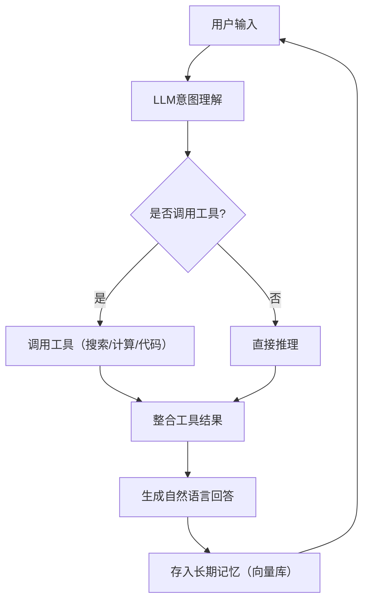
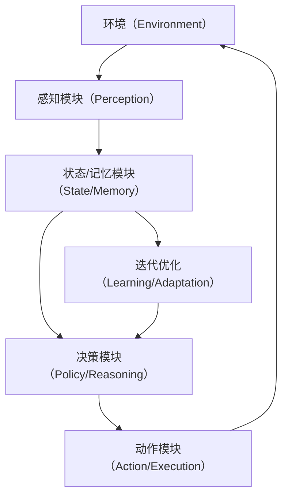

## 第1章 智能体的架构与工程实现

### 1.1 智能体（Agent）的核心定义
智能体是**能够感知环境、自主决策、执行动作并持续迭代优化的计算实体**，而非单纯的“AI程序”。其核心特征可概括为：
```
智能体 = 环境感知 + 自主决策 + 动作执行 + 迭代学习
```

智能体的最小结构包含三个不可缺失的核心要素：
1. **状态（State）**：智能体对当前环境、自身信息的实时表征（如对话历史、机器人当前位置）；
2. **策略（Policy）**：智能体根据当前状态做出决策的核心逻辑（如规则、模型推理）；
3. **动作（Action）**：智能体作用于环境的输出结果（如文字回复、硬件控制）。

### 1.2 从简单Demo理解智能体
#### 1.2.1 极简智能体Demo：核心能力落地
我们实现一个具备「对话交互、记忆存储、行为自适应」的极简智能体，直观理解核心要素的落地方式：
```python
# ./c01_01_simpleAgent.py
class SimpleAgent:
    def __init__(self):
        # 智能体的状态（短期记忆）：存储用户输入的历史信息
        self.memory = []

    # 感知+决策（策略模块核心）：处理输入并生成决策
    def think(self, user_input: str) -> str:
        # 感知：将用户输入纳入自身状态（更新记忆）
        self.memory.append(user_input)

        # 决策：基于状态的规则型策略
        if "你好" in user_input:
            return "你好呀！我是你的第一个智能体～"
        elif "记忆" in user_input:
            return f"我记得你说过：{self.memory}"
        elif "结束" in user_input:
            return "再见！下次再聊～"
        else:
            return "我还在学习中，你可以教我更多！"

    # 动作执行：持续交互的主循环
    def run(self):
        print("极简智能体已启动，输入‘结束’退出")
        while True:
            user_input = input("你：").strip()
            if not user_input:  # 补充空输入校验，提升鲁棒性
                print("智能体：请输入有效内容～")
                continue
            response = self.think(user_input)
            print("智能体：", response)
            if "结束" in user_input:
                break

# 运行智能体（规范的入口函数）
if __name__ == "__main__":
    agent = SimpleAgent()
    agent.run()
```

**运行说明**：直接复制代码执行，可通过以下输入验证效果：
- 输入「你好」→ 触发问候回复；
- 输入「今天天气不错」→ 触发默认回复；
- 输入「记忆」→ 查看所有历史输入；
- 输入「结束」→ 退出程序。

**设计意图**：通过这个极简示例，我们可以直观理解智能体的核心工作原理，为后续的LLM智能体开发打下基础。

#### 1.2.2 逐行拆解Demo：对应核心要素
##### 1.2.2.1 初始化：状态（State）的载体
```python
def __init__(self):
    self.memory = []
```
- `memory` 是智能体的**短期状态存储**，对应“状态（State）”要素；
- 所有智能体必须具备状态存储能力——决策无法脱离信息独立存在。

##### 1.2.2.2 think()方法：策略（Policy）的核心
```python
def think(self, user_input):
    self.memory.append(user_input)  # 感知：更新状态
    # 决策逻辑：规则型Policy
    if "你好" in user_input:
        return "你好呀！..."
```
这是典型的**规则型策略**，完整链路为：
```
环境输入 → 感知（更新状态） → 决策（规则判断） → 输出决策结果
```
真实大模型智能体仅替换此处的`if-else`逻辑，核心链路不变：
- 规则 → LLM自然语言推理；
- 简单记忆追加 → 向量数据库记忆检索；
- 固定回复 → 工具调用+结果整合。

##### 1.2.2.3 run()方法：动作（Action）的执行循环
```python
def run(self):
    while True:
        user_input = input(...)
        response = self.think(...)
        print(...)
```
- 智能体的核心特征是**持续与环境交互**，而非一次性函数调用；
- `print()` 是动作执行的最简形式，对应“动作（Action）”要素。

#### 1.2.3 进阶Demo：贴近真实AI智能体
为极简智能体补充真实场景必备能力：**长期记忆持久化**、**工具调用能力**，形成智能体最小可用骨架：
```python
# ./c01_02_advanceAgent.py
import json
import os  # 补充导入，处理文件路径

class AdvancedAgent(SimpleAgent):
    def __init__(self, memory_path: str = "agent_memory.json"):
        super().__init__()
        self.name = "进阶智能体"
        self.memory_path = memory_path
        self.load_memory()  # 启动时加载长期记忆

    # 长期记忆：保存到文件（持久化）
    def save_memory(self):
        """将记忆写入JSON文件，实现长期存储"""
        try:
            with open(self.memory_path, "w", encoding="utf-8") as f:
                json.dump(self.memory, f, ensure_ascii=False, indent=2)
        except Exception as e:
            print(f"记忆保存失败：{e}")

    # 加载长期记忆
    def load_memory(self):
        """启动时从文件加载历史记忆"""
        if os.path.exists(self.memory_path):
            try:
                with open(self.memory_path, "r", encoding="utf-8") as f:
                    self.memory = json.load(f)
            except Exception as e:
                print(f"记忆加载失败，初始化空记忆：{e}")
                self.memory = []
        else:
            self.memory = []

    # 工具调用模块：计算器（模拟真实智能体的工具能力）
    def calculate(self, expression: str) -> str:
        """安全的计算器工具（避免eval的安全风险）"""
        try:
            # 仅允许数字和基础运算符，提升安全性
            allowed_chars = "0123456789+-*/(). "
            if not all(c in allowed_chars for c in expression):
                return "计算出错：仅支持数字和+-*/()运算"
            result = eval(expression)  # 演示用，生产环境建议用ast模块
            return f"计算结果：{expression} = {result}"
        except:
            return "计算出错：请输入合法算式（如 1+2*3）"

    # 强化策略逻辑：整合长期记忆+工具调用
    def think(self, user_input: str) -> str:
        self.memory.append(user_input)
        self.save_memory()  # 实时保存长期记忆

        # 工具调用决策
        if "计算" in user_input:
            expr = user_input.replace("计算", "").strip()
            return self.calculate(expr)
        elif "你好" in user_input:
            return f"你好！我是{self.name}，我的记忆重启不丢失～"
        elif "清空记忆" in user_input:
            self.memory = []
            self.save_memory()
            return "记忆已清空（文件已同步删除）"
        else:
            return super().think(user_input)

# 运行进阶智能体
if __name__ == "__main__":
    agent = AdvancedAgent()
    agent.run()
```

**核心升级点**：
1. **长期记忆**：通过JSON文件实现记忆持久化，解决了智能体重启后记忆丢失的问题；
2. **工具调用**：新增计算器工具，展示了智能体如何通过工具扩展自身能力边界；
3. **鲁棒性**：补充文件操作异常处理、计算器输入校验，提升了智能体的稳定性和安全性。

**设计意图**：进阶Demo模拟了真实智能体的核心特征，包括记忆持久化和工具调用能力，为后续接入LLM打下基础。

#### 1.2.4 真实大模型智能体的核心结构
极简/进阶Demo已覆盖真实大模型智能体90%的核心架构，仅需替换策略层实现：

本质差异：将Demo中的`if-else`规则策略，替换为大语言模型（LLM）的推理能力。

---


### 1.3 智能体核心理论：从本质到通用架构
#### 1.3.1 智能体的本质定义（学术版）
智能体是**能够自主感知外部环境、基于内部状态做出决策、执行动作并通过交互反馈迭代优化的计算系统**，核心特征为：
- 自主性：无需持续人工干预，可独立完成决策；
- 交互性：与环境（用户/硬件/其他智能体）持续交互；
- 适应性：能根据交互反馈调整自身行为。

**生活类比**：
- 扫地机器人：感知（红外避障）→ 决策（规划路线）→ 动作（移动/清扫）→ 迭代（记忆已清扫区域）；
- 聊天智能体：感知（用户输入）→ 决策（回复内容）→ 动作（输出文字）→ 迭代（记录对话历史）。

#### 1.3.2 智能体的通用架构（所有智能体的底层框架）
无论简单规则型还是复杂大模型智能体，均遵循以下通用架构（学术界公认的经典框架）：


**模块拆解（新手友好版）**：

| 模块               | 核心作用                   | 极简Demo对应实现                |
| ---------------- | ---------------------- | ------------------------- |
| 环境（Environment）  | 智能体所处的外部系统，提供输入并接收输出   | 用户输入、记忆文件                 |
| 感知模块（Perception） | 解析环境信息，转换为智能体可处理的内部表征  | `think()`中接收并存储user_input |
| 状态/记忆模块          | 存储智能体的当前状态、历史信息（短期/长期） | `self.memory`变量、JSON文件    |
| 决策模块（Policy）     | 基于感知结果和记忆，选择最优动作的核心逻辑  | `if-else`规则、LLM推理         |
| 动作模块（Action）     | 将决策结果落地为可作用于环境的输出      | `print()`输出、工具调用          |
| 迭代优化模块           | 根据环境反馈调整决策逻辑（进阶能力）     | 记忆更新、策略规则补充               |

#### 1.3.3 智能体的核心分类（按决策逻辑）
| 类型     | 决策逻辑             | 核心特征         | 典型示例              | 实现难度 |
| ------ | ---------------- | ------------ | ----------------- | ---- |
| 规则型智能体 | 人工定义的if-else/规则集 | 简单可控、无学习能力   | 极简Demo、固定话术客服     | 低    |
| 反应型智能体 | 无记忆，仅响应当前环境      | 实时性强、无历史依赖   | 简单避障机器人           | 中    |
| 认知型智能体 | 记忆+推理+工具调用       | 类人思考、可解决复杂问题 | AutoGPT、ChatGPT插件 | 高    |

**学习路径建议**：先掌握规则型智能体（打牢架构基础）→ 扩展为认知型智能体（接入LLM+工具）。

### 1.4 基于通用架构的工程化实现
#### 1.4.1 模块化设计：按架构拆分代码
遵循“高内聚、低耦合”的工程原则，将智能体拆分为独立模块，便于扩展和维护：
```python
import json
import os
from typing import Dict, List, Optional

# ====================== 1. 环境模块（Environment） ======================
class AgentEnvironment:
    """智能体与外部环境的交互层：负责输入获取、数据持久化"""
    def __init__(self, memory_file: str = "agent_memory.json"):
        self.memory_file = memory_file
        # 初始化空记忆文件（避免文件不存在报错）
        self._init_memory_file()

    def _init_memory_file(self):
        """初始化记忆文件，确保文件存在且格式合法"""
        if not os.path.exists(self.memory_file):
            with open(self.memory_file, "w", encoding="utf-8") as f:
                json.dump([], f, ensure_ascii=False)

    def get_user_input(self) -> str:
        """获取环境输入（用户输入）"""
        return input("你：").strip()

    def write_memory(self, memory_data: List[str]):
        """将记忆写入环境（文件）"""
        try:
            with open(self.memory_file, "w", encoding="utf-8") as f:
                json.dump(memory_data, f, ensure_ascii=False, indent=2)
        except Exception as e:
            raise RuntimeError(f"记忆写入失败：{e}")

    def read_memory(self) -> List[str]:
        """从环境（文件）读取记忆"""
        try:
            with open(self.memory_file, "r", encoding="utf-8") as f:
                return json.load(f)
        except Exception as e:
            raise RuntimeError(f"记忆读取失败：{e}")

# ====================== 2. 感知模块（Perception） ======================
class AgentPerception:
    """感知层：解析环境输入，提取意图和关键信息"""
    @staticmethod
    def parse_input(user_input: str) -> Dict[str, str]:
        """
        解析用户输入，输出结构化感知结果
        返回格式：{"raw_input": 原始输入, "intent": 意图, "key_info": 关键信息}
        """
        intent = "unknown"
        key_info = ""

        if not user_input:
            intent = "empty_input"
        elif "你好" in user_input:
            intent = "greeting"
        elif "计算" in user_input:
            intent = "calculate"
            key_info = user_input.replace("计算", "").strip()
        elif "记忆" in user_input:
            intent = "check_memory"
        elif "清空记忆" in user_input:
            intent = "clear_memory"
        elif "结束" in user_input:
            intent = "exit"

        return {
            "raw_input": user_input,
            "intent": intent,
            "key_info": key_info
        }

# ====================== 3. 记忆模块（State/Memory） ======================
class AgentMemory:
    """记忆层：管理短期/长期记忆，关联环境模块实现持久化"""
    def __init__(self, env: AgentEnvironment):
        self.env = env
        self.short_term_memory: List[str] = []  # 运行时短期记忆
        self.long_term_memory: List[str] = self.env.read_memory()  # 持久化长期记忆

    def add_memory(self, content: str):
        """添加记忆，同步更新短期/长期记忆"""
        if content:  # 过滤空内容
            self.short_term_memory.append(content)
            self.long_term_memory.append(content)
            self.env.write_memory(self.long_term_memory)

    def get_all_memory(self) -> List[str]:
        """获取所有长期记忆"""
        return self.long_term_memory

    def clear_memory(self):
        """清空所有记忆，同步到文件"""
        self.short_term_memory = []
        self.long_term_memory = []
        self.env.write_memory([])

# ====================== 4. 决策模块（Policy） ======================
class AgentPolicy:
    """决策层：基于感知结果和记忆，生成动作决策"""
    @staticmethod
    def make_decision(perception_result: Dict[str, str], memory: AgentMemory) -> str:
        """
        核心决策逻辑：根据感知结果和记忆生成回复
        :param perception_result: 感知模块的解析结果
        :param memory: 记忆模块实例
        :return: 决策结果（回复内容）
        """
        intent = perception_result["intent"]
        key_info = perception_result["key_info"]

        if intent == "empty_input":
            return "请输入有效内容，我才能回应你～"
        elif intent == "greeting":
            return "你好呀！我是按通用架构实现的模块化智能体～"
        elif intent == "calculate":
            if not key_info:
                return "请输入需要计算的算式，比如‘计算 1+2*3’"
            # 调用计算器工具（内聚到决策层）
            allowed_chars = "0123456789+-*/(). "
            if not all(c in allowed_chars for c in key_info):
                return "计算出错：仅支持数字和+-*/()运算"
            try:
                result = eval(key_info)
                return f"计算结果：{key_info} = {result}"
            except:
                return "计算出错：请检查算式合法性（如 2*(3+4)）"
        elif intent == "check_memory":
            all_memory = memory.get_all_memory()
            return f"我的记忆里有这些内容：{all_memory}" if all_memory else "我还没有任何记忆～"
        elif intent == "clear_memory":
            memory.clear_memory()
            return "记忆已经清空啦！"
        elif intent == "exit":
            return "再见啦！下次再聊～"
        else:
            return "我还没学会处理这个问题，你可以教我呀～"

# ====================== 5. 动作模块（Action） ======================
class AgentAction:
    """动作层：执行决策结果，作用于环境"""
    @staticmethod
    def execute(action_content: str) -> bool:
        """
        执行动作（输出回复），返回是否需要退出
        :param action_content: 决策模块生成的回复内容
        :return: True=退出，False=继续
        """
        print("智能体：", action_content)
        return "exit" in action_content

# ====================== 6. 智能体主类（整合所有模块） ======================
class ModularAgent:
    """智能体主类：整合所有模块，实现完整生命周期"""
    def __init__(self):
        # 按架构初始化模块，建立依赖关系
        self.env = AgentEnvironment()
        self.perception = AgentPerception()
        self.memory = AgentMemory(self.env)
        self.policy = AgentPolicy()
        self.action = AgentAction()

    def run(self):
        """智能体主循环：感知→记忆→决策→动作"""
        print("模块化智能体已启动（按通用架构开发），输入‘结束’退出～")
        while True:
            # 1. 感知环境：获取用户输入
            user_input = self.env.get_user_input()
            
            # 2. 解析输入：提取意图和关键信息
            perception_result = self.perception.parse_input(user_input)
            
            # 3. 更新记忆：将输入纳入状态
            self.memory.add_memory(user_input)
            
            # 4. 决策：生成回复内容
            decision_result = self.policy.make_decision(perception_result, self.memory)
            
            # 5. 执行动作：输出回复，判断是否退出
            is_exit = self.action.execute(decision_result)
            if is_exit:
                break

# 运行智能体
if __name__ == "__main__":
    try:
        agent = ModularAgent()
        agent.run()
    except Exception as e:
        print(f"智能体运行出错：{e}")
```

#### 1.4.2 代码核心解析（理论→代码映射）
1. **环境模块（AgentEnvironment）**：
   - 对应“环境”要素，封装用户输入、文件读写等外部交互逻辑；
   - 新增`_init_memory_file`方法，避免文件不存在导致的运行错误。

2. **感知模块（AgentPerception）**：
   - 对应“感知层”，将原始用户输入转换为结构化的“意图+关键信息”，为决策层提供清晰输入；
   - 补充空输入识别，提升鲁棒性。

3. **记忆模块（AgentMemory）**：
   - 对应“状态/记忆层”，分离短期/长期记忆，关联环境模块实现持久化；
   - 过滤空内容，避免无效记忆存储。

4. **决策模块（AgentPolicy）**：
   - 对应“决策层”，整合感知结果和记忆，实现规则型决策；
   - 补充计算器输入校验，避免安全风险。

5. **动作模块（AgentAction）**：
   - 对应“动作层”，执行决策结果，返回退出标识；
   - 保持极简接口，便于后续扩展（如调用API、控制硬件）。

6. **主类（ModularAgent）**：
   - 按“感知→记忆→决策→动作”的循环整合所有模块，实现完整智能体生命周期；
   - 补充全局异常捕获，避免程序崩溃。

#### 1.4.3 测试验证（验证架构完整性）
运行代码后，依次输入以下内容，验证各模块功能：
1. 输入「你好」→ 感知层识别`greeting`意图，决策层返回问候语；
2. 输入「计算 10+20\*3」→ 感知层提取算式，决策层返回计算结果`70`；
3. 输入「记忆」→ 决策层读取长期记忆，返回所有历史输入；
4. 输入「清空记忆」→ 决策层调用记忆模块清空数据，同步到文件；
5. 输入「结束」→ 动作层识别退出指令，终止循环。


### 1.5 本章总结

1. **智能体核心架构**：所有智能体均遵循「环境感知+自主决策+动作执行+迭代优化」的通用架构，包含环境、感知、记忆、决策、动作五大核心模块。

2. **学习路径**：从规则型智能体入手，掌握架构基础后，可通过替换决策层为LLM，实现认知型智能体的升级。

3. **工程化要点**：
   - **模块化设计**：按功能拆分代码，实现高内聚低耦合
   - **鲁棒性**：完善异常处理、输入校验等安全机制
   - **可扩展性**：预留工具调用接口，便于能力扩展
   - **持久化**：实现长期记忆存储，提升用户体验

4. **技术演进**：从简单规则型智能体到复杂的LLM智能体，核心架构不变，仅在决策层和记忆层进行技术升级，体现了智能体设计的通用性和可扩展性。

通过本章的学习，我们建立了智能体的基础认知和工程化实现框架，为后续章节的LLM集成、工具扩展、记忆管理等高级功能打下了坚实基础。