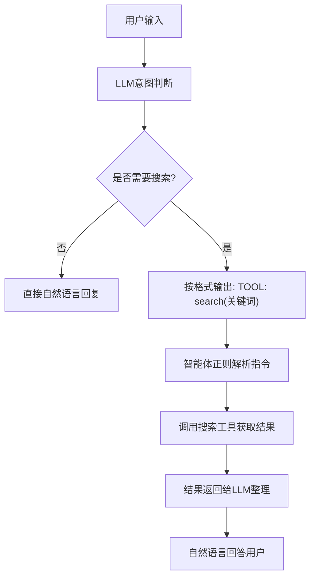

# 第5章 基于联网搜索的智能体能力扩展
## 5.1 搜索工具：智能体的外部知识获取能力
### 5.1.1 搜索工具的核心定位
大语言模型（LLM）本身存在**知识截止时间限制**与**实时信息缺失**问题，无法直接获取新闻、动态数据、外部知识等内容。**搜索工具**是智能体接入互联网的核心入口，相当于智能体的“外部眼睛”，用于突破本地知识库边界。

### 5.1.2 搜索工具的典型应用场景
- 获取**实时信息**：最新新闻、热点事件、行业动态
- 查询**时效性数据**：天气、股价、赛事结果、节假日安排
- 补充**外部知识**：百科信息、技术文档、专业资料
- 回答**本地无法解答**的开放域问题

### 5.1.3 工具调用的通用执行流程
所有工具（计算、天气、搜索等）均遵循统一执行链路：



## 5.2 免费开源搜索接口实现
本章采用**公开可调用、无需额外API Key**的开源搜索方案，降低入门门槛，保证代码可直接运行。
> 国内可能延迟很大，建议注册商用API以获得更快响应，或者准备好梯子。

### 5.2.1 搜索工具函数（工程化版本）
```python
import requests

def web_search(query: str, max_results: int = 3) -> str:
    """
    开源联网搜索工具（SearXNG 公开接口）
    无需API Key，可直接调用
    :param query: 搜索关键词/问题
    :param max_results: 最大返回结果数
    :return: 格式化搜索摘要
    """
    if not query or len(query.strip()) == 0:
        return "❌ 请输入有效的搜索内容"

    # 公开 节点（无需密钥）
    url = "https://search.inetol.net/search"

    params = {
        "q": query.strip(),
        "format": "json",
        "language": "zh-CN",
        "safesearch": 0,
    }

    try:
        resp = requests.get(url, params=params, timeout=15)
        resp.raise_for_status()
        data = resp.json()

        results = []
        for item in data.get("results", [])[:max_results]:
            title = item.get("title", "无标题")
            content = item.get("content", "无摘要")
            results.append(f"【标题】{title}\n【摘要】{content}\n")

        if not results:
            return "🔍 未搜索到相关结果"

        return "\n".join(results)

    except requests.exceptions.Timeout:
        return "❌ 搜索超时，请稍后重试"
    except requests.exceptions.RequestException as e:
        return f"❌ 网络请求失败：{str(e)}"
    except Exception as e:
        return f"❌ 搜索异常：{str(e)}"
```

### 5.2.2 工具函数独立测试
```python
if __name__ == "__main__":
    print(web_search("2026年人工智能发展趋势"))
```

## 5.3 搜索工具集成的标准化四步法
所有工具扩展均遵循统一工程化流程，可无限复用。

### 5.3.1 步骤1：实现工具函数
编写具备**参数校验、异常处理、结果格式化**的标准函数。
本章对应：`web_search(query)`

### 5.3.2 步骤2：在 System Prompt 中声明工具
明确告诉 LLM 工具名称、作用、调用格式：
```text
3 search(关键词) → 联网搜索，获取实时信息、新闻、外部知识
```

### 5.3.3 步骤3：在工具映射表中注册
```python
tool_map = {
    "calculate": calculate,
    "get_weather": get_weather,
    "search": web_search,
}
```

### 5.3.4 步骤4：全场景测试
```
你：2026年AI领域有哪些新进展？
你：搜索2026年春节时间
你：最近科技圈有什么热点？
```

## 5.4 完整可运行智能体（搜索+天气+计算+长期记忆）
以下为整合后的**工业级多工具智能体**，只需替换通义千问 API Key 即可运行。

```python
import dashscope
import re
import json
import os
import requests

# ====================== 全局配置 ======================
dashscope.api_key = "your api_key"
MEMORY_FILE = "agent_memory.json"
MAX_MEMORY_LENGTH = 20
LLM_MODEL = "qwen-turbo"
LLM_TEMPERATURE = 0.2
# ====================== 工具1：计算器 ======================
def calculate(expression: str) -> str:
    try:
        # 安全字符校验
        allowed = set("0123456789+-*/(). ")
        if not all(c in allowed for c in expression):
            return "❌ 仅支持数字与基础运算符"
        result = eval(expression)
        return f"✅ 计算结果：{result}"
    except ZeroDivisionError:
        return "❌ 除数不能为0"
    except SyntaxError:
        return "❌ 表达式语法错误"
    except:
        return "❌ 计算失败"

# ====================== 工具2：天气查询 ======================
def get_weather(city: str) -> str:
    try:
        city = city.strip()
        url = f"https://wttr.in/{city}?format=3"
        headers = {"User-Agent": "Mozilla/5.0"}
        resp = requests.get(url, headers=headers, timeout=10)
        resp.raise_for_status()
        return f"✅ {resp.text}"
    except:
        return "❌ 天气查询失败"

# ====================== 工具3：联网搜索（新增） ======================
def web_search(query: str, max_results: int = 3) -> str:
    if not query:
        return "❌ 请输入搜索内容"
    url = "https://search.inetol.net/search"
    params = {"q": query, "format": "json", "language": "zh-CN"}
    try:
        resp = requests.get(url, params=params, timeout=15)
        data = resp.json()
        res = []
        for item in data.get("results", [])[:max_results]:
            title = item.get("title", "无标题")
            content = item.get("content", "无摘要")
            res.append(f"【标题】{title}\n【摘要】{content}\n")
        return "\n".join(res) if res else "🔍 未找到结果"
    except:
        return "❌ 搜索服务异常"

# ====================== 长期记忆模块 ======================
def load_memory():
    if os.path.exists(MEMORY_FILE):
        try:
            with open(MEMORY_FILE, "r", encoding="utf-8") as f:
                return json.load(f)
        except:
            return []
    return []

def save_memory(memory):
    try:
        with open(MEMORY_FILE, "w", encoding="utf-8") as f:
            json.dump(memory[-MAX_MEMORY_LENGTH:], f, ensure_ascii=False, indent=2)
    except:
        pass

# ====================== 多工具智能体 ======================
class SearchEnabledAgent:
    def __init__(self):
        self.memory = load_memory()

    def think(self, user_input):
        # 清空记忆指令
        if "清空记忆" in user_input:
            self.memory = []
            save_memory(self.memory)
            return "✅ 记忆已清空"

        system_prompt = {
            "role": "system",
            "content": """
你是具备长期记忆的智能体，可使用三种工具：
1 calculate(数学表达式) → 数学计算
2 get_weather(城市名) → 查询天气
3 search(关键词) → 联网搜索

需要工具时，严格输出：
TOOL: 函数名(参数)
不需要工具则直接自然语言回复。
            """
        }

        messages = [system_prompt] + self.memory
        messages.append({"role": "user", "content": user_input})

        try:
            response = dashscope.Generation.call(
                model=LLM_MODEL,
                messages=messages,
                temperature=LLM_TEMPERATURE,
                top_p=0.5
            )
            return response.output.text
        except:
            return "❌ LLM调用失败"

    def use_tool(self, text):
        pattern = r"TOOL:\s*(\w+)\((.*?)\)"
        match = re.search(pattern, text.strip())
        if not match:
            return None

        tool_name = match.group(1)
        param = match.group(2).strip()

        tool_map = {
            "calculate": calculate,
            "get_weather": get_weather,
            "search": web_search
        }

        if tool_name in tool_map:
            try:
                return tool_map[tool_name](param)
            except:
                return f"❌ 工具{tool_name}执行失败"
        return "❌ 未知工具"

    def run(self):
        print("🧠 智能体已启动（搜索+天气+计算+长期记忆）")
        while True:
            ipt = input("你：")
            if ipt.strip().lower() == "exit":
                print("👋 再见！")
                break

            llm_output = self.think(ipt)
            tool_result = self.use_tool(llm_output)

            if tool_result:
                print("智能体(工具)：", tool_result)
                final = tool_result
            else:
                print("智能体：", llm_output)
                final = llm_output

            self.memory.append({"role": "user", "content": ipt})
            self.memory.append({"role": "assistant", "content": final})
            save_memory(self.memory)

if __name__ == "__main__":
    agent = SearchEnabledAgent()
    agent.run()
```

## 5.5 功能验证与测试用例
### 5.5.1 基础功能测试
```
你：2026年AI有什么新消息？
你：搜索2026年春晚相关信息
你：北京今天天气如何？
你：计算 (88+22)*5
你：介绍一下你自己
```

### 5.5.2 长期记忆+工具联合测试
1. 第一次运行：搜索“2026年春节时间”
2. 退出重启
3. 提问：“我刚才查了什么？结果是什么？”
智能体可正确回忆。

## 5.6 智能体工具扩展万能公式（工业级标准）
任何工具（邮件、股票、画图、数据库、硬件控制）都只需四步：
1. **写一个标准函数**：输入参数 → 输出字符串
2. **完善异常处理与格式**：保证稳定可用
3. **在 System Prompt 中声明**：告诉LLM工具名与用法
4. **在 tool_map 中注册**：建立名称→函数映射

这是**现代智能体系统的核心架构**。

## 5.7 本章总结
1. 搜索工具是智能体获取**实时信息与外部知识**的核心能力；
2. 所有工具遵循统一调用流程，具备高度可扩展性；
3. 本章实现的**三合一工具智能体**已具备基础实用价值；
4. 工具扩展四步法是通用、可复用的工程化方法。