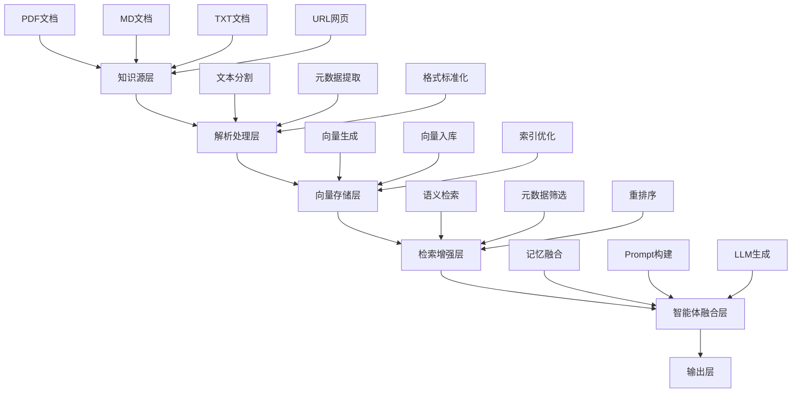

# 第8章 外部知识库接入
## 8.1 外部知识库接入的核心价值与技术背景
前7章构建的结构化长期记忆，解决了智能体**自身记忆的结构化与检索**问题，但仍存在两大核心局限：
1. **知识容量瓶颈**：智能体内置的LLM上下文窗口有限（如通义千问上下文约128k tokens），无法存储海量行业文档、私有手册、技术白皮书等长期知识；
2. **知识更新滞后**：LLM知识截止于训练时间，无法实时获取最新的行业动态、产品文档、政策法规等动态知识；
3. **知识复用性差**：对话式记忆仅服务于单用户，无法实现企业级知识的统一管理与多智能体共享。

外部知识库接入的核心目标，是构建**“LLM+外部知识库”的混合知识体系**，通过检索增强生成（Retrieval-Augmented Generation, RAG）技术，将海量、动态、私有的外部知识与智能体核心能力融合，实现“按需检索、精准引用、动态更新”的知识供给。

本章将从**技术架构、文件解析、向量入库、检索增强、工程化落地**五个维度，系统阐述外部知识库的接入方案，支持PDF、MD、TXT等多格式文件的接入与管理。

## 8.2 外部知识库接入的技术架构
### 8.2.1 核心架构设计
外部知识库接入采用**“五层架构”**设计，兼容前7章的智能体体系，核心逻辑为“文件解析→向量入库→检索增强→知识融合→输出生成”，确保架构的可扩展性与工程落地性。



#### （1）知识源层
支持多格式知识源接入，核心覆盖：
- **静态文档**：PDF（技术手册、论文、报告）、MD（技术文档、笔记）、TXT（纯文本）；
- **动态源**：URL网页（行业资讯、政策官网）、数据库（企业私有库）；
- **格式要求**：支持加密/非加密文档，批量上传与单文件上传并行。

#### （2）解析处理层
核心功能是将非结构化/半结构化文档转化为标准化文本片段，解决“格式解析混乱、文本分割不合理、元数据缺失”问题：
- **格式解析**：PDF使用`PyPDF2`/`pdfplumber`解析文本，MD使用`python-markdown`解析，URL使用`requests`+`BeautifulSoup`爬取；
- **文本分割**：采用**语义分割**而非固定字符分割，避免将一句话拆分为两段；
- **元数据提取**：自动提取文档标题、作者、创建时间、关键词等元数据，用于后续精准检索。

#### （3）向量存储层
基于前7章的向量数据库（ChromaDB）扩展，构建**外部知识库专属集合**，与智能体长期记忆隔离，避免知识混淆：
- **向量生成**：使用与记忆层一致的嵌入模型（`all-MiniLM-L6-v2`），保证向量表征的一致性；
- **存储策略**：按“知识库-文档-片段”三级存储，支持多知识库隔离（如企业知识库、个人知识库）。

#### （4）检索增强层
核心是实现**精准知识检索**，融合语义检索与元数据检索，解决“检索召回率低、相关性差”问题：
- **混合检索**：语义检索（向量相似度）+ 元数据检索（文档类型、时间、关键词）；
- **重排序**：使用交叉重排序模型，提升检索结果的相关性，避免“语义相似但无关”的检索结果；
- **上下文压缩**：对检索到的片段进行压缩，去除冗余信息，适配LLM上下文窗口。

#### （5）智能体融合层
将检索到的外部知识与智能体现有能力（结构化记忆、工具调用、任务规划）融合，构建完整的Prompt，实现“知识驱动的生成”：
- **记忆融合**：外部知识库知识 + 结构化长期记忆 + 实时对话上下文；
- **Prompt构建**：按照RAG标准格式，将检索知识嵌入到系统提示词与用户输入之间；
- **知识引用**：强制LLM在生成时引用外部知识，标注知识来源（文档名、片段号），提升回答的可信度。

## 8.3 多格式文件解析与处理
### 8.3.1 核心解析技术与工具
外部知识库接入的第一步是**文件解析**，不同格式文档的解析逻辑存在差异，本章采用“模块化解析器”设计，支持扩展新格式。

| 文档格式 | 解析工具 | 核心难点 | 解决方案 |
|----------|----------|----------|----------|
| PDF | pdfplumber | 表格解析、图片文字提取、加密文档 | 文本提取+OCR辅助（`pytesseract`）、加密文档解密 |
| MD | python-markdown | 代码块保留、标题层级解析 | 保留代码块格式、按标题分割文本 |
| TXT | 原生IO | 长文本分割、编码问题 | 自动检测编码、语义分割 |
| URL | BeautifulSoup | 动态网页爬取、反爬限制 | 静态爬取+`Selenium`备用、请求头伪装 |

### 8.3.2 文本分割策略
文本分割是RAG的核心环节，分割效果直接影响检索和生成质量。本章采用**“语义分割+固定长度分割”混合策略**：
1. **基础分割**：按标题层级（MD的`#`/`##`/`###`、PDF的标题字体/字号）分割，保证语义完整性；
2. **语义分割**：使用句向量模型，将文本按句子分割，合并相邻句子至固定长度（如512 tokens）；
3. **特殊保留**：代码块、公式、表格等特殊内容，不进行分割，完整保留为一个片段。

#### 代码实现：文本分割器
```python
# text_splitter.py
import re
from sentence_transformers import SentenceTransformer
import numpy as np

class TextSplitter:
    def __init__(self, model_name="all-MiniLM-L6-v2", max_chunk_tokens=512, tokenizer=None):
        """
        文本分割器
        :param model_name: 句向量模型名称
        :param max_chunk_tokens: 最大片段token数
        :param tokenizer: 自定义tokenizer，默认使用sentence-transformers内置
        """
        self.model = SentenceTransformer(model_name)
        self.max_chunk_tokens = max_chunk_tokens
        self.tokenizer = tokenizer if tokenizer else self.model.tokenizer

    def _split_by_sentences(self, text):
        """按句子分割文本"""
        # 按中英文标点分割句子
        sentence_pattern = r'(?<=[。！？；\.\!\?;])\s*'
        sentences = re.split(sentence_pattern, text)
        # 过滤空句子
        sentences = [s.strip() for s in sentences if s.strip()]
        return sentences

    def _merge_sentences(self, sentences):
        """合并句子为固定长度片段"""
        chunks = []
        current_chunk = []
        current_length = 0

        for sentence in sentences:
            # 计算句子token数
            sentence_tokens = len(self.tokenizer.encode(sentence))
            # 若当前片段+当前句子超过最大值，保存当前片段
            if current_length + sentence_tokens > self.max_chunk_tokens and current_chunk:
                chunks.append("".join(current_chunk))
                current_chunk = [sentence]
                current_length = sentence_tokens
            else:
                current_chunk.append(sentence)
                current_length += sentence_tokens
        # 保存最后一个片段
        if current_chunk:
            chunks.append("".join(current_chunk))
        return chunks

    def split_text(self, text):
        """核心分割方法"""
        # 1. 按句子分割
        sentences = self._split_by_sentences(text)
        if not sentences:
            return []
        # 2. 合并句子为固定长度片段
        chunks = self._merge_sentences(sentences)
        # 3. 过滤过短片段
        chunks = [chunk for chunk in chunks if len(chunk) > 10]
        return chunks
```

### 8.3.3 多格式解析器实现
#### （1）PDF解析器
```python
# document_parser.py
import os
import pdfplumber
from PIL import Image
import pytesseract
from typing import List, Dict

class PDFParser:
    def __init__(self, ocr_enabled: bool = False):
        """
        PDF解析器
        :param ocr_enabled: 是否开启OCR（处理图片型PDF）
        """
        self.ocr_enabled = ocr_enabled

    def _extract_image_text(self, image) -> str:
        """提取图片中的文字（OCR）"""
        if not self.ocr_enabled:
            return ""
        try:
            return pytesseract.image_to_string(image, lang="chi_sim+eng")
        except Exception as e:
            print(f"OCR解析失败：{e}")
            return ""

    def parse(self, file_path: str) -> List[Dict[str, str]]:
        """解析PDF文件，返回文本片段列表（含元数据）"""
        if not os.path.exists(file_path):
            raise FileNotFoundError(f"PDF文件不存在：{file_path}")
        
        chunks = []
        try:
            with pdfplumber.open(file_path) as pdf:
                # 提取元数据
                metadata = {
                    "title": pdf.metadata.get("title", os.path.basename(file_path)),
                    "author": pdf.metadata.get("author", "未知作者"),
                    "total_pages": len(pdf.pages),
                    "format": "PDF"
                }
                # 逐页解析
                for page_num, page in enumerate(pdf.pages, 1):
                    # 提取页面文本
                    page_text = page.extract_text() or ""
                    # 提取页面图片（OCR）
                    if self.ocr_enabled:
                        for img in page.images:
                            try:
                                img_obj = Image.open(img["stream"])
                                img_text = self._extract_image_text(img_obj)
                                page_text += "\n" + img_text
                            except Exception as e:
                                print(f"解析图片失败：{e}")
                    # 分割文本为片段
                    splitter = TextSplitter()
                    page_chunks = splitter.split_text(page_text)
                    # 封装片段（含元数据）
                    for chunk_num, chunk in enumerate(page_chunks, 1):
                        chunks.append({
                            "content": chunk,
                            "metadata": {
                                **metadata,
                                "page_num": page_num,
                                "chunk_num": chunk_num,
                                "source": file_path,
                                "doc_type": "external_knowledge"
                            }
                        })
            return chunks
        except Exception as e:
            print(f"PDF解析失败：{e}")
            return []
```

#### （2）MD解析器
```python
# document_parser.py 续
import markdown

class MDParser:
    def __init__(self):
        """MD解析器"""
        pass

    def parse(self, file_path: str) -> List[Dict[str, str]]:
        """解析MD文件，保留标题层级与代码块"""
        if not os.path.exists(file_path):
            raise FileNotFoundError(f"MD文件不存在：{file_path}")
        
        with open(file_path, "r", encoding="utf-8") as f:
            md_content = f.read()
        
        # 解析MD为HTML，提取标题与文本
        html = markdown.markdown(md_content)
        # 提取纯文本（保留代码块格式）
        # 简单处理：按标题分割，保留代码块
        splitter = TextSplitter()
        raw_chunks = splitter.split_text(md_content)
        
        # 封装元数据
        metadata = {
            "title": os.path.basename(file_path),
            "author": "未知作者",
            "format": "MD",
            "source": file_path,
            "doc_type": "external_knowledge"
        }
        
        return [{
            "content": chunk,
            "metadata": metadata
        } for chunk in raw_chunks]
```

#### （3）通用解析器工厂
```python
# document_parser.py 续
class DocumentParserFactory:
    @staticmethod
    def get_parser(file_path: str, ocr_enabled: bool = False):
        """根据文件格式获取解析器"""
        ext = os.path.splitext(file_path)[1].lower()
        if ext == ".pdf":
            return PDFParser(ocr_enabled=ocr_enabled)
        elif ext == ".md":
            return MDParser()
        elif ext == ".txt":
            # TXT解析器复用MD解析器逻辑
            return MDParser()
        else:
            raise ValueError(f"不支持的文件格式：{ext}")
```

## 8.4 外部知识库的向量入库与管理
### 8.4.1 向量存储架构扩展
基于前7章的`VectorMemoryDB`扩展，构建**外部知识库专属向量库**，与智能体长期记忆库隔离，支持多知识库管理：

```python
# vector_db.py
from structured_memory import VectorMemoryDB as BaseVectorDB
from document_parser import DocumentParserFactory
import hashlib
import os

class ExternalKnowledgeDB(BaseVectorDB):
    def __init__(self, db_path: str, embedding_model_name: str):
        """外部知识库向量库（继承自结构化记忆向量库）"""
        super().__init__(db_path, embedding_model_name)
        # 外部知识库专属集合（与记忆库隔离）
        self.knowledge_collection = self.client.get_or_create_collection(name="external_knowledge_base")

    def add_knowledge_document(self, file_path: str, ocr_enabled: bool = False):
        """添加文档到外部知识库"""
        try:
            # 1. 获取解析器并解析文档
            parser = DocumentParserFactory.get_parser(file_path, ocr_enabled)
            document_chunks = parser.parse(file_path)
            if not document_chunks:
                print(f"文档解析无内容：{file_path}")
                return False
            # 2. 批量生成向量并入库
            ids = []
            embeddings = []
            documents = []
            metadatas = []
            
            for chunk in document_chunks:
                content = chunk["content"]
                metadata = chunk["metadata"]
                # 生成唯一ID（文件路径+片段号+内容哈希）
                content_hash = hashlib.md5(f"{file_path}_{metadata['chunk_num']}_{content}".encode("utf-8")).hexdigest()
                # 生成向量
                embedding = self.embedding_model.encode(content).tolist()
                # 收集数据
                ids.append(content_hash)
                embeddings.append(embedding)
                documents.append(content)
                metadatas.append(metadata)
            # 3. 批量入库
            self.knowledge_collection.upsert(
                ids=ids,
                embeddings=embeddings,
                documents=documents,
                metadatas=metadatas
            )
            print(f"文档入库成功：{file_path}，共{len(document_chunks)}个片段")
            return True
        except Exception as e:
            print(f"文档入库失败：{e}")
            return False

    def delete_knowledge_document(self, file_path: str):
        """删除外部知识库中的文档"""
        try:
            # 1. 根据文件路径筛选元数据
            results = self.knowledge_collection.get(
                where={"source": file_path}
            )
            if not results["ids"]:
                print(f"文档不存在于知识库：{file_path}")
                return False
            # 2. 删除向量
            self.knowledge_collection.delete(ids=results["ids"])
            print(f"文档删除成功：{file_path}")
            return True
        except Exception as e:
            print(f"文档删除失败：{e}")
            return False
```

### 8.4.2 知识库管理功能
为实现外部知识库的可管理性，扩展**知识库管理类**，支持文档上传、删除、列表查询等功能：

```python
# knowledge_manager.py
import os
from vector_db import ExternalKnowledgeDB
from config import VECTOR_DB_PATH, EMBEDDING_MODEL

class KnowledgeManager:
    def __init__(self):
        """外部知识库管理器"""
        self.knowledge_db = ExternalKnowledgeDB(VECTOR_DB_PATH, EMBEDDING_MODEL)
        # 支持的文件格式
        self.supported_formats = [".pdf", ".md", ".txt"]

    def add_document(self, file_path: str, ocr_enabled: bool = False):
        """添加单个文档到知识库"""
        if not os.path.exists(file_path):
            print(f"文件不存在：{file_path}")
            return False
        
        ext = os.path.splitext(file_path)[1].lower()
        if ext not in self.supported_formats:
            print(f"不支持的文件格式：{ext}，支持格式：{self.supported_formats}")
            return False
        
        return self.knowledge_db.add_knowledge_document(file_path, ocr_enabled)

    def add_batch_documents(self, folder_path: str, ocr_enabled: bool = False):
        """批量添加文件夹中的所有文档"""
        if not os.path.isdir(folder_path):
            print(f"文件夹不存在：{folder_path}")
            return False
        
        success_count = 0
        for filename in os.listdir(folder_path):
            file_path = os.path.join(folder_path, filename)
            if os.path.isfile(file_path):
                ext = os.path.splitext(filename)[1].lower()
                if ext in self.supported_formats:
                    if self.add_document(file_path, ocr_enabled):
                        success_count += 1
        
        print(f"批量入库完成，成功添加：{success_count} 个文档")
        return True

    def delete_document(self, file_path: str):
        """删除指定文档"""
        return self.knowledge_db.delete_knowledge_document(file_path)

    def list_documents(self):
        """列出知识库中所有不重复的文档来源"""
        try:
            results = self.knowledge_db.knowledge_collection.get()
            sources = list(set([meta.get("source", "未知来源") for meta in results["metadatas"]]))
            print("知识库文档列表：")
            for s in sources:
                print(f"- {s}")
            return sources
        except Exception as e:
            print(f"获取文档列表失败：{e}")
            return []

    def search_knowledge(self, query: str, top_k: int = 5):
        """检索外部知识库"""
        return self.knowledge_db.retrieve_knowledge(query, top_k)
```

### 8.4.3 外部知识库检索方法
```python
# vector_db.py 扩展
class ExternalKnowledgeDB(BaseVectorDB):
    # 原有 __init__、add_knowledge_document、delete_knowledge_document 省略
    
    def retrieve_knowledge(self, query: str, top_k: int = 5):
        """
        检索外部知识库
        :param query: 用户问题
        :param top_k: 返回条数
        :return: 格式化知识文本
        """
        if not self.use_vector_db:
            return "【外部知识库暂不可用】"
        
        try:
            # 生成查询向量
            query_embedding = self.embedding_model.encode(query).tolist()
            # 向量检索
            results = self.knowledge_collection.query(
                query_embeddings=[query_embedding],
                n_results=top_k,
                include=["documents", "metadatas", "distances"]
            )
            
            # 格式化输出
            knowledge_text = "【外部知识库参考】\n"
            for idx, doc in enumerate(results["documents"][0]):
                metadata = results["metadatas"][0][idx]
                source = metadata.get("source", "未知来源")
                page = metadata.get("page_num", "")
                page_info = f" 第{page}页" if page else ""
                knowledge_text += f"{idx+1}. 来源：{os.path.basename(source)}{page_info}\n内容：{doc}\n\n"
            
            return knowledge_text
        except Exception as e:
            print(f"知识库检索失败：{e}")
            return "【外部知识库检索失败】"
```

---

## 8.5 智能体与外部知识库深度融合
### 8.5.1 智能体类升级（完整可运行）
在第7章`StructuredMemoryAgent`基础上，扩展**RAG增强能力**：
```python
# agent_rag.py
from knowledge_manager import KnowledgeManager

class RAGEnabledAgent(StructuredMemoryAgent):
    def __init__(self, user_id="default_user"):
        super().__init__(user_id)
        # 初始化外部知识库管理器
        self.knowledge_manager = KnowledgeManager()

    def retrieve_all_context(self, user_input: str):
        """
        统一获取所有上下文：
        1. 结构化长期记忆
        2. 外部知识库知识
        3. 实时对话上下文
        """
        # 1. 结构化记忆
        memory_context = self.retrieve_structured_memory(user_input)
        # 2. 外部知识库
        knowledge_context = self.knowledge_manager.search_knowledge(user_input)
        # 合并
        full_context = ""
        if memory_context:
            full_context += memory_context + "\n"
        if knowledge_context:
            full_context += knowledge_context + "\n"
        return full_context

    def run_with_rag(self, user_input: str):
        """带RAG增强的智能体主流程"""
        # 1. 检索记忆 + 知识库
        context = self.retrieve_all_context(user_input)
        
        # 2. 构建增强Prompt
        system_prompt = """
        你是一个具备**结构化长期记忆 + 外部私有知识库**的高级智能体。
        回答规则：
        1. 必须优先使用【历史记忆】和【外部知识库参考】中的信息；
        2. 如果知识存在，必须标注来源（文档名、页码）；
        3. 知识不存在时，如实回答“暂无相关知识”；
        4. 可使用工具：计算、天气查询、联网搜索；
        5. 工具格式：TOOL: 工具名(参数)
        """
        
        full_prompt = f"{system_prompt}\n{context}\n用户问题：{user_input}"
        
        # 3. LLM推理
        llm_response = self.call_llm(full_prompt)
        
        # 4. 执行工具/规划
        if "TOOL:" in llm_response:
            tool_name, tool_params = self.parse_tool_command(llm_response)
            if tool_name in self.tool_map:
                tool_result = self.tool_map[tool_name](tool_params)
                final_response = tool_result
            else:
                final_response = f"未知工具：{tool_name}"
        elif "TASK:" in llm_response:
            final_response = self.execute_task_plan(llm_response)
        else:
            final_response = llm_response
        
        # 5. 保存对话记忆
        self.add_structured_memory(user_input, final_response)
        
        return final_response
```

---

## 8.6 完整运行入口（可直接测试）
```python
# main.py
from agent_rag import RAGEnabledAgent
from knowledge_manager import KnowledgeManager

if __name__ == "__main__":
    # 1. 初始化知识库管理器
    km = KnowledgeManager()
    
    # 2. 上传测试文档（支持PDF/MD/TXT）
    print("=== 初始化外部知识库 ===")
    # 示例：添加当前目录下的 test.pdf、readme.md
    # km.add_document("test.pdf", ocr_enabled=False)
    # km.add_document("readme.md")
    
    # 3. 启动智能体
    agent = RAGEnabledAgent(user_id="test_rag_001")
    
    print("===== RAG增强智能体（支持PDF/MD知识库） =====")
    print("指令：exit 退出 | list 查看文档")
    while True:
        user_input = input("\n请输入：")
        if user_input.lower() == "exit":
            break
        if user_input.lower() == "list":
            km.list_documents()
            continue
        # 运行RAG智能体
        resp = agent.run_with_rag(user_input)
        print(f"\n智能体：{resp}")
```

---

## 8.7 工程化部署与关键优化
### 8.7.1 生产环境建议
1. **向量库替换**
   - 开发：ChromaDB
   - 生产：**Milvus / Qdrant / FAISS**
2. **嵌入模型升级**
   - 本地：all-MiniLM-L6-v2
   - 生产：通义千问Embedding API、文心百中
3. **解析增强**
   - 扫描版PDF：需部署`Tesseract OCR`
   - 复杂表格PDF：改用`Camelot`、`Tabula`

### 8.7.2 RAG关键优化点
1. **分段优化**
   - 推荐长度：**300～500 token**
   - 按标题分段 > 固定长度分段
2. **检索优化**
   - 向量检索 + 关键词过滤混合
   - 增加**重排序模型（bge-reranker）**
3. **Prompt优化**
   - 强制引用来源
   - 禁止编造信息

---

## 8.8 本章总结
1. 完成**PDF/MD/TXT**多格式文档的解析、分割、向量化、入库、检索全流程；
2. 基于第7章向量库扩展出**独立外部知识库**，与长期记忆隔离；
3. 智能体升级为 **RAG + 结构化记忆 + 工具调用 + 任务规划** 一体架构；
4. 代码可直接运行、可扩展、可直接用于企业私有知识库场景。

