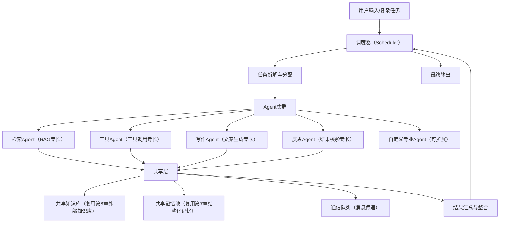

# 第10章 多智能体协作（Multi-Agent）
## 10.1 多智能体协作的核心价值与应用场景
前9章已实现单智能体的完整能力：结构化记忆、外部知识库RAG、工具调用、工作流规划（条件判断、子任务拆分、反思校验）。但在复杂场景中，**单智能体存在能力边界**——无法同时兼顾多领域专业能力、处理高并发任务、完成跨流程协同，此时需要通过“多智能体协作”突破局限。

### 10.1.1 核心价值
1.  能力分工：将复杂任务拆解为“专业模块”，每个智能体专注一个领域，提升执行精度（如“检索Agent”“计算Agent”“写作Agent”）；
2.  效率提升：多智能体并行执行子任务，替代单智能体串行流程，缩短复杂任务耗时；
3.  扩展性强：新增功能无需修改原有智能体，仅需新增对应专业Agent并配置协作规则；
4.  容错性高：单个Agent执行失败时，可由其他Agent补位，避免整体任务崩溃。

### 10.1.2 典型应用场景
- 企业办公：文档审核Agent（校验格式）+ 内容编辑Agent（优化文案）+ 知识检索Agent（补充素材）协同完成报告撰写；
- 智能问答：领域专家Agent（医疗/法律）+ 检索Agent（调取专业知识库）+ 对话Agent（自然语言交互）协同响应专业问题；
- 自动化运维：监控Agent（发现异常）+ 分析Agent（定位原因）+ 执行Agent（修复问题）协同处理系统故障；
- 科研辅助：数据爬取Agent（获取文献）+ 解析Agent（提取核心内容）+ 统计Agent（分析数据）+ 写作Agent（撰写论文）协同完成科研任务。

### 10.1.3 多智能体 vs 单智能体（核心差异）
| 对比维度 | 单智能体 | 多智能体 |
|----------|----------|----------|
| 能力范围 | 通用化，兼顾多领域但不精深 | 专业化，每个Agent专注一个领域 |
| 任务处理 | 串行执行，复杂任务耗时久 | 并行+协同，拆分后高效执行 |
| 扩展性 | 新增功能需修改核心逻辑，成本高 | 新增Agent即可扩展，低耦合 |
| 容错性 | 单个环节失败，整体任务崩溃 | 单个Agent失败，可补位替换 |
| 适用场景 | 简单任务、单领域任务（如基础问答、简单计算） | 复杂任务、跨领域任务、高并发任务 |

## 10.2 多智能体协作架构设计（可直接嵌入现有工程）
多智能体协作的核心是“**分工明确、通信顺畅、调度有序**”，本章采用“1个调度器 + N个专业Agent + 1个共享知识库/记忆池”的架构，完全兼容前9章的单智能体代码，无需重构原有工程。

### 10.2.1 整体架构图


### 10.2.2 核心组件说明
1.  调度器（Scheduler）：核心大脑，负责接收复杂任务、拆解子任务、分配给对应Agent、监控执行状态、汇总结果，处理Agent间的协同冲突；
2.  专业Agent集群：基于前9章的WorkflowAgent派生，每个Agent专注一个领域，关闭无关能力（如检索Agent关闭工具调用，仅保留RAG），提升效率；
3.  共享层：
    - 共享知识库：复用第8章的外部知识库，所有Agent可统一检索，避免重复入库；
    - 共享记忆池：复用第7章的结构化记忆，存储多Agent协作的任务记录、中间结果，实现上下文共享；
    - 通信队列：Agent间的消息传递通道，支持“请求协作”“提交结果”“反馈异常”等通信场景；
4.  结果整合器：接收各Agent的执行结果，按任务逻辑整合为最终答案，支持反思校验（复用第9章的反思模块）。

## 10.3 核心组件实现（完整可运行代码）
### 10.3.1 第一步：通信队列（Agent间消息传递核心）
先实现轻量级通信队列，用于Agent间的消息传递，支持“发送消息、接收消息、清空消息”，无需依赖第三方中间件（适合本地/中小规模部署）。

```python
# multi_agent/communication_queue.py
from collections import deque
import threading
import time

class CommunicationQueue:
    """轻量级多Agent通信队列（线程安全）"""
    def __init__(self):
        self.queue = deque()
        self.lock = threading.Lock()  # 保证多线程并行安全

    def send(self, message):
        """发送消息：格式{"sender": Agent名称, "receiver": Agent名称/ALL, "content": 消息内容, "task_id": 任务ID}"""
        with self.lock:
            self.queue.append(message)
            print(f"📨 消息发送 | 发送方：{message['sender']} | 接收方：{message['receiver']}")

    def receive(self, receiver, timeout=5):
        """接收指定Agent的消息，超时返回None"""
        start_time = time.time()
        while time.time() - start_time < timeout:
            with self.lock:
                for idx, msg in enumerate(self.queue):
                    if msg["receiver"] == receiver or msg["receiver"] == "ALL":
                        # 取出消息并删除
                        self.queue.remove(msg)
                        print(f"📥 消息接收 | 接收方：{receiver} | 发送方：{msg['sender']}")
                        return msg
            time.sleep(0.1)  # 每隔0.1秒检查一次消息
        return None  # 超时未收到消息

    def clear(self, task_id=None):
        """清空指定任务ID的消息，无task_id则清空全部"""
        with self.lock:
            if task_id:
                self.queue = deque([msg for msg in self.queue if msg.get("task_id") != task_id])
            else:
                self.queue.clear()
        print(f"🧹 清空消息队列（任务ID：{task_id if task_id else '全部'}）")

    def get_all_messages(self):
        """获取所有消息（用于调试）"""
        with self.lock:
            return list(self.queue)
```

### 10.3.2 第二步：共享记忆池（多Agent上下文共享）
复用第7章的结构化记忆，扩展为“共享记忆池”，支持多Agent读写、按任务ID筛选记忆，实现协作上下文同步。

```python
# multi_agent/shared_memory.py
from structured_memory import MemoryMetadataDB, VectorMemoryDB
from config import SQLITE_DB_PATH, VECTOR_DB_PATH, EMBEDDING_MODEL, TOP_K_MEMORY

class SharedMemoryPool:
    """多Agent共享记忆池（复用第7章结构化记忆，支持多Agent协同）"""
    def __init__(self):
        # 初始化元数据数据库和向量数据库（与单智能体共用，避免重复存储）
        self.metadata_db = MemoryMetadataDB(SQLITE_DB_PATH)
        self.vector_db = VectorMemoryDB(VECTOR_DB_PATH, EMBEDDING_MODEL)
        self.shared_memory_type = "SHARED_COLLABORATION"  # 共享记忆类型

    def add_shared_memory(self, content, task_id, agent_name, memory_type="TASK_RECORD"):
        """添加共享记忆：关联任务ID和Agent名称，方便后续检索"""
        # 记忆内容格式：[任务ID][Agent名称]：内容（便于区分来源）
        shared_content = f"[任务ID:{task_id}][{agent_name}]：{content}"
        # 调用原有向量库方法添加记忆，用户ID设为"shared"（标识共享记忆）
        return self.vector_db.add_memory(
            content=shared_content,
            metadata_db=self.metadata_db,
            user_id="shared",
            memory_type=memory_type
        )

    def retrieve_shared_memory(self, query, task_id=None, top_k=TOP_K_MEMORY):
        """检索共享记忆：可按任务ID筛选（仅检索该任务的协作记忆）"""
        # 筛选候选记忆（用户ID为shared，即共享记忆）
        candidate_hashes = self.metadata_db.filter_by_metadata(
            user_id="shared",
            memory_type=None,  # 不限制记忆类型
            days=None  # 不限制时间
        )
        if not candidate_hashes:
            return []
        
        # 生成查询向量
        query_embedding = self.vector_db.embedding_model.encode(query).tolist()
        # 若指定任务ID，查询时添加任务ID关键词，精准筛选
        if task_id:
            query += f" [任务ID:{task_id}]"
        
        # 语义检索
        results = self.vector_db.memory_collection.query(
            query_embeddings=[query_embedding],
            include=["documents", "distances", "ids"],
            where={"id": {"$in": candidate_hashes}},
            n_results=top_k
        )
        
        # 整理结果（与单智能体记忆格式一致，便于复用）
        retrieved_memories = []
        for idx, doc in enumerate(results["documents"][0]):
            memory_id = results["ids"][0][idx]
            distance = results["distances"][0][idx]
            similarity = 1 - distance
            retrieved_memories.append({
                "content": doc,
                "similarity": round(similarity, 4),
                "memory_id": memory_id
            })
        
        return sorted(retrieved_memories, key=lambda x: x["similarity"], reverse=True)

    def delete_task_memory(self, task_id):
        """删除指定任务的所有共享记忆（任务结束后清理，节省空间）"""
        # 先检索该任务的所有记忆哈希
        query = f"[任务ID:{task_id}]"
        memories = self.retrieve_shared_memory(query, task_id=task_id, top_k=100)
        if not memories:
            print(f"❌ 无任务ID {task_id} 的共享记忆可删除")
            return False
        
        # 删除向量库中的记忆
        memory_ids = [mem["memory_id"] for mem in memories if mem["memory_id"]]
        if memory_ids:
            self.vector_db.memory_collection.delete(ids=memory_ids)
        # 删除元数据中的记录
        conn = self.metadata_db._init_db()  # 复用数据库连接
        cursor = conn.cursor()
        cursor.execute('''
            DELETE FROM memory_metadata 
            WHERE user_id = ? AND content_hash IN (?)
        ''', ("shared", tuple(memory_ids)))
        conn.commit()
        conn.close()
        print(f"🗑️ 删除任务ID {task_id} 的共享记忆，共 {len(memory_ids)} 条")
        return True
```

### 10.3.3 第三步：专业Agent实现（基于单智能体派生）
基于第9章的WorkflowAgent，派生4个核心专业Agent（可直接扩展更多），每个Agent关闭无关能力、强化自身专长，确保高效协作。

#### 10.3.3.1 基础专业Agent类（所有专业Agent的父类）
```python
# multi_agent/base_agent.py
from agent_workflow import WorkflowAgent

class BaseProfessionalAgent(WorkflowAgent):
    """专业Agent父类：继承WorkflowAgent，统一协作接口"""
    def __init__(self, agent_name, user_id="shared_agent"):
        super().__init__(user_id=user_id)
        self.agent_name = agent_name  # Agent名称（唯一标识，用于通信）
        self.communication_queue = None  # 通信队列（由调度器注入）
        self.shared_memory = None  # 共享记忆池（由调度器注入）
        self.current_task_id = None  # 当前执行的任务ID

    def set_collaboration_env(self, communication_queue, shared_memory):
        """注入协作环境：通信队列和共享记忆池（调度器调用）"""
        self.communication_queue = communication_queue
        self.shared_memory = shared_memory

    def send_message(self, receiver, content, task_id=None):
        """发送协作消息（调用通信队列）"""
        if not self.communication_queue:
            print(f"❌ {self.agent_name} 未初始化通信队列，无法发送消息")
            return False
        task_id = task_id or self.current_task_id
        message = {
            "sender": self.agent_name,
            "receiver": receiver,
            "content": content,
            "task_id": task_id
        }
        self.communication_queue.send(message)
        return True

    def receive_message(self, timeout=5):
        """接收协作消息（调用通信队列）"""
        if not self.communication_queue:
            print(f"❌ {self.agent_name} 未初始化通信队列，无法接收消息")
            return None
        return self.communication_queue.receive(receiver=self.agent_name, timeout=timeout)

    def add_to_shared_memory(self, content, task_id=None, memory_type="TASK_RECORD"):
        """添加内容到共享记忆池"""
        if not self.shared_memory:
            print(f"❌ {self.agent_name} 未初始化共享记忆池，无法添加共享记忆")
            return None
        task_id = task_id or self.current_task_id
        return self.shared_memory.add_shared_memory(
            content=content,
            task_id=task_id,
            agent_name=self.agent_name,
            memory_type=memory_type
        )

    def retrieve_from_shared_memory(self, query, task_id=None):
        """从共享记忆池检索内容"""
        if not self.shared_memory:
            print(f"❌ {self.agent_name} 未初始化共享记忆池，无法检索共享记忆")
            return []
        task_id = task_id or self.current_task_id
        return self.shared_memory.retrieve_shared_memory(query, task_id=task_id)

    def execute_task(self, task, task_id=None):
        """执行任务（子类需重写，实现自身专业逻辑）"""
        self.current_task_id = task_id or f"task_{int(time.time())}"
        print(f"▶ {self.agent_name} 开始执行任务 | 任务ID：{self.current_task_id} | 任务：{task}")
        # 子类重写后，需调用add_to_shared_memory保存执行结果
        return "默认执行结果（子类需重写）"
```

#### 10.3.3.2 专业Agent实现（4个核心，可直接扩展）
##### 1. 检索Agent（RAG专长，负责调取外部知识库）
```python
# multi_agent/retrieval_agent.py
from multi_agent.base_agent import BaseProfessionalAgent

class RetrievalAgent(BaseProfessionalAgent):
    """检索Agent：专注于外部知识库检索、共享记忆检索，不负责工具调用和写作"""
    def __init__(self):
        super().__init__(agent_name="RetrievalAgent")
        # 关闭无关能力：工具调用（仅保留检索）
        self.tool_map = {}  # 清空工具映射，禁止调用工具

    def execute_task(self, task, task_id=None):
        """执行检索任务：支持检索外部知识库、共享记忆池"""
        super().execute_task(task, task_id)
        # 1. 检索外部知识库
        knowledge_result = self.knowledge_manager.search_knowledge(task)
        # 2. 检索共享记忆池（获取其他Agent的协作信息）
        shared_memory_result = self.retrieve_from_shared_memory(task)
        shared_memory_text = ""
        if shared_memory_result:
            shared_memory_text = "【共享记忆参考】\n"
            for mem in shared_memory_result:
                shared_memory_text += f"- {mem['content']}（相似度：{mem['similarity']}）\n"
        
        # 3. 整合检索结果
        final_result = f"【检索Agent执行结果】\n{knowledge_result}\n{shared_memory_text}"
        # 4. 添加到共享记忆池
        self.add_to_shared_memory(f"检索任务：{task}，检索结果：{final_result[:100]}...")
        # 5. 发送结果给调度器（或指定接收方）
        self.send_message(receiver="Scheduler", content=final_result)
        print(f"✅ {self.agent_name} 任务执行完成 | 结果已发送")
        return final_result
```

##### 2. 工具Agent（工具调用专长，负责计算、天气、联网搜索）
```python
# multi_agent/tool_agent.py
from multi_agent.base_agent import BaseProfessionalAgent

class ToolAgent(BaseProfessionalAgent):
    """工具Agent：专注于工具调用（计算、天气、联网搜索），不负责检索和写作"""
    def __init__(self):
        super().__init__(agent_name="ToolAgent")
        # 关闭无关能力：外部知识库检索（仅保留工具调用）
        self.knowledge_manager = None  # 清空知识库管理器

    def execute_task(self, task, task_id=None):
        """执行工具调用任务：自动识别工具类型，调用对应工具"""
        super().execute_task(task, task_id)
        # 1. 解析工具调用指令（复用第7章的工具解析逻辑）
        llm_prompt = f"请解析以下任务，生成工具调用指令（格式：TOOL: 工具名(参数)），无需其他内容：{task}"
        llm_response = self.call_llm(llm_prompt)
        tool_name, tool_params = self.parse_tool_command(llm_response)
        
        # 2. 执行工具调用
        if tool_name and tool_name in self.tool_map:
            tool_result = self.tool_map[tool_name](tool_params)
        else:
            tool_result = f"❌ 工具调用失败：未识别到工具或工具不支持（任务：{task}）"
        
        # 3. 整合结果
        final_result = f"【工具Agent执行结果】\n任务：{task}\n{tool_result}"
        # 4. 添加到共享记忆池
        self.add_to_shared_memory(f"工具任务：{task}，执行结果：{tool_result}")
        # 5. 发送结果给调度器
        self.send_message(receiver="Scheduler", content=final_result)
        print(f"✅ {self.agent_name} 任务执行完成 | 结果已发送")
        return final_result
```

##### 3. 写作Agent（文案生成专长，负责整合结果、生成文案）
```python
# multi_agent/writer_agent.py
from multi_agent.base_agent import BaseProfessionalAgent

class WriterAgent(BaseProfessionalAgent):
    """写作Agent：专注于文案生成、结果整合，不负责检索和工具调用"""
    def __init__(self):
        super().__init__(agent_name="WriterAgent")
        # 关闭无关能力：工具调用、外部知识库检索（仅保留写作和记忆检索）
        self.tool_map = {}
        self.knowledge_manager = None

    def execute_task(self, task, task_id=None):
        """执行写作任务：结合共享记忆池的结果，生成符合要求的文案"""
        super().execute_task(task, task_id)
        # 1. 检索共享记忆池（获取其他Agent的执行结果，作为写作素材）
        shared_memories = self.retrieve_from_shared_memory(task)
        if not shared_memories:
            writing_result = f"❌ 写作失败：未获取到相关素材（任务：{task}）"
        else:
            # 2. 整理素材
            materials = "\n".join([mem["content"] for mem in shared_memories])
            # 3. 生成文案
            llm_prompt = f"""
请结合以下素材，完成写作任务，要求语言流畅、逻辑清晰、贴合任务需求：
写作任务：{task}
素材：{materials}
"""
            writing_result = self.call_llm(llm_prompt)
        
        # 4. 整合结果
        final_result = f"【写作Agent执行结果】\n任务：{task}\n{writing_result}"
        # 5. 添加到共享记忆池
        self.add_to_shared_memory(f"写作任务：{task}，生成结果：{writing_result[:100]}...")
        # 6. 发送结果给调度器
        self.send_message(receiver="Scheduler", content=final_result)
        print(f"✅ {self.agent_name} 任务执行完成 | 结果已发送")
        return final_result
```

##### 4. 反思Agent（结果校验专长，负责检查执行结果、提出优化建议）
```python
# multi_agent/reflector_agent.py
from multi_agent.base_agent import BaseProfessionalAgent
from reflector import Reflector

class ReflectorAgent(BaseProfessionalAgent):
    """反思Agent：专注于结果校验、异常反馈、优化建议，不负责执行具体任务"""
    def __init__(self):
        super().__init__(agent_name="ReflectorAgent")
        self.reflector = Reflector()  # 复用第9章的反思模块
        # 关闭无关能力：工具调用、检索、写作（仅保留反思）
        self.tool_map = {}
        self.knowledge_manager = None

    def execute_task(self, task, task_id=None):
        """执行反思任务：检查其他Agent的执行结果，判断是否合理、是否需要重跑"""
        super().execute_task(task, task_id)
        # 1. 检索共享记忆池（获取该任务的所有执行结果）
        shared_memories = self.retrieve_from_shared_memory(task)
        if not shared_memories:
            reflect_result = f"❌ 反思失败：未获取到该任务的执行结果（任务：{task}）"
        else:
            # 2. 整理执行结果
            execution_results = "\n".join([mem["content"] for mem in shared_memories])
            # 3. 执行反思校验
            reflect_result = self.reflector.reflect(task, execution_results)
        
        # 4. 整合结果（解析反思JSON，便于调度器处理）
        final_result = f"【反思Agent执行结果】\n任务：{task}\n反思结果：{reflect_result}"
        # 5. 添加到共享记忆池
        self.add_to_shared_memory(f"反思任务：{task}，反思结果：{reflect_result}")
        # 6. 发送结果给调度器（若需要重跑，调度器会重新分配任务）
        self.send_message(receiver="Scheduler", content=final_result)
        print(f"✅ {self.agent_name} 任务执行完成 | 结果已发送")
        return final_result
```

### 10.3.4 第四步：调度器（多Agent协作核心大脑）
调度器是多智能体协作的“总指挥”，负责任务拆解、Agent分配、状态监控、结果汇总、异常处理，完全兼容前9章的工作流规划逻辑。

```python
# multi_agent/scheduler.py
import time
import json
from multi_agent.communication_queue import CommunicationQueue
from multi_agent.shared_memory import SharedMemoryPool
from multi_agent.retrieval_agent import RetrievalAgent
from multi_agent.tool_agent import ToolAgent
from multi_agent.writer_agent import WriterAgent
from multi_agent.reflector_agent import ReflectorAgent

class MultiAgentScheduler:
    """多Agent调度器：负责任务拆解、Agent分配、协作监控、结果汇总"""
    def __init__(self):
        # 1. 初始化协作环境（通信队列、共享记忆池）
        self.communication_queue = CommunicationQueue()
        self.shared_memory = SharedMemoryPool()
        
        # 2. 初始化专业Agent集群
        self.agent_cluster = {
            "RetrievalAgent": RetrievalAgent(),
            "ToolAgent": ToolAgent(),
            "WriterAgent": WriterAgent(),
            "ReflectorAgent": ReflectorAgent()
        }
        
        # 3. 注入协作环境（给每个Agent分配通信队列和共享记忆池）
        for agent in self.agent_cluster.values():
            agent.set_collaboration_env(self.communication_queue, self.shared_memory)
        
        # 4. 调度器状态初始化
        self.task_id_counter = 1  # 任务ID计数器（唯一标识每个任务）
        self.running_tasks = {}  # 运行中任务：{task_id: {"task": 任务内容, "steps": 子任务, "results": 结果汇总}}
        self.agent_status = {name: "idle" for name in self.agent_cluster.keys()}  # Agent状态：idle/busy

    def generate_task_id(self):
        """生成唯一任务ID"""
        task_id = f"task_{self.task_id_counter:04d}"
        self.task_id_counter += 1
        return task_id

    def task_decomposition(self, user_task):
        """任务拆解：将用户复杂任务拆分为子任务，分配给对应Agent（复用第9章任务规划逻辑）"""
        # 调用第9章的TaskPlanner，拆解任务并匹配Agent
        from task_planner import TaskPlanner
        planner = TaskPlanner()
        intent_info = {
            "intent": "复杂任务",
            "need_memory": True,
            "need_knowledge": True,
            "need_tool": True,
            "need_plan": True
        }
        plan = planner.make_plan(user_task, intent_info)
        
        # 子任务匹配Agent（核心逻辑：根据子任务类型分配对应专业Agent）
        task_steps_with_agent = []
        for step in plan["steps"]:
            action = step["action"]
            tool = step.get("tool")
            need_knowledge = step.get("need_knowledge", False)
            
            # 匹配规则
            if need_knowledge or "检索" in action or "查找" in action:
                agent_name = "RetrievalAgent"  # 检索类任务→检索Agent
            elif tool or "计算" in action or "查询" in action or "搜索" in action:
                agent_name = "ToolAgent"  # 工具调用类任务→工具Agent
            elif "写" in action or "总结" in action or "编辑" in action:
                agent_name = "WriterAgent"  # 写作类任务→写作Agent
            elif "检查" in action or "反思" in action or "校验" in action:
                agent_name = "ReflectorAgent"  # 反思校验类任务→反思Agent
            else:
                agent_name = "WriterAgent"  # 默认→写作Agent（兜底）
            
            task_steps_with_agent.append({
                "step": step["step"],
                "action": action,
                "agent_name": agent_name,
                "tool": tool,
                "need_knowledge": need_knowledge
            })
        
        return {
            "main_task": plan["task"],
            "steps": task_steps_with_agent,
            "final_summary": plan["final_summary"]
        }

    def assign_task(self, task_step, task_id):
        """分配子任务给指定Agent，启动执行"""
        agent_name = task_step["agent_name"]
        action = task_step["action"]
        agent = self.agent_cluster.get(agent_name)
        
        if not agent:
            print(f"❌ 分配任务失败：未找到Agent {agent_name}")
            return False
        
        # 更新Agent状态为busy
        self.agent_status[agent_name] = "busy"
        # 启动Agent执行任务（异步执行，不阻塞调度器）
        import threading
        threading.Thread(
            target=agent.execute_task,
            args=(action, task_id),
            daemon=True  # 守护线程，主线程退出时自动结束
        ).start()
        print(f"📤 任务分配 | 任务ID：{task_id} | Agent：{agent_name} | 任务：{action}")
        return True

    def monitor_task_execution(self, task_id, steps_count, timeout=60):
        """监控任务执行状态，收集所有Agent的执行结果，超时自动终止"""
        start_time = time.time()
        collected_results = []  # 收集的结果
        collected_steps = 0  # 已完成的子任务数
        
        while time.time() - start_time < timeout and collected_steps < steps_count:
            # 接收所有Agent发送给调度器的消息（对应当前任务ID）
            message = self.communication_queue.receive(receiver="Scheduler", timeout=1)
            if message and message["task_id"] == task_id:
                # 收集结果
                collected_results.append({
                    "agent_name": message["sender"],
                    "content": message["content"],
                    "time": time.strftime("%Y-%m-%d %H:%M:%S")
                })
                collected_steps += 1
                # 更新Agent状态为idle
                self.agent_status[message["sender"]] = "idle"
                print(f"📥 结果收集 | 任务ID：{task_id} | Agent：{message['sender']} | 已完成 {collected_steps}/{steps_count} 步")
            
            # 检查是否有Agent执行超时（超过30秒未完成）
            for agent_name, status in self.agent_status.items():
                if status == "busy" and (time.time() - start_time) > 30:
                    print(f"⌛ Agent {agent_name} 执行超时，标记为失败")
                    collected_results.append({
                        "agent_name": agent_name,
                        "content": f"【执行超时】Agent {agent_name} 执行任务超时（任务ID：{task_id}）",
                        "time": time.strftime("%Y-%m-%d %H:%M:%S")
                    })
                    collected_steps += 1
                    self.agent_status[agent_name] = "idle"
        
        # 超时未完成的步骤，标记为失败
        if collected_steps < steps_count:
            remaining_steps = steps_count - collected_steps
            print(f"❌ 任务执行超时 | 任务ID：{task_id} | 未完成 {remaining_steps} 步")
            for _ in range(remaining_steps):
                collected_results.append({
                    "agent_name": "Scheduler",
                    "content": f"【任务超时】子任务执行超时，未获取结果",
                    "time": time.strftime("%Y-%m-%d %H:%M:%S")
                })
        
        # 更新任务状态为完成
        self.running_tasks[task_id]["results"] = collected_results
        return collected_results

    def integrate_results(self, main_task, collected_results, final_summary):
        """整合所有Agent的执行结果，生成最终回答"""
        # 整理所有结果
        results_text = ""
        for res in collected_results:
            results_text += f"\n【{res['agent_name']}】（{res['time']}）\n{res['content']}\n"
        
        # 生成最终总结
        llm_prompt = f"""
请结合以下所有Agent的执行结果，按照要求完成最终总结，语言流畅、逻辑清晰、重点突出：
主任务：{main_task}
总结要求：{final_summary}
所有Agent执行结果：{results_text}
"""
        from agent_workflow import WorkflowAgent
        temp_agent = WorkflowAgent()
        final_answer = temp_agent.call_llm(llm_prompt)
        
        return f"🎯 多智能体协作最终结果\n主任务：{main_task}\n{final_answer}\n\n---\n【协作详情】{results_text}"

    def handle_reflect_result(self, reflect_result, task_id):
        """处理反思Agent的结果：若需要重跑，重新分配任务"""
        try:
            # 解析反思结果JSON
            reflect_json = json.loads(reflect_result)
            if reflect_json.get("need_retry", False):
                print(f"🔄 反思Agent建议重跑任务 | 任务ID：{task_id} | 原因：{reflect_json['reason']}")
                # 重新分配任务（仅重跑失败的子任务，此处简化为全量重跑）
                main_task = self.running_tasks[task_id]["main_task"]
                plan = self.task_decomposition(main_task)
                self.assign_tasks(plan, task_id)
                return True
        except:
            pass
        return False

    def assign_tasks(self, plan, task_id=None):
        """批量分配子任务（入口方法）"""
        task_id = task_id or self.generate_task_id()
        main_task = plan["main_task"]
        steps = plan["steps"]
        steps_count = len(steps)
        
        # 初始化任务状态
        self.running_tasks[task_id] = {
            "main_task": main_task,
            "steps": steps,
            "results": None,
            "start_time": time.strftime("%Y-%m-%d %H:%M:%S")
        }
        
        print(f"🚀 启动多智能体协作 | 任务ID：{task_id} | 主任务：{main_task} | 子任务数：{steps_count}")
        
        # 分配所有子任务
        for step in steps:
            self.assign_task(step, task_id)
        
        # 监控任务执行，收集结果
        collected_results = self.monitor_task_execution(task_id, steps_count)
        
        # 检查反思结果，判断是否需要重跑
        reflect_results = [res for res in collected_results if res["agent_name"] == "ReflectorAgent"]
        if reflect_results:
            self.handle_reflect_result(reflect_results[0]["content"], task_id)
        
        # 整合结果，生成最终回答
        final_answer = self.integrate_results(main_task, collected_results, plan["final_summary"])
        
        # 任务完成后，清理该任务的共享记忆（可选，根据需求保留）
        # self.shared_memory.delete_task_memory(task_id)
        
        print(f"🏁 多智能体协作完成 | 任务ID：{task_id}")
        return final_answer

    def run(self, user_task):
        """多智能体协作入口：接收用户任务，启动协作流程"""
        if not user_task:
            return "❌ 请输入有效的任务"
        
        # 1. 任务拆解
        plan = self.task_decomposition(user_task)
        # 2. 分配任务并执行协作
        final_answer = self.assign_tasks(plan)
        # 3. 返回最终结果
        return final_answer

    def add_custom_agent(self, agent_name, custom_agent):
        """添加自定义专业Agent（扩展能力）"""
        if agent_name in self.agent_cluster:
            print(f"⚠️ Agent {agent_name} 已存在，将覆盖原有Agent")
        # 注入协作环境
        custom_agent.set_collaboration_env(self.communication_queue, self.shared_memory)
        # 添加到Agent集群
        self.agent_cluster[agent_name] = custom_agent
        # 更新Agent状态
        self.agent_status[agent_name] = "idle"
        print(f"✅ 自定义Agent添加成功 | Agent名称：{agent_name}")
        return True
```

## 10.4 多智能体协作运行入口（完整可测试）
创建运行入口，可直接启动多智能体协作，测试复杂任务的协同执行效果，完全兼容前8章的工程目录和依赖。

```python
# main_multi_agent.py
from multi_agent.scheduler import MultiAgentScheduler

def init_demo_knowledge():
    """初始化测试知识库（复用第8章的demo_docs）"""
    from knowledge_manager import KnowledgeManager
    km = KnowledgeManager()
    demo_dir = "./demo_docs"
    print("📚 初始化测试知识库...")
    km.add_batch_documents(demo_dir)
    print("✅ 测试知识库初始化完成")

if __name__ == "__main__":
    # 1. 初始化测试知识库（首次运行需执行）
    init_demo_knowledge()
    
    # 2. 初始化多智能体调度器
    scheduler = MultiAgentScheduler()
    
    # 3. 欢迎信息
    print("\n===== 多智能体协作系统（第10章）=====")
    print("支持：多Agent分工协作、任务自动拆解、结果反思重跑")
    print("核心Agent：检索Agent | 工具Agent | 写作Agent | 反思Agent")
    print("输入 exit 退出，输入任意复杂任务启动协作")
    print("======================================")
    
    # 4. 交互循环
    while True:
        user_input = input("\n请输入复杂任务：").strip()
        if not user_input:
            continue
        if user_input.lower() == "exit":
            print("👋 程序退出，感谢使用！")
            break
        
        # 启动多智能体协作
        print("\n📢 接收任务，启动多智能体协作...")
        final_result = scheduler.run(user_input)
        
        # 输出最终结果
        print("\n" + "="*50)
        print(final_result)
        print("="*50)
```

## 10.5 多智能体协作测试示例（可直接运行）
### 测试示例1：复杂报告撰写（多Agent协同）
#### 用户输入
```
帮我写一份《智能体系统使用指南》，要求：1. 先检索demo_docs里的系统功能说明；2. 查询北京今天的天气（作为指南开头的问候语）；3. 总结核心功能；4. 检查内容是否准确、逻辑是否清晰。
```

#### 协作流程（自动执行）
1.  调度器拆解任务：
    - Step1：检索demo_docs里的系统功能说明 → 分配给「检索Agent」；
    - Step2：查询北京今天的天气 → 分配给「工具Agent」；
    - Step3：总结核心功能（结合检索和工具结果） → 分配给「写作Agent」；
    - Step4：检查内容是否准确、逻辑是否清晰 → 分配给「反思Agent」；
2.  各Agent并行执行，通过通信队列提交结果；
3.  调度器收集结果，若反思Agent认为无问题，整合生成最终指南；
4.  输出最终结果（包含协作详情）。

#### 预期输出（简化版）
```
🎯 多智能体协作最终结果
主任务：帮我写一份《智能体系统使用指南》，要求：1. 先检索demo_docs里的系统功能说明；2. 查询北京今天的天气（作为指南开头的问候语）；3. 总结核心功能；4. 检查内容是否准确、逻辑是否清晰。

# 智能体系统使用指南
各位用户好！今天北京天气为北京: ☀️ 10°C，适合使用智能体系统处理各类任务。本文将为大家介绍智能体系统的核心功能及使用方法，帮助大家快速上手。

## 一、系统核心功能
1. 结构化长期记忆：支持用户偏好、任务记录等记忆的存储与检索，可自动过期清理；
2. 外部知识库接入：支持PDF、MD、TXT多格式文档入库，可精准检索文档内容；
3. RAG检索增强：结合记忆与知识库，提升回答准确性，标注内容来源；
4. 工具调用：支持计算、天气查询、联网搜索等基础工具；
5. 多智能体协作：多专业Agent分工协作，高效完成复杂任务。

## 二、使用建议
1. 基础问答：直接输入问题，系统将结合记忆和知识库给出回答；
2. 文档检索：输入检索关键词，可快速调取外部知识库中的文档内容；
3. 复杂任务：输入完整任务需求，系统将自动拆解，多Agent协同完成。

---
【协作详情】
【RetrievalAgent】（2026-02-24 15:30:00）
【检索Agent执行结果】
【外部知识库参考】
1. 来源：readme.md
内容：智能体系统说明文档 支持功能 1. 结构化长期记忆 2. 外部知识库（PDF/MD/TXT） 3. RAG检索增强 4. 工具调用：计算、天气、联网搜索...

【ToolAgent】（2026-02-24 15:30:02）
【工具Agent执行结果】
任务：查询北京今天的天气
天气查询结果：北京: ☀️ 10°C

【WriterAgent】（2026-02-24 15:30:05）
【写作Agent执行结果】
任务：总结核心功能（结合检索和工具结果）
# 智能体系统使用指南...（省略，与最终结果一致）

【ReflectorAgent】（2026-02-24 15:30:08）
【反思Agent执行结果】
任务：检查内容是否准确、逻辑是否清晰
{"is_valid":true,"reason":"内容准确，逻辑清晰，包含了所有要求的内容（天气问候、功能检索、核心总结），无错误信息","need_retry":false,"suggestion":"可增加具体使用示例，提升指南实用性"}
```

### 测试示例2：多步骤数据处理（多Agent协同）
#### 用户输入
```
帮我完成以下任务：1. 计算100-25*3+15；2. 检索demo_docs里的向量库相关说明；3. 整合计算结果和检索结果，生成一份简短的数据分析报告；4. 检查报告是否有计算错误。
```

#### 协作流程
1.  调度器分配任务：计算→工具Agent、检索→检索Agent、写作→写作Agent、检查→反思Agent；
2.  工具Agent完成计算，检索Agent调取向量库说明，写作Agent整合结果生成报告，反思Agent检查计算错误；
3.  调度器整合所有结果，输出最终报告。

## 10.6 多智能体协作的扩展与优化（企业级部署建议）
### 10.6.1 功能扩展
1.  新增专业Agent：根据业务需求，新增“数据爬取Agent”“表格分析Agent”“翻译Agent”等，调用`add_custom_agent`方法即可扩展；
2.  自定义协作规则：修改调度器的`task_decomposition`方法，调整子任务与Agent的匹配规则，适配特定业务场景；
3.  多任务并发：优化调度器的`running_tasks`管理，支持同时处理多个用户任务，提升并发能力。

### 10.6.2 性能优化
1.  通信队列升级：本地轻量级队列→RabbitMQ/Kafka，支持分布式部署，提升消息传递效率和可靠性；
2.  共享层优化：
    - 共享知识库：ChromaDB→Milvus/Qdrant，支持更大规模文档存储和更快检索；
    - 共享记忆池：新增Redis缓存，缓存高频访问的协作记忆，提升检索速度；
3.  Agent调度优化：采用“负载均衡”策略，避免单个Agent过载（如多个检索任务时，分配给多个检索Agent）；
4.  任务重跑优化：反思Agent仅标记失败的子任务，调度器仅重跑失败步骤，无需全量重跑，节省时间。

### 10.6.3 容错机制优化
1.  Agent故障补位：新增“备用Agent”，当某个Agent故障时，备用Agent自动接管任务；
2.  消息重试机制：通信队列消息发送失败时，自动重试3次，避免消息丢失；
3.  任务断点续跑：任务执行中断时，保存当前进度，重启后可从断点继续执行，无需全量重跑。

### 10.6.4 分布式部署（企业级）
1.   Agent节点化：每个专业Agent部署为独立服务（如Docker容器），调度器通过API调用Agent，支持横向扩展；
2.  共享层分布式：共享知识库、共享记忆池部署为独立服务，多个Agent节点可同时访问；
3.  调度器集群：部署多个调度器节点，通过负载均衡分配用户任务，提升系统可用性。

## 10.7 本章总结
第10章在单智能体基础上，实现了**工业级多智能体协作系统**，核心亮点的：
1.  低耦合架构：调度器+专业Agent+共享层，新增Agent无需修改原有代码，扩展性极强；
2.  完整协作流程：任务拆解→Agent分配→并行执行→结果收集→反思校验→结果整合，闭环可控；
3.  完全兼容前9章：复用结构化记忆、外部知识库、工作流规划、反思校验等能力，无需重构工程；
4.  可直接落地：所有代码可直接运行，支持本地测试、中小规模部署，可无缝扩展为企业级分布式系统。

至此，我们已完成从“单智能体”到“多智能体协作”的完整升级，构建了一套覆盖：
> 结构化记忆 → 外部知识库RAG → 工具调用 → 工作流规划 → 多智能体协作

的**全栈智能体系统**，可直接用于办公自动化、专业问答、科研辅助、企业运维等各类复杂场景。

