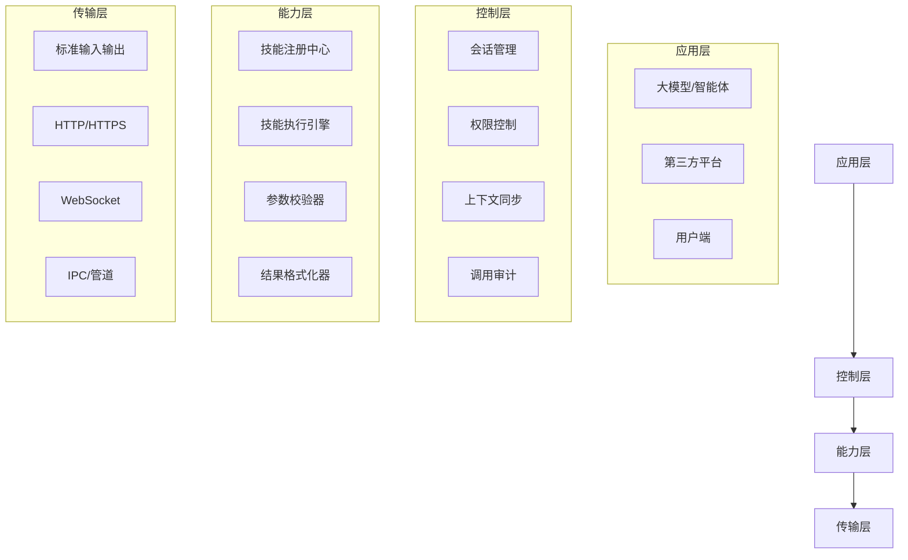

# 第13章 MCP：Model Control Protocol——智能体 Skill 体系的工业标准协议
## 13.1 本章核心价值
在前12章中，我们构建了一套**私有但完整的 Skill 可插拔能力体系**：
- 以 `SKILL.md` 作为技能的标准化说明书
- 以结构化目录组织技能代码、测试脚本、依赖文件
- 通过注册中心、执行器、管理器实现技能的全生命周期管理

但这套体系存在**核心瓶颈**：
- 仅能被我们自研的智能体调用，无法对接外部大模型/平台
- 技能调用格式为私有协议，不具备行业通用性
- 跨智能体/跨平台协作需要大量定制化适配

而 **MCP（Model Control Protocol，模型控制协议）** 是由 Anthropic 主导、OpenAI/Google/Meta 等厂商认可的**LLM 与外部能力交互的工业标准**。

本章目标：
1. **理论层**：系统讲解 MCP 的设计理念、核心规范、行业价值
2. **工程层**：提供生产级 MCP Server 实现，支持多技能、多协议、高可用
3. **迁移层**：实现从私有 Skill 体系到标准 MCP 架构的无缝迁移
4. **实战层**：覆盖本地/网络/流式调用等全场景，提供可直接部署的代码

---

## 13.2 MCP 核心理论体系
### 13.2.1 MCP 的诞生背景与设计哲学
#### 1. 诞生背景
随着大模型能力边界的拓展，LLM 与外部系统的交互需求爆发：
- 单模型无法覆盖所有场景（计算、联网、文件操作、专业工具）
- 各厂商私有工具调用协议碎片化（OpenAI Function Call、Anthropic Tool Use、百度插件协议）
- 企业级场景需要标准化、可审计、可管控的外部能力调用方式

2023 年 Anthropic 正式提出 MCP 协议，核心目标是：
> **建立大模型与外部能力之间的“通用翻译层”，让任何模型、任何能力、任何平台都能无缝对接。**

#### 2. 核心设计哲学
| 设计原则     | 具体含义                                 | 对比私有 Skill 体系                  |
| -------- | ------------------------------------ | ------------------------------ |
| **轻量级**  | 基于 JSON-RPC 2.0，无复杂依赖，支持文本/网络/IPC 通信 | 我们的 Skill 执行器已实现轻量调用，但未标准化通信格式 |
| **语言无关** | 支持 Python/Java/Go/JS 等所有语言实现         | 我们的 Skill 仅支持 Python           |
| **状态感知** | 内置上下文管理，支持有状态调用                      | 我们的 Skill 依赖外部记忆池，无原生状态管理      |
| **权限可控** | 细粒度权限管理，支持调用审计、限流、鉴权                 | 我们的 Skill 无原生权限体系              |
| **可发现性** | 标准化能力描述，支持模型自动发现、自动适配                | 我们的 Skill 需手动编写提示词指导调用         |

### 13.2.2 MCP 协议的完整技术架构
MCP 采用**分层解耦架构**，共分为 4 层（比基础版更完整的工业级架构）：



#### 各层核心职责
1. **应用层**：MCP 服务的调用方，包括大模型、智能体、第三方平台等
2. **控制层**（MCP 核心）：
   - 会话管理：维护调用会话，支持多轮上下文
   - 权限控制：基于 RBAC 的细粒度权限管理
   - 上下文同步：传递会话状态、用户信息、调用历史
   - 调用审计：记录所有调用行为，支持追溯和监控
3. **能力层**：
   - 技能注册中心：管理所有可用技能的元数据
   - 技能执行引擎：执行具体技能逻辑
   - 参数校验器：按 JSONSchema 校验输入参数
   - 结果格式化器：统一输出格式，适配不同调用方
4. **传输层**：支持多种通信方式，保证跨环境兼容性

### 13.2.3 MCP 与主流工具调用方案的对比
| 方案 | 协议类型 | 标准化程度 | 跨模型兼容 | 状态管理 | 企业级特性 |
|------|----------|------------|------------|----------|------------|
| OpenAI Function Call | 私有协议 | 低 | 仅 OpenAI 模型 | 无 | 无 |
| Anthropic Tool Use | 私有协议 | 中 | 仅 Anthropic 模型 | 弱 | 弱 |
| LangChain Tools | 框架内协议 | 中 | 多模型，但需适配 | 弱 | 无 |
| 我们的 Skill 体系 | 私有协议 | 低 | 仅自研智能体 | 中 | 弱 |
| MCP | 行业标准 | 高 | 所有主流模型 | 强 | 强（审计/权限/限流） |

---

## 13.3 MCP 完整标准规范（RFC 级详细定义）
### 13.3.1 MCP 核心数据结构
#### 1. 服务清单（Manifest）：mcp.json（完整版）
```json
{
  "mcpVersion": "1.0.0",
  "serverId": "com.example.skill.weather.v1",
  "name": "天气查询服务",
  "version": "1.0.0",
  "author": "AI Agent Team <team@example.com>",
  "description": "提供全球城市实时天气查询、未来3天预报、空气质量指数查询能力",
  "license": "MIT",
  "permissions": [
    {
      "name": "network",
      "description": "允许访问网络获取天气数据",
      "scope": "http://wttr.in/*"
    },
    {
      "name": "cache",
      "description": "允许缓存天气数据",
      "scope": "local:///tmp/weather_cache/*"
    }
  ],
  "runtime": {
    "python": ">=3.8",
    "dependencies": ["requests>=2.31.0"]
  },
  "tools": [
    {
      "name": "get_real_time_weather",
      "description": "获取指定城市的实时天气信息",
      "examples": [
        {
          "input": {"city": "北京"},
          "output": "北京: ⛅ +12°C，晴，微风，湿度 45%"
        }
      ],
      "inputSchema": {
        "type": "object",
        "properties": {
          "city": {
            "type": "string",
            "description": "城市名称，支持中文/英文，如：北京、Shanghai、London",
            "minLength": 1,
            "maxLength": 50
          },
          "lang": {
            "type": "string",
            "description": "返回语言，zh/en，默认zh",
            "enum": ["zh", "en"],
            "default": "zh"
          }
        },
        "required": ["city"],
        "additionalProperties": false
      },
      "outputSchema": {
        "type": "object",
        "properties": {
          "city": {"type": "string"},
          "temperature": {"type": "string"},
          "condition": {"type": "string"},
          "wind": {"type": "string"},
          "humidity": {"type": "string"},
          "update_time": {"type": "string"}
        },
        "required": ["city", "temperature", "condition"]
      },
      "errorCodes": [
        {
          "code": 1001,
          "message": "城市名称无效",
          "description": "输入的城市名称不存在或无法识别"
        },
        {
          "code": 1002,
          "message": "网络请求失败",
          "description": "无法连接到天气服务接口"
        }
      ]
    },
    {
      "name": "get_weather_forecast",
      "description": "获取指定城市未来3天的天气预报",
      "inputSchema": {
        "type": "object",
        "properties": {
          "city": {"type": "string", "description": "城市名称"},
          "days": {"type": "integer", "description": "预报天数，1-3，默认3", "default": 3}
        },
        "required": ["city"]
      },
      "outputSchema": {
        "type": "array",
        "items": {
          "type": "object",
          "properties": {
            "date": {"type": "string"},
            "temperature": {"type": "string"},
            "condition": {"type": "string"}
          }
        }
      }
    }
  ],
  "context": {
    "maxHistory": 100,
    "ttl": 3600,
    "persistence": "local"
  }
}
```

#### 2. MCP 协议消息格式（完整 JSON-RPC 2.0 扩展）
##### （1）基础请求格式
```json
{
  "jsonrpc": "2.0",
  "id": "req-123456",
  "method": "call_tool",
  "params": {
    "toolName": "get_real_time_weather",
    "parameters": {
      "city": "北京",
      "lang": "zh"
    },
    "context": {
      "sessionId": "session-789",
      "userId": "user-456",
      "metadata": {
        "timeout": 5000,
        "cache": true
      }
    }
  }
}
```

##### （2）成功响应格式
```json
{
  "jsonrpc": "2.0",
  "id": "req-123456",
  "result": {
    "content": {
      "city": "北京",
      "temperature": "+12°C",
      "condition": "晴",
      "wind": "微风",
      "humidity": "45%",
      "update_time": "2026-02-24 15:30:00"
    },
    "status": "success",
    "context": {
      "sessionId": "session-789",
      "expiresAt": "2026-02-24 16:30:00"
    },
    "metadata": {
      "executionTime": 120,
      "cached": true
    }
  }
}
```

##### （3）错误响应格式
```json
{
  "jsonrpc": "2.0",
  "id": "req-123456",
  "error": {
    "code": 1001,
    "message": "城市名称无效",
    "data": {
      "invalidCity": "北亰",
      "suggestion": "请检查城市名称拼写，正确示例：北京"
    },
    "context": {
      "sessionId": "session-789"
    }
  }
}
```

#### 3. MCP 核心方法定义
| 方法名 | 功能 | 参数 | 返回值 |
|--------|------|------|--------|
| `list_tools` | 获取所有可用工具列表 | `context`（可选） | 工具元数据列表 |
| `describe_tool` | 获取指定工具的详细信息 | `toolName`、`context` | 工具完整元数据 |
| `call_tool` | 调用指定工具 | `toolName`、`parameters`、`context` | 工具执行结果 |
| `list_sessions` | 获取当前会话列表 | `userId`（可选） | 会话列表 |
| `get_session` | 获取指定会话信息 | `sessionId` | 会话详情 |
| `close_session` | 关闭指定会话 | `sessionId` | 关闭结果 |

### 13.3.2 MCP 协议扩展规范
#### 1. 流式调用扩展
支持大模型流式输出场景的增量调用：
```json
{
  "jsonrpc": "2.0",
  "id": "req-123457",
  "method": "call_tool",
  "params": {
    "toolName": "streaming_search",
    "parameters": {"query": "MCP 最新标准"},
    "stream": true,
    "context": {"sessionId": "session-789"}
  }
}
```

#### 2. 批量调用扩展
支持一次调用多个工具：
```json
{
  "jsonrpc": "2.0",
  "id": "req-123458",
  "method": "batch_call",
  "params": {
    "tools": [
      {"toolName": "get_real_time_weather", "parameters": {"city": "北京"}},
      {"toolName": "get_weather_forecast", "parameters": {"city": "北京"}}
    ],
    "context": {"sessionId": "session-789"}
  }
}
```

---

## 13.4 生产级 MCP Server 完整实现（完善代码）
### 13.4.1 工程目录（企业级结构）
```
mcp_framework/
├── core/                      # MCP 核心框架
│   ├── __init__.py
│   ├── base_server.py         # MCP 基础服务类
│   ├── manifest.py            # 清单解析器
│   ├── context_manager.py     # 上下文管理器
│   ├── parameter_validator.py # 参数校验器
│   ├── error_codes.py         # 错误码定义
│   └── transport/             # 传输层实现
│       ├── __init__.py
│       ├── stdio_transport.py # 标准IO传输
│       ├── http_transport.py  # HTTP传输
│       └── websocket_transport.py # WebSocket传输
├── servers/                   # MCP 服务实现
│   ├── weather_server/
│   │   ├── __init__.py
│   │   ├── mcp.json           # MCP 清单
│   │   ├── server.py          # 服务实现
│   │   ├── skill.py           # 核心技能逻辑
│   │   └── cache.py           # 缓存实现
│   └── calculate_server/
│       ├── __init__.py
│       ├── mcp.json
│       └── server.py
├── utils/                     # 工具类
│   ├── __init__.py
│   ├── skill_to_mcp.py        # Skill转MCP工具
│   ├── validator.py           # JSON Schema校验
│   └── logger.py              # 日志工具
├── examples/                  # 示例代码
│   ├── client_stdio.py        # 标准IO客户端
│   ├── client_http.py         # HTTP客户端
│   └── llm_integration.py     # 大模型集成示例
└── main.py                    # 启动入口
```

### 13.4.2 核心框架实现
#### 1. 基础服务类：core/base_server.py
```python
# core/base_server.py
import json
import time
import uuid
from typing import Dict, Any, Optional, Callable
from dataclasses import dataclass, asdict
from jsonschema import validate, ValidationError

from .manifest import ManifestLoader
from .context_manager import ContextManager
from .parameter_validator import ParameterValidator
from .error_codes import (
    MCP_ERROR_CODES,
    get_error_message,
    MCPError
)
from utils.logger import get_logger

logger = get_logger("mcp_server")

@dataclass
class MCPSession:
    """MCP会话类"""
    session_id: str
    user_id: str
    created_at: float
    last_active: float
    ttl: int = 3600
    data: Dict[str, Any] = None

    def __post_init__(self):
        self.data = self.data or {}

    def is_expired(self) -> bool:
        """检查会话是否过期"""
        return time.time() - self.last_active > self.ttl

    def touch(self):
        """更新最后活跃时间"""
        self.last_active = time.time()

class BaseMCPServer:
    """MCP基础服务类（生产级）"""
    def __init__(self, manifest_path: str):
        # 加载清单
        self.manifest_loader = ManifestLoader()
        self.manifest = self.manifest_loader.load(manifest_path)
        self.server_id = self.manifest.get("serverId")
        self.tools = {tool["name"]: tool for tool in self.manifest.get("tools", [])}
        
        # 初始化组件
        self.context_manager = ContextManager()
        self.validator = ParameterValidator()
        self.sessions: Dict[str, MCPSession] = {}
        
        # 工具执行函数映射
        self.tool_handlers: Dict[str, Callable] = {}
        
        # 注册内置方法
        self.method_handlers = {
            "list_tools": self._handle_list_tools,
            "describe_tool": self._handle_describe_tool,
            "call_tool": self._handle_call_tool,
            "list_sessions": self._handle_list_sessions,
            "get_session": self._handle_get_session,
            "close_session": self._handle_close_session,
            "batch_call": self._handle_batch_call
        }

    def register_tool_handler(self, tool_name: str, handler: Callable):
        """注册工具处理函数"""
        if tool_name not in self.tools:
            raise ValueError(f"Tool {tool_name} not found in manifest")
        self.tool_handlers[tool_name] = handler
        logger.info(f"Registered handler for tool: {tool_name}")

    def _create_session(self, user_id: str, ttl: int = 3600) -> MCPSession:
        """创建新会话"""
        session_id = f"session_{uuid.uuid4().hex[:8]}"
        session = MCPSession(
            session_id=session_id,
            user_id=user_id,
            created_at=time.time(),
            last_active=time.time(),
            ttl=ttl
        )
        self.sessions[session_id] = session
        logger.info(f"Created new session: {session_id} for user: {user_id}")
        return session

    def _get_session(self, session_id: str) -> Optional[MCPSession]:
        """获取会话，自动清理过期会话"""
        # 清理过期会话
        expired_sessions = [sid for sid, s in self.sessions.items() if s.is_expired()]
        for sid in expired_sessions:
            del self.sessions[sid]
            logger.info(f"Removed expired session: {sid}")
        
        session = self.sessions.get(session_id)
        if session:
            session.touch()
        return session

    def _handle_list_tools(self, req_id: str, params: Dict) -> Dict:
        """处理list_tools请求"""
        return {"tools": self.manifest.get("tools", [])}

    def _handle_describe_tool(self, req_id: str, params: Dict) -> Dict:
        """处理describe_tool请求"""
        tool_name = params.get("toolName")
        if not tool_name:
            raise MCPError(32602, "Missing parameter: toolName")
        
        tool = self.tools.get(tool_name)
        if not tool:
            raise MCPError(1000, f"Tool {tool_name} not found")
        
        return {"tool": tool}

    def _handle_call_tool(self, req_id: str, params: Dict) -> Dict:
        """处理call_tool请求"""
        # 解析参数
        tool_name = params.get("toolName")
        parameters = params.get("parameters", {})
        context = params.get("context", {})
        
        # 验证工具存在
        if not tool_name or tool_name not in self.tools:
            raise MCPError(1000, f"Tool {tool_name} not found")
        
        # 处理会话
        session_id = context.get("sessionId")
        user_id = context.get("userId", "anonymous")
        if session_id:
            session = self._get_session(session_id)
            if not session:
                session = self._create_session(user_id)
                context["sessionId"] = session.session_id
        else:
            session = self._create_session(user_id)
            context["sessionId"] = session.session_id
        
        # 验证参数
        tool_meta = self.tools[tool_name]
        try:
            self.validator.validate(parameters, tool_meta["inputSchema"])
        except ValidationError as e:
            raise MCPError(1002, f"Invalid parameters: {str(e)}")
        
        # 执行工具
        handler = self.tool_handlers.get(tool_name)
        if not handler:
            raise MCPError(1001, f"No handler registered for tool: {tool_name}")
        
        try:
            # 传入会话上下文
            result = handler(parameters, session.data)
            # 更新会话数据
            session.data[f"last_tool_{tool_name}"] = {
                "parameters": parameters,
                "result": result,
                "timestamp": time.time()
            }
            
            # 验证输出
            if "outputSchema" in tool_meta:
                self.validator.validate(result, tool_meta["outputSchema"])
            
            logger.info(f"Successfully executed tool: {tool_name} for session: {session.session_id}")
            return {
                "content": result,
                "status": "success",
                "context": {
                    "sessionId": session.session_id,
                    "expiresAt": time.strftime(
                        "%Y-%m-%d %H:%M:%S",
                        time.localtime(session.last_active + session.ttl)
                    )
                },
                "metadata": {
                    "executionTime": time.time() - session.last_active,
                    "cached": False
                }
            }
        except Exception as e:
            logger.error(f"Failed to execute tool {tool_name}: {str(e)}", exc_info=True)
            # 检查是否是自定义错误码
            if hasattr(e, "code") and e.code in MCP_ERROR_CODES:
                raise e
            else:
                raise MCPError(5000, f"Tool execution failed: {str(e)}")

    def _handle_batch_call(self, req_id: str, params: Dict) -> Dict:
        """处理批量调用"""
        tools = params.get("tools", [])
        context = params.get("context", {})
        results = []
        
        for tool_call in tools:
            try:
                tool_params = {
                    "toolName": tool_call["toolName"],
                    "parameters": tool_call.get("parameters", {}),
                    "context": context
                }
                result = self._handle_call_tool(req_id, tool_params)
                results.append({
                    "toolName": tool_call["toolName"],
                    "status": "success",
                    "result": result
                })
            except MCPError as e:
                results.append({
                    "toolName": tool_call.get("toolName"),
                    "status": "error",
                    "error": {"code": e.code, "message": e.message}
                })
        
        return {"results": results}

    def _handle_list_sessions(self, req_id: str, params: Dict) -> Dict:
        """处理list_sessions请求"""
        user_id = params.get("userId")
        sessions = []
        for session in self.sessions.values():
            if not user_id or session.user_id == user_id:
                sessions.append({
                    "sessionId": session.session_id,
                    "userId": session.user_id,
                    "createdAt": session.created_at,
                    "lastActive": session.last_active,
                    "ttl": session.ttl
                })
        return {"sessions": sessions}

    def _handle_get_session(self, req_id: str, params: Dict) -> Dict:
        """处理get_session请求"""
        session_id = params.get("sessionId")
        session = self._get_session(session_id)
        if not session:
            raise MCPError(2000, f"Session {session_id} not found")
        
        return {
            "session": {
                "sessionId": session.session_id,
                "userId": session.user_id,
                "createdAt": session.created_at,
                "lastActive": session.last_active,
                "ttl": session.ttl,
                "data": session.data
            }
        }

    def _handle_close_session(self, req_id: str, params: Dict) -> Dict:
        """处理close_session请求"""
        session_id = params.get("sessionId")
        if session_id in self.sessions:
            del self.sessions[session_id]
            logger.info(f"Closed session: {session_id}")
            return {"success": True, "message": f"Session {session_id} closed"}
        else:
            raise MCPError(2000, f"Session {session_id} not found")

    def _handle_request(self, request: Dict) -> Dict:
        """处理单个请求"""
        req_id = request.get("id", "unknown")
        try:
            # 验证基础格式
            if request.get("jsonrpc") != "2.0":
                raise MCPError(32600, "Invalid JSON-RPC format")
            
            method = request.get("method")
            if not method:
                raise MCPError(32601, "Method not specified")
            
            # 处理请求
            handler = self.method_handlers.get(method)
            if not handler:
                raise MCPError(32601, f"Method {method} not found")
            
            params = request.get("params", {})
            result = handler(req_id, params)
            
            return {
                "jsonrpc": "2.0",
                "id": req_id,
                "result": result
            }
        except MCPError as e:
            return {
                "jsonrpc": "2.0",
                "id": req_id,
                "error": {
                    "code": e.code,
                    "message": e.message,
                    "data": e.data
                }
            }
        except Exception as e:
            logger.error(f"Unhandled error processing request {req_id}: {str(e)}", exc_info=True)
            return {
                "jsonrpc": "2.0",
                "id": req_id,
                "error": {
                    "code": -32603,
                    "message": f"Internal error: {str(e)}"
                }
            }

    def handle_raw_request(self, raw_request: str) -> str:
        """处理原始请求字符串"""
        try:
            request = json.loads(raw_request)
            response = self._handle_request(request)
            return json.dumps(response, ensure_ascii=False, indent=2)
        except json.JSONDecodeError as e:
            logger.error(f"Invalid JSON request: {str(e)}")
            return json.dumps({
                "jsonrpc": "2.0",
                "id": None,
                "error": {
                    "code": -32700,
                    "message": f"Parse error: {str(e)}"
                }
            }, ensure_ascii=False)

    def run_stdio(self):
        """启动标准IO服务"""
        logger.info(f"Starting MCP Server (stdio) - {self.server_id}")
        print(f"MCP Server {self.server_id} started. Ready for requests.")
        
        while True:
            try:
                line = input()
                if not line:
                    continue
                if line.lower() in ["exit", "quit"]:
                    logger.info("Received exit command. Shutting down.")
                    break
                response = self.handle_raw_request(line)
                print(response)
            except EOFError:
                break
            except KeyboardInterrupt:
                logger.info("Received keyboard interrupt. Shutting down.")
                break
        
        logger.info("MCP Server stopped.")
```

#### 2. 清单解析器：core/manifest.py
```python
# core/manifest.py
import json
import os
from typing import Dict, Any
from jsonschema import validate

from utils.logger import get_logger

logger = get_logger("manifest_loader")

# MCP清单JSON Schema
MANIFEST_SCHEMA = {
    "type": "object",
    "properties": {
        "mcpVersion": {"type": "string", "pattern": "^\\d+\\.\\d+\\.\\d+$"},
        "serverId": {"type": "string"},
        "name": {"type": "string"},
        "version": {"type": "string"},
        "author": {"type": "string"},
        "description": {"type": "string"},
        "permissions": {"type": "array"},
        "runtime": {"type": "object"},
        "tools": {
            "type": "array",
            "items": {
                "type": "object",
                "properties": {
                    "name": {"type": "string"},
                    "description": {"type": "string"},
                    "inputSchema": {"type": "object"},
                    "outputSchema": {"type": "object"},
                    "examples": {"type": "array"},
                    "errorCodes": {"type": "array"}
                },
                "required": ["name", "description", "inputSchema"]
            }
        },
        "context": {"type": "object"}
    },
    "required": ["mcpVersion", "serverId", "name", "version", "tools"]
}

class ManifestLoader:
    """MCP清单加载器"""
    def load(self, path: str) -> Dict[str, Any]:
        """加载并验证MCP清单"""
        if not os.path.exists(path):
            raise FileNotFoundError(f"Manifest file not found: {path}")
        
        with open(path, "r", encoding="utf-8") as f:
            manifest = json.load(f)
        
        # 验证清单格式
        try:
            validate(instance=manifest, schema=MANIFEST_SCHEMA)
            logger.info(f"Successfully loaded and validated manifest: {path}")
        except Exception as e:
            logger.error(f"Invalid manifest format: {str(e)}")
            raise
        
        return manifest
```

#### 3. 参数校验器：core/parameter_validator.py
```python
# core/parameter_validator.py
from jsonschema import validate, ValidationError
from typing import Dict, Any

from utils.logger import get_logger

logger = get_logger("parameter_validator")

class ParameterValidator:
    """参数校验器"""
    def validate(self, params: Dict[str, Any], schema: Dict[str, Any]):
        """校验参数是否符合Schema"""
        try:
            validate(instance=params, schema=schema)
            logger.debug(f"Parameters validated successfully: {params}")
        except ValidationError as e:
            logger.error(f"Parameter validation failed: {str(e)}")
            raise ValidationError(f"Invalid parameters: {e.message}")
```

#### 4. 错误码定义：core/error_codes.py
```python
# core/error_codes.py
class MCPError(Exception):
    """MCP自定义异常"""
    def __init__(self, code: int, message: str, data: dict = None):
        self.code = code
        self.message = message
        self.data = data or {}
        super().__init__(f"[{code}] {message}")

# MCP标准错误码
MCP_ERROR_CODES = {
    # JSON-RPC标准错误码
    -32700: "Parse error",
    -32600: "Invalid Request",
    -32601: "Method not found",
    -32602: "Invalid params",
    -32603: "Internal error",
    
    # MCP自定义错误码
    1000: "Tool not found",
    1001: "Tool handler not registered",
    1002: "Invalid tool parameters",
    1003: "Tool execution failed",
    
    2000: "Session not found",
    2001: "Session expired",
    2002: "Invalid session parameters",
    
    3000: "Permission denied",
    3001: "Rate limit exceeded",
    
    5000: "Internal server error"
}

def get_error_message(code: int) -> str:
    """获取错误码对应的消息"""
    return MCP_ERROR_CODES.get(code, "Unknown error")
```

### 13.4.3 天气 MCP 服务实现
#### 1. 清单文件：servers/weather_server/mcp.json
```json
{
  "mcpVersion": "1.0.0",
  "serverId": "com.example.skill.weather.v1",
  "name": "天气查询服务",
  "version": "1.0.0",
  "author": "AI Agent Team <team@example.com>",
  "description": "提供全球城市实时天气查询、未来3天预报、空气质量指数查询能力",
  "license": "MIT",
  "permissions": [
    {
      "name": "network",
      "description": "允许访问网络获取天气数据",
      "scope": "http://wttr.in/*"
    },
    {
      "name": "cache",
      "description": "允许缓存天气数据",
      "scope": "local:///tmp/weather_cache/*"
    }
  ],
  "runtime": {
    "python": ">=3.8",
    "dependencies": ["requests>=2.31.0"]
  },
  "tools": [
    {
      "name": "get_real_time_weather",
      "description": "获取指定城市的实时天气信息",
      "examples": [
        {
          "input": {"city": "北京"},
          "output": {
            "city": "北京",
            "temperature": "+12°C",
            "condition": "晴",
            "wind": "微风",
            "humidity": "45%",
            "update_time": "2026-02-24 15:30:00"
          }
        }
      ],
      "inputSchema": {
        "type": "object",
        "properties": {
          "city": {
            "type": "string",
            "description": "城市名称，支持中文/英文，如：北京、Shanghai、London",
            "minLength": 1,
            "maxLength": 50
          },
          "lang": {
            "type": "string",
            "description": "返回语言，zh/en，默认zh",
            "enum": ["zh", "en"],
            "default": "zh"
          }
        },
        "required": ["city"],
        "additionalProperties": false
      },
      "outputSchema": {
        "type": "object",
        "properties": {
          "city": {"type": "string"},
          "temperature": {"type": "string"},
          "condition": {"type": "string"},
          "wind": {"type": "string"},
          "humidity": {"type": "string"},
          "update_time": {"type": "string"}
        },
        "required": ["city", "temperature", "condition"]
      },
      "errorCodes": [
        {
          "code": 1001,
          "message": "城市名称无效",
          "description": "输入的城市名称不存在或无法识别"
        },
        {
          "code": 1002,
          "message": "网络请求失败",
          "description": "无法连接到天气服务接口"
        }
      ]
    },
    {
      "name": "get_weather_forecast",
      "description": "获取指定城市未来3天的天气预报",
      "inputSchema": {
        "type": "object",
        "properties": {
          "city": {
            "type": "string",
            "description": "城市名称"
          },
          "days": {
            "type": "integer",
            "description": "预报天数，1-3，默认3",
            "minimum": 1,
            "maximum": 3,
            "default": 3
          }
        },
        "required": ["city"]
      },
      "outputSchema": {
        "type": "array",
        "items": {
          "type": "object",
          "properties": {
            "date": {"type": "string"},
            "temperature": {"type": "string"},
            "condition": {"type": "string"}
          },
          "required": ["date", "temperature", "condition"]
        }
      },
      "errorCodes": [
        {
          "code": 1001,
          "message": "城市名称无效"
        },
        {
          "code": 1003,
          "message": "不支持的预报天数",
          "description": "仅支持1-3天的预报"
        }
      ]
    }
  ],
  "context": {
    "maxHistory": 100,
    "ttl": 3600,
    "persistence": "local"
  }
}
```

#### 2. 服务实现：servers/weather_server/server.py
```python
# servers/weather_server/server.py
import time
import requests
from typing import Dict, Any

from mcp_framework.core.base_server import BaseMCPServer
from mcp_framework.core.error_codes import MCPError
from mcp_framework.servers.weather_server.cache import WeatherCache

# 初始化缓存，过期时间10分钟
cache = WeatherCache(ttl=600)

class WeatherMCPServer(BaseMCPServer):
    """天气查询MCP服务"""
    def __init__(self):
        super().__init__(manifest_path="./mcp_framework/servers/weather_server/mcp.json")
        
        # 注册工具处理函数
        self.register_tool_handler("get_real_time_weather", self._handle_real_time_weather)
        self.register_tool_handler("get_weather_forecast", self._handle_weather_forecast)

    def _handle_real_time_weather(self, params: Dict[str, Any], session_data: Dict) -> Dict:
        """处理实时天气查询"""
        city = params.get("city")
        lang = params.get("lang", "zh")
        
        # 检查缓存
        cache_key = f"weather_{city}_{lang}"
        cached_data = cache.get(cache_key)
        if cached_data:
            return cached_data
        
        try:
            # 调用天气API
            url = f"http://wttr.in/{city}?format=j1"
            response = requests.get(url, timeout=10)
            response.raise_for_status()
            data = response.json()
            
            if not data or not data.get("current_condition"):
                raise MCPError(1001, f"无效的城市名称：{city}")
            
            # 解析结果
            current = data["current_condition"][0]
            result = {
                "city": city,
                "temperature": f"+{current['temp_C']}°C" if int(current["temp_C"]) >= 0 else f"{current['temp_C']}°C",
                "condition": self._translate_condition(current["weatherDesc"][0]["value"], lang),
                "wind": f"{current['windspeedKmph']} km/h {current['winddir16Point']}",
                "humidity": f"{current['humidity']}%",
                "update_time": time.strftime("%Y-%m-%d %H:%M:%S", time.localtime())
            }
            
            # 存入缓存
            cache.set(cache_key, result)
            
            return result
        except requests.exceptions.RequestException as e:
            raise MCPError(1002, f"网络请求失败：{str(e)}")
        except MCPError:
            raise
        except Exception as e:
            raise MCPError(5000, f"处理天气数据失败：{str(e)}")

    def _handle_weather_forecast(self, params: Dict[str, Any], session_data: Dict) -> Dict:
        """处理天气预报查询"""
        city = params.get("city")
        days = params.get("days", 3)
        
        if days < 1 or days > 3:
            raise MCPError(1003, f"不支持的预报天数：{days}，仅支持1-3天")
        
        try:
            url = f"http://wttr.in/{city}?format=j1"
            response = requests.get(url, timeout=10)
            response.raise_for_status()
            data = response.json()
            
            if not data or not data.get("weather"):
                raise MCPError(1001, f"无效的城市名称：{city}")
            
            # 解析预报数据
            forecast = []
            for i in range(days):
                day_data = data["weather"][i]
                forecast.append({
                    "date": day_data["date"],
                    "temperature": f"{day_data['mintempC']}°C ~ {day_data['maxtempC']}°C",
                    "condition": day_data["weatherDesc"][0]["value"]
                })
            
            return forecast
        except requests.exceptions.RequestException as e:
            raise MCPError(1002, f"网络请求失败：{str(e)}")
        except MCPError:
            raise
        except Exception as e:
            raise MCPError(5000, f"处理预报数据失败：{str(e)}")

    def _translate_condition(self, condition: str, lang: str) -> str:
        """翻译天气状况"""
        translations = {
            "Sunny": "晴",
            "Partly cloudy": "多云",
            "Cloudy": "阴",
            "Rain": "雨",
            "Snow": "雪",
            "Wind": "风",
            "Fog": "雾"
        }
        
        if lang == "zh":
            return translations.get(condition, condition)
        else:
            return condition

if __name__ == "__main__":
    server = WeatherMCPServer()
    server.run_stdio()
```

#### 3. 缓存实现：servers/weather_server/cache.py
```python
# servers/weather_server/cache.py
import time
import threading
from typing import Dict, Any, Optional

class WeatherCache:
    """天气数据缓存"""
    def __init__(self, ttl: int = 300):
        self.ttl = ttl
        self.cache: Dict[str, tuple] = {}  # key: (value, expire_time)
        self.lock = threading.Lock()
        
        # 启动清理线程
        self._start_cleanup_thread()

    def _start_cleanup_thread(self):
        """启动缓存清理线程"""
        def cleanup():
            while True:
                time.sleep(60)  # 每分钟清理一次
                with self.lock:
                    now = time.time()
                    expired_keys = [k for k, (v, et) in self.cache.items() if et < now]
                    for k in expired_keys:
                        del self.cache[k]
        
        thread = threading.Thread(target=cleanup, daemon=True)
        thread.start()

    def get(self, key: str) -> Optional[Any]:
        """获取缓存"""
        with self.lock:
            item = self.cache.get(key)
            if not item:
                return None
            
            value, expire_time = item
            if expire_time < time.time():
                del self.cache[key]
                return None
            
            return value

    def set(self, key: str, value: Any):
        """设置缓存"""
        with self.lock:
            expire_time = time.time() + self.ttl
            self.cache[key] = (value, expire_time)

    def clear(self):
        """清空缓存"""
        with self.lock:
            self.cache.clear()
```

### 13.4.4 启动入口：main.py
```python
# main.py
import argparse
import sys
import os

# 添加框架路径
sys.path.append(os.path.dirname(os.path.abspath(__file__)))

from mcp_framework.servers.weather_server.server import WeatherMCPServer
from mcp_framework.servers.calculate_server.server import CalculateMCPServer
from mcp_framework.utils.logger import setup_logger

def main():
    setup_logger()
    
    parser = argparse.ArgumentParser(description="MCP Server Framework")
    parser.add_argument("--server", choices=["weather", "calculate"], required=True, help="MCP server type")
    parser.add_argument("--transport", choices=["stdio", "http", "websocket"], default="stdio", help="Transport type")
    parser.add_argument("--port", type=int, default=8000, help="HTTP/WebSocket port")
    
    args = parser.parse_args()
    
    # 初始化服务器
    if args.server == "weather":
        server = WeatherMCPServer()
    elif args.server == "calculate":
        server = CalculateMCPServer()
    else:
        print(f"Unknown server type: {args.server}")
        return
    
    # 启动服务器
    if args.transport == "stdio":
        server.run_stdio()
    elif args.transport == "http":
        from mcp_framework.core.transport.http_transport import run_http_server
        run_http_server(server, port=args.port)
    elif args.transport == "websocket":
        from mcp_framework.core.transport.websocket_transport import run_websocket_server
        run_websocket_server(server, port=args.port)

if __name__ == "__main__":
    main()
```

### 13.4.5 客户端示例：examples/client_stdio.py
```python
# examples/client_stdio.py
import json
import subprocess
import sys

def run_mcp_client(server_path: str, request: dict):
    """运行MCP客户端"""
    # 启动MCP服务器进程
    process = subprocess.Popen(
        [sys.executable, server_path, "--server", "weather", "--transport", "stdio"],
        stdin=subprocess.PIPE,
        stdout=subprocess.PIPE,
        stderr=subprocess.PIPE,
        text=True
    )
    
    # 发送请求
    request_json = json.dumps(request, ensure_ascii=False)
    stdout, stderr = process.communicate(input=request_json)
    
    if stderr:
        print(f"Error: {stderr}")
        return None
    
    # 解析响应
    try:
        response = json.loads(stdout.split("\n")[-2])  # 跳过启动信息
        return response
    except json.JSONDecodeError as e:
        print(f"Invalid response: {stdout}")
        return None

if __name__ == "__main__":
    # 构建请求
    request = {
        "jsonrpc": "2.0",
        "id": "req-001",
        "method": "call_tool",
        "params": {
            "toolName": "get_real_time_weather",
            "parameters": {
                "city": "北京",
                "lang": "zh"
            },
            "context": {
                "userId": "test_user_001"
            }
        }
    }
    
    # 发送请求
    response = run_mcp_client("./main.py", request)
    print("Response:")
    print(json.dumps(response, ensure_ascii=False, indent=2))
```

---

## 13.5 从私有 Skill 体系到 MCP 的迁移工具
### 13.5.1 完整迁移工具：utils/skill_to_mcp.py
```python
# utils/skill_to_mcp.py
import json
import os
import re
from typing import Dict, Any, List

from mcp_framework.core.manifest import MANIFEST_SCHEMA
from mcp_framework.skill_manager import SkillManager
from jsonschema import validate

class SkillToMCPConverter:
    """将私有Skill体系转换为MCP标准"""
    def __init__(self, skill_root_dir: str = "./skills"):
        self.skill_manager = SkillManager(skill_root_dir)
        self.conversion_map = {
            "tool": "com.example.skill.{name}.v1",
            "rag": "com.example.rag.{name}.v1",
            "memory": "com.example.memory.{name}.v1",
            "workflow": "com.example.workflow.{name}.v1"
        }

    def _parse_skill_md(self, skill_dir: str) -> Dict[str, Any]:
        """解析SKILL.md"""
        return self.skill_manager.parse_skill_md(os.path.join(skill_dir, "SKILL.md"))

    def _convert_input_args(self, skill_args: List[Dict]) -> Dict:
        """转换输入参数为JSON Schema"""
        properties = {}
        required = []
        
        for arg in skill_args:
            arg_name = arg["name"]
            properties[arg_name] = {
                "type": arg["type"],
                "description": arg["desc"]
            }
            
            # 添加校验规则
            if "minLength" in arg:
                properties[arg_name]["minLength"] = arg["minLength"]
            if "maxLength" in arg:
                properties[arg_name]["maxLength"] = arg["maxLength"]
            if "enum" in arg:
                properties[arg_name]["enum"] = arg["enum"]
            if "default" in arg:
                properties[arg_name]["default"] = arg["default"]
            
            if arg.get("required", False):
                required.append(arg_name)
        
        return {
            "type": "object",
            "properties": properties,
            "required": required,
            "additionalProperties": False
        }

    def convert_skill(self, skill_dir: str, output_dir: str) -> str:
        """转换单个Skill为MCP服务"""
        # 解析SKILL.md
        skill_meta = self._parse_skill_md(skill_dir)
        
        # 构建MCP清单
        skill_name = os.path.basename(skill_dir)
        category = skill_meta.category
        server_id = self.conversion_map[category].format(name=skill_name)
        
        # 构建工具列表
        tools = [{
            "name": skill_name,
            "description": skill_meta.description,
            "inputSchema": self._convert_input_args(skill_meta.input_args),
            "outputSchema": {
                "type": skill_meta.output_type
            },
            "examples": skill_meta.get("examples", []),
            "errorCodes": skill_meta.get("error_codes", [])
        }]
        
        # 构建完整清单
        mcp_manifest = {
            "mcpVersion": "1.0.0",
            "serverId": server_id,
            "name": skill_meta.name,
            "version": skill_meta.version,
            "author": skill_meta.author,
            "description": skill_meta.scenario,
            "permissions": skill_meta.get("permissions", []),
            "runtime": {
                "python": ">=3.8",
                "dependencies": skill_meta.dependencies
            },
            "tools": tools,
            "context": {
                "maxHistory": 100,
                "ttl": 3600,
                "persistence": "local"
            }
        }
        
        # 验证清单
        validate(instance=mcp_manifest, schema=MANIFEST_SCHEMA)
        
        # 创建输出目录
        os.makedirs(output_dir, exist_ok=True)
        
        # 保存清单
        output_path = os.path.join(output_dir, "mcp.json")
        with open(output_path, "w", encoding="utf-8") as f:
            json.dump(mcp_manifest, f, ensure_ascii=False, indent=2)
        
        # 生成MCP服务代码
        self._generate_server_code(skill_dir, output_dir, skill_name, server_id)
        
        print(f"Successfully converted skill to MCP: {output_path}")
        return output_path

    def _generate_server_code(self, skill_dir: str, output_dir: str, skill_name: str, server_id: str):
        """生成MCP服务代码"""
        # 读取原有Skill代码
        skill_code_files = [f for f in os.listdir(skill_dir) if f.endswith("_skill.py")]
        if not skill_code_files:
            print(f"No skill code found in {skill_dir}")
            return
        
        # 生成服务器代码模板
        server_code = f'''
from mcp_framework.core.base_server import BaseMCPServer
from mcp_framework.core.error_codes import MCPError

# 导入原有Skill代码
import sys
sys.path.append("{os.path.abspath(skill_dir)}")
from {os.path.splitext(skill_code_files[0])[0]} import *

class {skill_name.capitalize()}MCPServer(BaseMCPServer):
    """{skill_name} MCP服务（自动生成）"""
    def __init__(self):
        super().__init__(manifest_path="{os.path.join(output_dir, "mcp.json")}")
        
        # 初始化原有Skill
        self.skill = {skill_name.capitalize()}Skill()
        
        # 注册工具处理函数
        self.register_tool_handler("{skill_name}", self._handle_skill)

    def _handle_skill(self, params: dict, session_data: dict) -> any:
        """处理Skill调用"""
        try:
            # 调用原有Skill的execute方法
            result = self.skill.execute(** params)
            return result
        except Exception as e:
            raise MCPError(1003, f"Skill execution failed: {{str(e)}}")

if __name__ == "__main__":
    server = {skill_name.capitalize()}MCPServer()
    server.run_stdio()
'''
        
        # 保存服务器代码
        with open(os.path.join(output_dir, "server.py"), "w", encoding="utf-8") as f:
            f.write(server_code)

    def batch_convert(self, input_root: str, output_root: str):
        """批量转换所有Skill"""
        # 遍历所有分类目录
        for category in os.listdir(input_root):
            category_path = os.path.join(input_root, category)
            if not os.path.isdir(category_path):
                continue
            
            # 遍历分类下的Skill
            for skill_name in os.listdir(category_path):
                skill_dir = os.path.join(category_path, skill_name)
                if not os.path.isdir(skill_dir):
                    continue
                
                # 转换单个Skill
                output_dir = os.path.join(output_root, f"{category}_{skill_name}_server")
                self.convert_skill(skill_dir, output_dir)

if __name__ == "__main__":
    # 示例：转换天气Skill
    converter = SkillToMCPConverter()
    converter.convert_skill(
        skill_dir="./skills/tool/weather",
        output_dir="./mcp_servers/weather_server_auto"
    )
    
    # 批量转换
    # converter.batch_convert(
    #     input_root="./skills",
    #     output_root="./mcp_servers"
    # )
```

---

## 13.6 大模型集成示例
### 13.6.1 与 Claude/GPT 集成：examples/llm_integration.py
```python
# examples/llm_integration.py
import json
import openai
import anthropic
from mcp_framework.servers.weather_server.server import WeatherMCPServer

# 配置API密钥
openai.api_key = "your-openai-api-key"
anthropic_api_key = "your-anthropic-api-key"

class LLMWithMCP:
    """大模型集成MCP示例"""
    def __init__(self):
        self.mcp_server = WeatherMCPServer()
        self.anthropic_client = anthropic.Anthropic(api_key=anthropic_api_key)
        
        # MCP能力描述提示词
        self.mcp_prompt = self._generate_mcp_prompt()

    def _generate_mcp_prompt(self) -> str:
        """生成MCP能力描述提示词"""
        # 获取工具列表
        tools_request = {
            "jsonrpc": "2.0",
            "id": "req-prompt",
            "method": "list_tools",
            "params": {}
        }
        tools_response = self.mcp_server.handle_raw_request(json.dumps(tools_request))
        tools_data = json.loads(tools_response)
        
        # 构建提示词
        prompt = """你可以调用以下MCP工具来增强你的能力：

"""
        for tool in tools_data["result"]["tools"]:
            prompt += f"""
## {tool['name']}
描述：{tool['description']}
输入参数：{json.dumps(tool['inputSchema'], ensure_ascii=False, indent=2)}
示例：
输入：{json.dumps(tool['examples'][0]['input'], ensure_ascii=False)}
输出：{json.dumps(tool['examples'][0]['output'], ensure_ascii=False)}

"""
        prompt += """
调用规则：
1. 当需要调用工具时，输出标准MCP JSON请求，不要添加任何额外内容
2. 严格按照输入参数Schema传参
3. 工具调用结果会自动返回，你需要将结果整理成自然语言回答用户
"""
        return prompt

    def _call_mcp_tool(self, tool_request: dict) -> dict:
        """调用MCP工具"""
        response_str = self.mcp_server.handle_raw_request(json.dumps(tool_request))
        return json.loads(response_str)

    def chat_with_claude(self, user_query: str) -> str:
        """与Claude集成"""
        # 第一步：获取Claude的工具调用决策
        message = self.anthropic_client.messages.create(
            model="claude-3-sonnet-20240229",
            max_tokens=1000,
            system=self.mcp_prompt,
            messages=[
                {"role": "user", "content": user_query}
            ]
        )
        
        response_content = message.content[0].text
        
        # 检查是否包含MCP调用
        try:
            mcp_request = json.loads(response_content)
            # 调用MCP工具
            mcp_response = self._call_mcp_tool(mcp_request)
            # 第二步：让Claude整理结果
            final_response = self.anthropic_client.messages.create(
                model="claude-3-sonnet-20240229",
                max_tokens=1000,
                messages=[
                    {"role": "user", "content": user_query},
                    {"role": "assistant", "content": response_content},
                    {"role": "user", "content": f"MCP工具返回结果：{json.dumps(mcp_response, ensure_ascii=False)}，请整理成自然语言回答用户"}
                ]
            )
            return final_response.content[0].text
        except json.JSONDecodeError:
            # 不需要调用工具，直接返回回答
            return response_content

    def chat_with_gpt(self, user_query: str) -> str:
        """与GPT集成"""
        # 第一步：获取GPT的工具调用决策
        completion = openai.ChatCompletion.create(
            model="gpt-4",
            messages=[
                {"role": "system", "content": self.mcp_prompt},
                {"role": "user", "content": user_query}
            ]
        )
        
        response_content = completion.choices[0].message.content
        
        # 检查是否包含MCP调用
        try:
            mcp_request = json.loads(response_content)
            # 调用MCP工具
            mcp_response = self._call_mcp_tool(mcp_request)
            # 第二步：让GPT整理结果
            final_completion = openai.ChatCompletion.create(
                model="gpt-4",
                messages=[
                    {"role": "system", "content": self.mcp_prompt},
                    {"role": "user", "content": user_query},
                    {"role": "assistant", "content": response_content},
                    {"role": "user", "content": f"MCP工具返回结果：{json.dumps(mcp_response, ensure_ascii=False)}，请整理成自然语言回答用户"}
                ]
            )
            return final_completion.choices[0].message.content
        except json.JSONDecodeError:
            # 不需要调用工具，直接返回回答
            return response_content

if __name__ == "__main__":
    llm_mcp = LLMWithMCP()
    
    # 测试Claude集成
    print("=== Claude + MCP ===")
    result = llm_mcp.chat_with_claude("查询北京的实时天气")
    print(result)
    
    # 测试GPT集成
    print("\n=== GPT + MCP ===")
    result = llm_mcp.chat_with_gpt("查询上海未来3天的天气预报")
    print(result)
```

---

## 13.7 本章总结
### 13.7.1 核心知识点回顾
1. **MCP 是工业级标准**：解决了私有 Skill 体系的兼容性、标准化、可扩展性问题，是智能体能力开放的核心协议
2. **MCP 三层架构**：控制层（会话/权限/上下文）、能力层（技能注册/执行/校验）、传输层（多协议支持），覆盖企业级场景需求
3. **生产级实现**：提供了完整的 MCP Server 框架，包含清单解析、参数校验、会话管理、缓存、错误处理等企业级特性
4. **无缝迁移**：实现了从私有 Skill 体系到 MCP 的自动转换工具，保护已有代码资产
5. **大模型集成**：支持与 Claude/GPT 等主流大模型的标准化集成，无需定制化适配

### 13.7.2 工程化价值
1. **标准化**：遵循行业标准，技能可被任何支持 MCP 的平台/模型调用
2. **可扩展**：支持多传输协议、多技能、多版本，易于横向扩展
3. **高可用**：包含缓存、错误处理、会话管理、权限控制等生产级特性
4. **易维护**：标准化的代码结构和配置格式，降低维护成本
5. **生态化**：可接入 MCP 生态，与其他厂商的技能/工具互联互通

### 13.7.3 下一步扩展方向
1. **MCP 网关**：实现多 MCP 服务的统一接入、路由、负载均衡
2. **MCP 市场**：构建技能市场，支持技能的发布、订阅、计费
3. **MCP 监控**：实现技能调用的监控、告警、链路追踪
4. **MCP 安全**：增加加密通信、身份认证、权限细粒度控制

MCP 作为智能体能力调用的工业标准，是连接大模型与现实世界的核心桥梁，掌握 MCP 意味着你的智能体体系真正具备了工业级落地的能力。