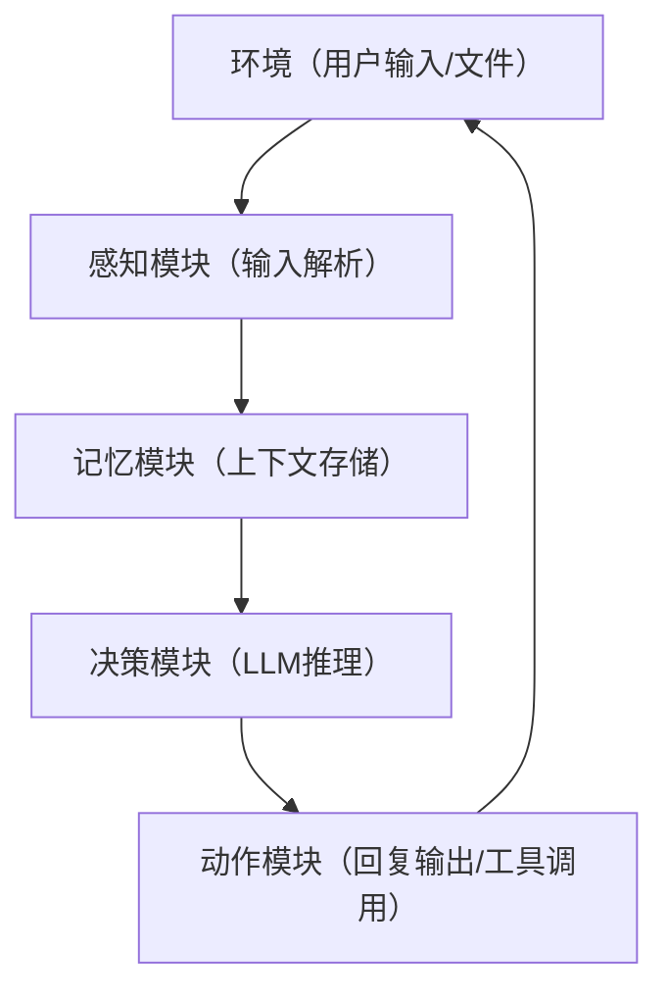

# 第2章 工程化实现可用的LLM智能体

## 2.1 本章目标与核心框架
### 2.1.1 目标定义
本章将基于大语言模型（以通义千问为例），实现具备以下核心能力的实用型智能体：
> 实用型LLM智能体 = 自然语言交互 + 上下文记忆 + 结构化决策 + 可扩展工具调用

### 2.1.2 架构复用
本章实现的LLM智能体完全沿用智能体通用架构，仅将「决策模块」从规则型替换为LLM驱动型：


## 2.2 LLM智能体与规则智能体的核心差异
### 2.2.1 决策逻辑本质区别
| 维度   | 规则型智能体          | LLM智能体           |
| ---- | --------------- | ---------------- |
| 决策核心 | 人工编写的if-else规则集 | 大语言模型的语义推理能力     |
| 灵活性  | 低（仅覆盖预设场景）      | 高（适配未预设的复杂场景）    |
| 开发成本 | 低（规则编写）         | 中（Prompt工程+工具适配） |
| 运行依赖 | 无外部依赖           | 需调用LLM API       |
| 适用场景 | 固定流程、简单交互       | 开放域对话、复杂任务处理     |

### 2.2.2 LLM智能体的核心三要素
1. **Prompt工程（Prompt Engineering）**：通过结构化提示词定义智能体的身份、任务边界、输出格式，是LLM决策的核心指引；
2. **上下文记忆（Context Memory）**：维护对话历史，让LLM具备时序感知能力，避免“失忆”；
3. **工具调用（Tool Calling）**：扩展LLM的能力边界（如计算、搜索、API调用），弥补其算力/实时数据缺陷。

## 2.3 开发环境准备
### 2.3.1 依赖安装
使用通义千问API作为LLM基座（免费额度满足入门学习需求），首先安装官方SDK：
```bash
# 安装通义千问Python SDK
pip install dashscope --upgrade
# 安装辅助依赖（后续工具调用需用）
pip install requests regex
```

### 2.3.2 API密钥获取
1. 访问[阿里云百炼控制台](https://dashscope.console.aliyun.com/)，完成实名认证；
2. 进入「API-KEY管理」页面，创建并复制API密钥（`api_key`）；
3. 密钥安全提示：请勿硬编码到代码中（本章为入门演示暂简化，生产环境需用环境变量/配置文件）。

## 2.4 第一步：实现最小LLM智能体骨架
### 2.4.1 核心功能
实现具备「输入接收→LLM调用→回复输出→上下文记忆」的基础LLM智能体，代码如下：
```python
import dashscope
from dashscope import Generation
from typing import List, Dict

# 配置API密钥（替换为你的真实密钥）
dashscope.api_key = "YOUR_API_KEY"

class SimpleLLMAgent:
    """最小LLM智能体骨架：基础对话+上下文记忆"""
    def __init__(self):
        # 记忆模块：存储对话上下文（格式符合通义千问API要求）
        self.context_memory: List[Dict[str, str]] = []

    def perceive(self) -> str:
        """感知模块：获取用户输入"""
        user_input = input("你：").strip()
        if not user_input:
            return self.perceive()  # 过滤空输入
        return user_input

    def decide(self, user_input: str) -> str:
        """决策模块：调用LLM生成回复"""
        # 1. 将用户输入加入记忆
        self.context_memory.append({"role": "user", "content": user_input})
        
        # 2. 调用通义千问API
        try:
            response = Generation.call(
                model="qwen-turbo",  # 轻量版模型，速度快、成本低
                messages=self.context_memory,  # 传入上下文
                temperature=0.7,  # 随机性：0（确定）~1（随机）
                top_p=0.8  # 采样策略：控制输出多样性
            )
            
            # 3. 解析并保存回复到记忆
            llm_reply = response.output.text
            self.context_memory.append({"role": "assistant", "content": llm_reply})
            return llm_reply
        
        except Exception as e:
            error_msg = f"LLM调用失败：{str(e)}"
            print(f"错误：{error_msg}")
            return error_msg

    def act(self, reply: str) -> None:
        """动作模块：输出LLM回复"""
        print(f"智能体：{reply}")

    def run(self) -> None:
        """智能体主循环"""
        print("LLM智能体已启动（输入'exit'退出对话）\n")
        while True:
            # 感知→决策→行动
            user_input = self.perceive()
            if user_input.lower() == "exit":
                print("智能体：再见！")
                break
            reply = self.decide(user_input)
            self.act(reply)

if __name__ == "__main__":
    agent = SimpleLLMAgent()
    agent.run()
```

### 2.4.2 代码解析
1. **记忆模块**：`context_memory`采用通义千问API标准格式（`[{"role":角色, "content":内容}]`），确保上下文可直接传入API；
2. **决策模块**：补充异常捕获，避免API调用失败导致程序崩溃；
3. **感知模块**：过滤空输入，提升交互体验；
4. **核心特性验证**：运行后输入多轮对话（如“介绍下智能体”→“刚才的回答再精简点”），验证上下文记忆生效。

## 2.5 第二步：通过Prompt工程定义智能体身份
### 2.5.1 System Prompt的作用
System Prompt（系统提示词）是LLM智能体的“身份说明书”，定义其行为准则、专业领域、输出风格，核心价值是将通用LLM约束为特定角色的智能体。

### 2.5.2 升级决策模块（添加System Prompt）
修改`SimpleLLMAgent`的`decide`方法，添加专业智能体的身份定义：
```python
def decide(self, user_input: str) -> str:
    """决策模块：添加System Prompt，定义智能体身份"""
    # 1. 定义System Prompt（智能体身份）
    system_prompt = {
        "role": "system",
        "content": """
你是一名专业的智能体技术讲解助手，具备以下特征：
1. 身份：智能体领域入门导师，擅长用通俗语言解释技术概念；
2. 能力：基于上下文回答问题，拒绝无关话题；
3. 输出：回答简洁（不超过100字），结构清晰，无冗余内容。
        """
    }
    
    # 2. 构造完整消息链（System Prompt + 历史记忆 + 当前输入）
    messages = [system_prompt] + self.context_memory
    messages.append({"role": "user", "content": user_input})
    
    # 3. 调用LLM（其余逻辑不变）
    try:
        response = Generation.call(
            model="qwen-turbo",
            messages=messages,
            temperature=0.5,  # 降低随机性，保证回答准确性
            top_p=0.7
        )
        llm_reply = response.output.text
        self.context_memory.append({"role": "user", "content": user_input})
        self.context_memory.append({"role": "assistant", "content": llm_reply})
        return llm_reply
    except Exception as e:
        error_msg = f"LLM调用失败：{str(e)}"
        print(f"错误：{error_msg}")
        return error_msg
```

### 2.5.3 效果验证
运行升级后的智能体，输入：
- 第一轮：“什么是LLM智能体？” → 智能体按“简洁、专业”的要求回答；
- 第二轮：“刚才的回答再举个例子” → 智能体基于上下文补充示例，且保持风格一致。

## 2.6 第三步：实现工具调用能力（核心升级）
### 2.6.1 工具调用的核心逻辑
LLM智能体的工具调用需完成三个关键步骤：
1. 定义工具（如计算器）并编写执行函数；
2. 通过Prompt告知LLM工具的使用场景和格式；
3. 解析LLM输出的工具调用指令，执行工具并返回结果。

### 2.6.2 完整工具调用型LLM智能体实现
```python
import dashscope
import re
from dashscope import Generation
from typing import List, Dict, Optional

dashscope.api_key = "YOUR_API_KEY"


class ToolEnabledLLMAgent:
    """具备工具调用能力的LLM智能体（计算器工具）"""
    def __init__(self):
        self.context_memory: List[Dict[str, str]] = []

    # ========== 工具定义 ==========
    def calculate(self, expression: str) -> str:
        """
        计算器工具：执行数学表达式计算
        :param expression: 数学表达式（如"1+2*3"）
        :return: 计算结果或错误信息
        """
        # 安全校验：仅允许数字和基础运算符
        allowed_chars = set("0123456789+-*/(). ")
        if not all(c in allowed_chars for c in expression):
            return "计算错误：仅支持数字和+-*/()运算"
        
        try:
            # 生产环境建议使用ast.literal_eval替代eval，提升安全性
            result = eval(expression)
            return f"计算结果：{expression} = {result}"
        except ZeroDivisionError:
            return "计算错误：除数不能为0"
        except:
            return "计算错误：表达式格式不合法（如'2*(3+4)'）"

    def parse_tool_call(self, llm_output: str) -> Optional[Dict[str, str]]:
        """
        解析LLM输出的工具调用指令
        :param llm_output: LLM原始输出
        :return: 工具调用信息（如{"tool": "calculate", "params": "1+2"}），无调用则返回None
        """
        # 匹配格式：TOOL: calculate(表达式)
        pattern = r"TOOL:\s*calculate\((.*?)\)"
        match = re.search(pattern, llm_output.strip(), re.IGNORECASE)
        if match:
            return {
                "tool": "calculate",
                "params": match.group(1).strip()
            }
        return None

    # ========== 核心模块 ==========
    def perceive(self) -> str:
        """感知模块：获取用户输入"""
        user_input = input("你：").strip()
        if not user_input:
            return self.perceive()
        return user_input

    def decide(self, user_input: str) -> str:
        """决策模块：LLM推理（含工具调用判断）"""
        # 1. 定义System Prompt（包含工具使用说明）
        system_prompt = {
            "role": "system",
            "content": """
你是具备计算能力的智能体，遵循以下规则：
1. 当用户提出计算需求时，必须严格按格式输出工具调用指令：TOOL: calculate(数学表达式)；
2. 非计算需求直接回答，无需调用工具；
3. 回答简洁，不超过100字。
            """
        }

        # 2. 构造消息链
        messages = [system_prompt] + self.context_memory
        messages.append({"role": "user", "content": user_input})

        # 3. 调用LLM
        try:
            response = Generation.call(
                model="qwen-turbo",
                messages=messages,
                temperature=0.3,  # 极低随机性，保证工具调用格式准确
                top_p=0.6
            )
            return response.output.text
        except Exception as e:
            return f"LLM调用失败：{str(e)}"

    def act(self, llm_reply: str, user_input: str) -> str:
        """
        动作模块：执行回复或工具调用
        :param llm_reply: LLM原始回复
        :param user_input: 当前用户输入
        :return: 最终回复内容（用于保存到记忆）
        """
        # 1. 解析工具调用指令
        tool_call = self.parse_tool_call(llm_reply)
        if tool_call and tool_call["tool"] == "calculate":
            # 2. 执行计算器工具
            tool_result = self.calculate(tool_call["params"])
            print(f"智能体（计算器工具）：{tool_result}")
            final_reply = tool_result
        else:
            # 3. 无工具调用，直接输出LLM回复
            print(f"智能体：{llm_reply}")
            final_reply = llm_reply

        # 4. 保存到记忆
        self.context_memory.append({"role": "user", "content": user_input})
        self.context_memory.append({"role": "assistant", "content": final_reply})
        return final_reply

    def run(self) -> None:
        """智能体主循环"""
        print("工具增强型LLM智能体已启动（输入'exit'退出）\n")
        while True:
            user_input = self.perceive()
            if user_input.lower() == "exit":
                print("智能体：再见！")
                break
            llm_reply = self.decide(user_input)
            self.act(llm_reply, user_input)

if __name__ == "__main__":
    agent = ToolEnabledLLMAgent()
    agent.run()
```

### 2.6.3 工具调用验证
运行代码后测试以下输入：
1. 非计算需求：“解释下智能体的工具调用” → 智能体直接回答；
2. 计算需求：“计算 100*(20+30)/5” → 智能体调用计算器工具，输出“计算结果：100*(20+30)/5 = 1000”；
3. 非法计算：“计算 10/0” → 工具返回“计算错误：除数不能为0”。

## 2.7 本章实现的LLM智能体核心能力总结
本章构建的LLM智能体已具备实用型智能体的核心特征：
1. **自然语言交互**：基于LLM实现开放域对话，无需预设所有对话规则；
2. **上下文记忆**：维护对话历史，支持多轮交互；
3. **结构化身份**：通过System Prompt定义专业角色，保证回答质量；
4. **可扩展工具调用**：集成计算器工具，具备能力扩展基础；
5. **工程化基础**：模块化设计，便于后续功能升级。

## 2.8 进阶升级方向
### 2.8.1 长期记忆升级
将上下文记忆从内存存储改为JSON文件/数据库持久化，实现“重启不丢失记忆”：
- 核心改造：新增`save_memory`/`load_memory`方法，将`context_memory`写入/读取JSON文件；
- 价值：突破LLM上下文窗口限制，支持超长对话记忆。

### 2.8.2 多工具扩展
新增天气查询、网络搜索等工具，构建工具库：
- 示例工具：天气查询（调用wttr.in API）、百度搜索（调用百度API）；
- 核心改造：扩展`parse_tool_call`方法，支持多工具指令解析，建立工具映射表。

### 2.8.3 自动规划能力
添加任务规划逻辑，让智能体能拆解复杂任务（如“帮我查北京天气并计算出行预算”）：
- 核心改造：通过Prompt让LLM输出任务拆解步骤，自动调用对应工具完成子任务。

### 2.8.4 可视化交互界面
基于Gradio/Streamlit构建Web界面，替代命令行交互：
- 核心改造：将`perceive`/`act`模块替换为Gradio的输入/输出组件；
- 价值：降低使用门槛，便于演示和测试。

### 总结
1. LLM智能体的核心是「Prompt工程+上下文记忆+工具调用」，决策层由人工规则替换为LLM语义推理；
2. 工具调用的关键是“格式约定+指令解析+工具执行”三步法，具备可无限扩展的特性；
3. 本章实现的模块化LLM智能体是入门基础，可通过长期记忆、多工具、可视化等方向升级为实用型智能体。