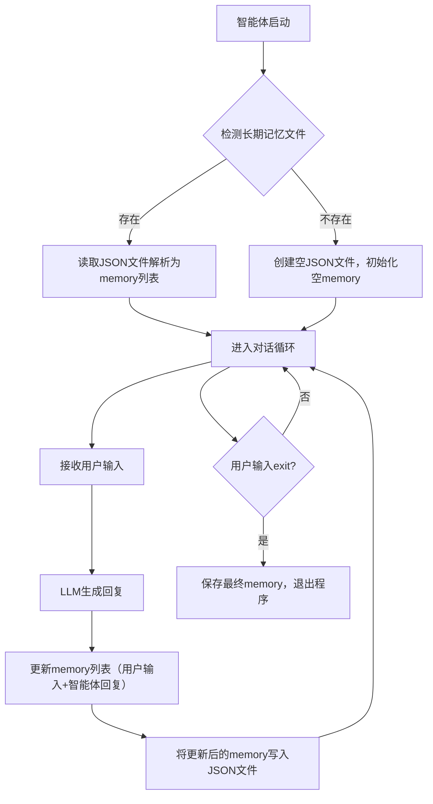

# 第3章 LLM智能体的长期记忆工程实现
## 3.1 长期记忆的核心理论与价值
### 3.1.1 长期记忆的定义与必要性
智能体的记忆按存储维度可分为两类，其核心差异如下：

| 记忆类型       | 存储位置 | 生命周期       | 核心缺陷                  | 适用场景               |
|----------------|----------|----------------|---------------------------|------------------------|
| 短期记忆       | 内存     | 程序运行期间   | 程序关闭后数据丢失        | 单轮/短轮次临时交互    |
| 长期记忆       | 硬盘/数据库 | 永久存储       | 需手动管理存储格式与容量  | 跨会话、长周期交互场景 |

**长期记忆的核心定义**：将智能体的对话上下文、状态信息从内存持久化到硬盘（如JSON文件、数据库），实现「程序重启后记忆不丢失」的存储机制，是实用型智能体的必备能力。

### 3.1.2 长期记忆的实现逻辑（学术版）
长期记忆的核心是「启动加载-交互更新-持久化保存」的闭环流程，其执行逻辑如下：


**核心实现要点**：
1. 存储格式一致性：JSON文件的结构必须与LLM API要求的`messages`格式（`[{"role":角色, "content":内容}]`）完全匹配；
2. 读写原子性：文件读写需添加异常捕获，避免数据损坏；
3. 编码兼容性：保存时开启`ensure_ascii=False`，确保中文等非ASCII字符正常存储。

## 3.2 工程化实现长期记忆（分步开发）
基于第2章的工具增强型LLM智能体，分5步实现长期记忆功能，每一步均保证可验证、可运行。

### 3.2.1 环境配置与依赖导入
补充文件操作相关依赖，定义全局配置项（便于后续维护）：
```python
import dashscope
import re
import json
import os
from dashscope import Generation
from typing import List, Dict, Optional

# ====================== 全局配置项 ======================
# 1. LLM配置（替换为你的真实API Key）
dashscope.api_key = "YOUR_API_KEY"
# 2. 长期记忆文件路径（规范命名，便于识别）
LONG_TERM_MEMORY_PATH = "llm_agent_long_memory.json"
# 3. LLM模型配置（统一管理）
LLM_MODEL = "qwen-turbo"
LLM_TEMPERATURE = 0.3  # 低随机性，保证工具调用格式稳定
```

### 3.2.2 长期记忆加载函数
实现程序启动时的记忆加载逻辑，包含文件检测、异常处理、初始化等核心逻辑：
```python
def load_long_term_memory() -> List[Dict[str, str]]:
    """
    加载长期记忆：从JSON文件读取历史对话记录
    :return: 格式化的memory列表（与LLM messages格式一致）
    """
    # 1. 检测文件是否存在
    if os.path.exists(LONG_TERM_MEMORY_PATH):
        try:
            # 2. 读取并解析JSON文件
            with open(LONG_TERM_MEMORY_PATH, "r", encoding="utf-8") as f:
                memory = json.load(f)
                # 校验格式合法性（避免手动修改文件导致格式错误）
                if isinstance(memory, list):
                    print(f"✅ 长期记忆加载成功，共{len(memory)}条对话记录")
                    return memory
                else:
                    print("⚠️ 记忆文件格式错误（非列表），初始化空记忆")
                    return []
        except json.JSONDecodeError:
            print("⚠️ 记忆文件JSON解析失败，初始化空记忆")
            return []
        except Exception as e:
            print(f"⚠️ 加载记忆异常：{str(e)}，初始化空记忆")
            return []
    else:
        # 3. 文件不存在时创建空文件
        with open(LONG_TERM_MEMORY_PATH, "w", encoding="utf-8") as f:
            json.dump([], f, ensure_ascii=False, indent=2)
        print("✅ 未检测到长期记忆文件，已创建新文件")
        return []
```

### 3.2.3 长期记忆保存函数
实现对话更新后的记忆持久化逻辑，补充长度限制（避免文件过大）：
```python
def save_long_term_memory(memory: List[Dict[str, str]], max_length: int = 20) -> None:
    """
    保存长期记忆：将memory列表写入JSON文件，支持长度限制
    :param memory: 待保存的记忆列表
    :param max_length: 最大记忆条数（默认保留最近20条，避免LLM上下文超限）
    """
    try:
        # 1. 截取最近max_length条记录（优化：避免上下文过长）
        trimmed_memory = memory[-max_length:]
        # 2. 写入文件（indent=2保证可读性）
        with open(LONG_TERM_MEMORY_PATH, "w", encoding="utf-8") as f:
            json.dump(trimmed_memory, f, ensure_ascii=False, indent=2)
        # 3. 可选：打印保存日志（便于调试）
        # print(f"✅ 长期记忆已保存，当前共{len(trimmed_memory)}条记录")
    except Exception as e:
        print(f"⚠️ 保存长期记忆失败：{str(e)}")
```

### 3.2.4 工具函数复用与优化
复用第2章的计算器工具，补充安全校验（避免恶意输入）：
```python
def calculate_tool(expression: str) -> str:
    """
    计算器工具：安全执行数学表达式计算
    :param expression: 数学表达式（如"1+2*3"）
    :return: 计算结果或错误提示
    """
    # 安全校验：仅允许数字和基础运算符
    allowed_chars = set("0123456789+-*/(). ")
    if not all(char in allowed_chars for char in expression):
        return "计算错误：仅支持数字和+-*/()运算"
    
    try:
        # 生产环境建议使用ast.literal_eval替代eval
        result = eval(expression)
        return f"计算结果：{expression} = {result}"
    except ZeroDivisionError:
        return "计算错误：除数不能为0"
    except SyntaxError:
        return "计算错误：表达式语法错误（如缺少括号）"
    except Exception:
        return "计算错误：无法识别的表达式格式"

def parse_tool_call(llm_output: str) -> Optional[Dict[str, str]]:
    """
    解析LLM输出的工具调用指令
    :param llm_output: LLM原始回复
    :return: 工具调用信息（如{"tool":"calculate", "params":"1+2"}），无调用则返回None
    """
    pattern = r"TOOL:\s*calculate\((.*?)\)"
    match = re.search(pattern, llm_output.strip(), re.IGNORECASE)
    if match:
        return {
            "tool": "calculate",
            "params": match.group(1).strip()
        }
    return None
```

### 3.2.5 整合长期记忆的智能体类
基于模块化设计，改造智能体类，接入长期记忆加载/保存逻辑：
```python
class LLMAgentWithLongMemory:
    """具备长期记忆+工具调用能力的LLM智能体"""
    def __init__(self):
        # 初始化时加载长期记忆（核心改造点1）
        self.memory: List[Dict[str, str]] = load_long_term_memory()

    def perceive(self) -> str:
        """感知模块：获取用户输入，过滤空值"""
        user_input = input("你：").strip()
        if not user_input:
            print("智能体：请输入有效内容～")
            return self.perceive()
        return user_input

    def decide(self, user_input: str) -> str:
        """
        决策模块：LLM推理（含清空记忆意图识别）
        :param user_input: 用户输入
        :return: LLM原始回复
        """
        # 新增：清空记忆意图处理
        if "清空记忆" in user_input:
            self.memory = []
            save_long_term_memory(self.memory)
            return "✅ 已清空所有长期记忆！"

        # 定义System Prompt（强调长期记忆能力）
        system_prompt = {
            "role": "system",
            "content": """
你是具备长期记忆和工具调用能力的智能体，遵循以下规则：
1. 记忆：你能记住所有历史对话，重启后也不会丢失；
2. 工具：仅拥有calculate(数学表达式)工具，计算需求必须输出：TOOL: calculate(表达式)；
3. 输出：工具调用仅返回格式指令，非计算需求直接友好回复，回答简洁（≤100字）。
            """
        }

        # 构造LLM输入消息链
        messages = [system_prompt] + self.memory
        messages.append({"role": "user", "content": user_input})

        # 调用LLM API
        try:
            response = Generation.call(
                model=LLM_MODEL,
                messages=messages,
                temperature=LLM_TEMPERATURE,
                top_p=0.6
            )
            return response.output.text
        except Exception as e:
            return f"LLM调用失败：{str(e)}"

    def act(self, llm_reply: str, user_input: str) -> str:
        """
        动作模块：执行回复或工具调用，更新记忆
        :param llm_reply: LLM原始回复
        :param user_input: 当前用户输入
        :return: 最终回复内容（用于保存到记忆）
        """
        # 解析工具调用指令
        tool_call = parse_tool_call(llm_reply)
        if tool_call and tool_call["tool"] == "calculate":
            # 执行计算器工具
            final_reply = calculate_tool(tool_call["params"])
            print(f"智能体（计算器工具）：{final_reply}")
        else:
            # 直接输出LLM回复
            final_reply = llm_reply
            print(f"智能体：{final_reply}")

        # 更新记忆并保存（核心改造点2）
        self.memory.append({"role": "user", "content": user_input})
        self.memory.append({"role": "assistant", "content": final_reply})
        save_long_term_memory(self.memory)

        return final_reply

    def run(self) -> None:
        """智能体主循环"""
        print("📌 LLM智能体（带长期记忆）已启动，输入'exit'退出对话\n")
        while True:
            user_input = self.perceive()
            if user_input.lower() == "exit":
                print("智能体：再见！已保存所有对话记忆～")
                break
            # 决策→行动
            llm_reply = self.decide(user_input)
            self.act(llm_reply, user_input)
```

### 3.2.6 完整可运行代码
整合所有模块，形成最终可直接执行的代码：
```python
import dashscope
import re
import json
import os
from dashscope import Generation
from typing import List, Dict, Optional

# ====================== 全局配置 ======================
dashscope.api_key = "YOUR_API_KEY"
LONG_TERM_MEMORY_PATH = "llm_agent_long_memory.json"
LLM_MODEL = "qwen-turbo"
LLM_TEMPERATURE = 0.3

# ====================== 长期记忆工具函数 ======================
def load_long_term_memory() -> List[Dict[str, str]]:
    if os.path.exists(LONG_TERM_MEMORY_PATH):
        try:
            with open(LONG_TERM_MEMORY_PATH, "r", encoding="utf-8") as f:
                memory = json.load(f)
                if isinstance(memory, list):
                    print(f"✅ 长期记忆加载成功，共{len(memory)}条对话记录")
                    return memory
                else:
                    print("⚠️ 记忆文件格式错误，初始化空记忆")
                    return []
        except Exception as e:
            print(f"⚠️ 加载记忆异常：{str(e)}，初始化空记忆")
            return []
    else:
        with open(LONG_TERM_MEMORY_PATH, "w", encoding="utf-8") as f:
            json.dump([], f, ensure_ascii=False, indent=2)
        print("✅ 已创建新的长期记忆文件")
        return []

def save_long_term_memory(memory: List[Dict[str, str]], max_length: int = 20) -> None:
    try:
        trimmed_memory = memory[-max_length:]
        with open(LONG_TERM_MEMORY_PATH, "w", encoding="utf-8") as f:
            json.dump(trimmed_memory, f, ensure_ascii=False, indent=2)
    except Exception as e:
        print(f"⚠️ 保存长期记忆失败：{str(e)}")

# ====================== 工具函数 ======================
def calculate_tool(expression: str) -> str:
    allowed_chars = set("0123456789+-*/(). ")
    if not all(char in allowed_chars for char in expression):
        return "计算错误：仅支持数字和+-*/()运算"
    try:
        result = eval(expression)
        return f"计算结果：{expression} = {result}"
    except ZeroDivisionError:
        return "计算错误：除数不能为0"
    except SyntaxError:
        return "计算错误：表达式语法错误"
    except Exception:
        return "计算错误：无法识别的表达式格式"

def parse_tool_call(llm_output: str) -> Optional[Dict[str, str]]:
    pattern = r"TOOL:\s*calculate\((.*?)\)"
    match = re.search(pattern, llm_output.strip(), re.IGNORECASE)
    if match:
        return {"tool": "calculate", "params": match.group(1).strip()}
    return None

# ====================== 智能体主类 ======================
class LLMAgentWithLongMemory:
    def __init__(self):
        self.memory = load_long_term_memory()

    def perceive(self) -> str:
        user_input = input("你：").strip()
        if not user_input:
            print("智能体：请输入有效内容～")
            return self.perceive()
        return user_input

    def decide(self, user_input: str) -> str:
        if "清空记忆" in user_input:
            self.memory = []
            save_long_term_memory(self.memory)
            return "✅ 已清空所有长期记忆！"

        system_prompt = {
            "role": "system",
            "content": """
你是具备长期记忆和工具调用能力的智能体，遵循以下规则：
1. 记忆：你能记住所有历史对话，重启后也不会丢失；
2. 工具：仅拥有calculate(数学表达式)工具，计算需求必须输出：TOOL: calculate(表达式)；
3. 输出：工具调用仅返回格式指令，非计算需求直接友好回复，回答简洁（≤100字）。
            """
        }

        messages = [system_prompt] + self.memory
        messages.append({"role": "user", "content": user_input})

        try:
            response = Generation.call(
                model=LLM_MODEL,
                messages=messages,
                temperature=LLM_TEMPERATURE,
                top_p=0.6
            )
            return response.output.text
        except Exception as e:
            return f"LLM调用失败：{str(e)}"

    def act(self, llm_reply: str, user_input: str) -> str:
        tool_call = parse_tool_call(llm_reply)
        if tool_call and tool_call["tool"] == "calculate":
            final_reply = calculate_tool(tool_call["params"])
            print(f"智能体（计算器工具）：{final_reply}")
        else:
            final_reply = llm_reply
            print(f"智能体：{final_reply}")

        self.memory.append({"role": "user", "content": user_input})
        self.memory.append({"role": "assistant", "content": final_reply})
        save_long_term_memory(self.memory)

        return final_reply

    def run(self) -> None:
        print("📌 LLM智能体（带长期记忆）已启动，输入'exit'退出对话\n")
        while True:
            user_input = self.perceive()
            if user_input.lower() == "exit":
                print("智能体：再见！已保存所有对话记忆～")
                break
            llm_reply = self.decide(user_input)
            self.act(llm_reply, user_input)

# ====================== 运行入口 ======================
if __name__ == "__main__":
    agent = LLMAgentWithLongMemory()
    agent.run()
```

## 3.3 长期记忆功能验证（标准化测试流程）
按以下步骤验证长期记忆的完整性、持久性、准确性：

### 3.3.1 第一轮运行测试
1. 执行代码，输入以下内容：
   - 输入：`你好，我叫小明，是一名智能体学习者` → 记录智能体回复；
   - 输入：`计算 100*(20+30)/5` → 验证计算器工具返回`计算结果：100*(20+30)/5 = 1000`；
   - 输入：`exit` → 退出程序，确认控制台提示「已保存所有对话记忆」。

### 3.3.2 第二轮运行验证
1. 重新执行代码，控制台会提示「长期记忆加载成功，共4条对话记录」；
2. 输入验证内容：
   - 输入：`我叫什么名字？` → 智能体应回答「你叫小明」；
   - 输入：`刚才计算的表达式结果是多少？` → 智能体应回答「100*(20+30)/5 = 1000」；
   - 输入：`清空记忆` → 验证记忆清空功能，控制台提示「✅ 已清空所有长期记忆！」；
   - 输入：`exit` → 退出程序。

### 3.3.3 文件内容校验
打开`llm_agent_long_memory.json`文件，验证不同阶段的内容：
1. 第一轮退出后，文件包含4条记录（2轮对话：用户+智能体各2条）；
2. 清空记忆后，文件内容为`[]`（空列表）；
3. 所有中文内容正常显示（无乱码），格式符合`[{"role":"xxx","content":"xxx"}]`。

## 3.4 进阶优化（生产级改造）
针对长期记忆在实际使用中的痛点，提供3个核心优化方向：

### 3.4.1 记忆长度动态管理
默认保留最近20条记录，可根据LLM上下文窗口大小动态调整（如通义千问turbo版支持8k上下文，可设为`max_length=40`）：
```python
def save_long_term_memory(memory: List[Dict[str, str]], max_length: int = 40) -> None:
    """根据LLM上下文窗口调整记忆长度"""
    # 按角色成对截取（保证对话完整性）
    if len(memory) > max_length:
        # 从后往前截取，保留最后max_length条（需为偶数，保证用户/智能体回复成对）
        start_idx = len(memory) - max_length
        if start_idx % 2 != 0:
            start_idx += 1
        trimmed_memory = memory[start_idx:]
    else:
        trimmed_memory = memory
    
    try:
        with open(LONG_TERM_MEMORY_PATH, "w", encoding="utf-8") as f:
            json.dump(trimmed_memory, f, ensure_ascii=False, indent=2)
    except Exception as e:
        print(f"⚠️ 保存长期记忆失败：{str(e)}")
```

### 3.4.2 记忆加密存储（安全优化）
针对敏感对话场景，使用AES加密记忆文件（需安装`pycryptodome`）：
```python
from Crypto.Cipher import AES
from Crypto.Util.Padding import pad, unpad
import base64

# 加密配置（生产环境需从环境变量读取密钥）
KEY = b"1234567890123456"  # 16/24/32字节密钥
IV = b"1234567890123456"   # 16字节IV

def encrypt_memory(memory_str: str) -> str:
    """加密记忆内容"""
    cipher = AES.new(KEY, AES.MODE_CBC, IV)
    encrypted = cipher.encrypt(pad(memory_str.encode("utf-8"), AES.block_size))
    return base64.b64encode(encrypted).decode("utf-8")

def decrypt_memory(encrypted_str: str) -> str:
    """解密记忆内容"""
    cipher = AES.new(KEY, AES.MODE_CBC, IV)
    decrypted = unpad(cipher.decrypt(base64.b64decode(encrypted_str)), AES.block_size)
    return decrypted.decode("utf-8")

# 改造保存函数
def save_long_term_memory(memory: List[Dict[str, str]], max_length: int = 20):
    try:
        trimmed_memory = memory[-max_length:]
        memory_str = json.dumps(trimmed_memory, ensure_ascii=False)
        encrypted_str = encrypt_memory(memory_str)
        with open(LONG_TERM_MEMORY_PATH, "w", encoding="utf-8") as f:
            f.write(encrypted_str)
    except Exception as e:
        print(f"⚠️ 保存长期记忆失败：{str(e)}")

# 改造加载函数
def load_long_term_memory() -> List[Dict[str, str]]:
    if os.path.exists(LONG_TERM_MEMORY_PATH):
        try:
            with open(LONG_TERM_MEMORY_PATH, "r", encoding="utf-8") as f:
                encrypted_str = f.read()
            memory_str = decrypt_memory(encrypted_str)
            memory = json.loads(memory_str)
            if isinstance(memory, list):
                print(f"✅ 长期记忆加载成功，共{len(memory)}条记录")
                return memory
            else:
                return []
        except Exception as e:
            print(f"⚠️ 加载记忆异常：{str(e)}")
            return []
    else:
        with open(LONG_TERM_MEMORY_PATH, "w", encoding="utf-8") as f:
            f.write(encrypt_memory("[]"))
        print("✅ 已创建新的长期记忆文件")
        return []
```

### 3.4.3 记忆结构化存储（数据库升级）
将JSON文件替换为SQLite数据库，支持更高效的查询、分页、筛选：
```python
import sqlite3

# 初始化数据库
def init_memory_db():
    conn = sqlite3.connect("llm_agent_memory.db")
    cursor = conn.cursor()
    # 创建对话记录表
    cursor.execute("""
    CREATE TABLE IF NOT EXISTS conversation (
        id INTEGER PRIMARY KEY AUTOINCREMENT,
        role TEXT NOT NULL,
        content TEXT NOT NULL,
        create_time TIMESTAMP DEFAULT CURRENT_TIMESTAMP
    )
    """)
    conn.commit()
    conn.close()

# 加载记忆（从数据库读取）
def load_long_term_memory() -> List[Dict[str, str]]:
    init_memory_db()
    conn = sqlite3.connect("llm_agent_memory.db")
    cursor = conn.cursor()
    cursor.execute("SELECT role, content FROM conversation ORDER BY id")
    rows = cursor.fetchall()
    memory = [{"role": row[0], "content": row[1]} for row in rows]
    conn.close()
    print(f"✅ 长期记忆加载成功，共{len(memory)}条记录")
    return memory

# 保存记忆（写入数据库）
def save_long_term_memory(memory: List[Dict[str, str]], max_length: int = 20):
    init_memory_db()
    # 清空旧数据，保留最新max_length条
    trimmed_memory = memory[-max_length:]
    conn = sqlite3.connect("llm_agent_memory.db")
    cursor = conn.cursor()
    cursor.execute("DELETE FROM conversation")  # 清空表
    # 插入最新记忆
    for item in trimmed_memory:
        cursor.execute("INSERT INTO conversation (role, content) VALUES (?, ?)",
                      (item["role"], item["content"]))
    conn.commit()
    conn.close()
```

## 总结
1. 长期记忆的核心是「内存数据持久化」，实现逻辑为「启动加载-交互更新-保存落地」，且需保证存储格式与LLM API要求一致；
2. 工程化实现需重点关注异常处理、格式校验、编码兼容，避免数据丢失或格式错误；
3. 基础版使用JSON文件即可满足入门需求，生产环境可通过长度管理、加密、数据库存储等方式优化；
4. 长期记忆是实用型LLM智能体的基础能力，为后续复杂任务（如多轮任务规划、个性化交互）提供支撑。