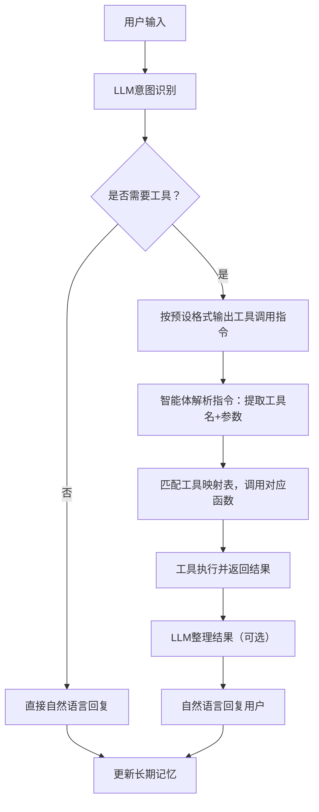

# 第4章 LLM智能体的多工具扩展与工程化实现
## 4.1 工具调用的核心理论体系
### 4.1.1 工具调用的本质与价值
LLM智能体的工具调用并非LLM自身具备工具能力，而是通过 `「意图理解-格式输出-指令解析-工具执行-结果返回」`的闭环，实现LLM能力边界的扩展。其核心价值体现在：
- 弥补LLM固有缺陷：解决实时数据缺失（如天气）、算力不足（如复杂计算）、功能单一（如翻译）等问题；
- 提升智能体实用性：从“仅能对话”升级为“能解决实际问题”；
- 标准化能力扩展：通过统一的工具调用框架，实现任意工具的即插即用。

### 4.1.2 工具调用的通用执行链路（学术版）


### 4.1.3 多工具扩展的通用方法论（标准化步骤）
新增任意工具均遵循以下5个标准化步骤，确保扩展过程可复用、无遗漏：
1. **工具函数实现**：编写具备异常处理、参数校验的工具核心逻辑；
2. **工具描述定义**：在System Prompt中明确工具名称、参数、调用格式；
3. **指令解析升级**：实现通用的工具指令解析逻辑，支持多工具识别；
4. **工具映射整合**：建立工具名与工具函数的映射关系，便于调用；
5. **全链路测试**：验证工具调用的完整性、容错性、结果准确性。

## 4.2 实战：多工具扩展——新增天气查询工具
基于第3章的「长期记忆LLM智能体」，分步实现天气查询工具的集成，全程保证代码可直接复制运行。

### 4.2.1 环境准备
#### 2.1.1 依赖安装
安装HTTP请求库（用于调用天气API）：
```bash
# 安装requests库（用于API调用）
pip install requests --upgrade
# 安装核心依赖（确保版本兼容）
pip install dashscope regex json5
```

#### 2.1.2 免费天气API说明
选用wttr.in免费天气接口（无需注册、全球覆盖、支持中文）：
- 基础调用格式：`https://wttr.in/城市名?format=3`（简洁文本格式）
- JSON格式调用：`https://wttr.in/城市名?format=j`（便于结构化解析）
- 示例请求：`https://wttr.in/上海?format=3` → 返回：`上海: 🌧️ +10°C`
> 延迟比较大，必要时可以替换为uapis.cn的API

### 4.2.2 步骤1：实现天气查询工具函数
工具函数需满足「参数校验-异常处理-结果返回」的工程化要求，代码如下：
```python
import requests
from typing import Optional

def get_weather(city: str) -> str:
    """天气查询工具（完整异常处理版）"""
    if not city or city.strip() == "":
        return "❌ 请输入有效的城市名（如北京、上海）"
    
    try:
        # url = f"https://wttr.in/{city.strip()}?format=3" # 原始URL，延迟比较大，因此使用uapis.cn的API
        import urllib.parse
        encoded_city = urllib.parse.quote(city.strip())
        url = f'https://uapis.cn/api/v1/misc/weather?city={encoded_city}'
        headers = {"User-Agent": "Mozilla/5.0"}
        # 移除verify=False以避免SSL警告，或使用requests.packages.urllib3.disable_warnings()
        import requests.packages.urllib3
        requests.packages.urllib3.disable_warnings()
        response = requests.get(url, headers=headers, timeout=10, verify=False)
        response.raise_for_status()
        # 直接使用response.text，requests会自动处理编码
        weather_info = response.text
        return f"✅ {weather_info}"
    except requests.exceptions.Timeout:
        return "❌ 天气API请求超时，请稍后重试"
    except requests.exceptions.HTTPError:
        return "❌ 城市不存在或API返回错误"
    except requests.exceptions.RequestException as e:
        return f"❌ 网络请求失败：{str(e)}"
    except Exception as e:
        return f"❌ 天气查询异常：{str(e)}"

# 工具函数测试（独立验证）
if __name__ == "__main__":
    print(get_weather("北京"))  # 测试有效城市
    print(get_weather(""))      # 测试空参数
    print(get_weather("不存在的城市"))  # 测试无效城市
```

### 4.2.3 步骤2：更新System Prompt（工具描述）
在智能体的决策模块中，更新System Prompt，明确告知LLM新增的天气工具及调用规则：
```python
def decide(self, user_input: str) -> str:
    """决策模块：LLM推理（含多工具调用规则）"""
    # 清空记忆指令（保留原有逻辑）
    if "清空记忆" in user_input:
        self.memory = []
        save_long_term_memory(self.memory)
        return "✅ 已清空所有长期记忆！"

    # 系统提示词（明确多工具调用规则）
    system_prompt = {
        "role": "system",
        "content": """
你是具备长期记忆和多工具调用能力的智能体，严格遵循以下规则：
1. 可用工具列表（仅在需要时调用）：
   - calculate(数学表达式)：执行数学计算，参数为合法数学表达式（如1+2*3、99/3）；
   - get_weather(城市名)：查询城市天气，参数为中文城市名（如北京、上海）。
2. 工具调用格式（必须严格遵守，无任何额外内容）：
   正确示例：TOOL: calculate(100+200)、TOOL: get_weather(广州)
   错误示例：请调用calculate(100+200)、TOOL:get_weather(广州)
3. 回复规则：
   - 仅计算/查天气需求调用对应工具，其他需求直接自然语言回复；
   - 工具调用仅输出指令，不添加任何解释、标点、换行；
   - 回复简洁，非工具调用内容不超过100字。
        """
    }

    # 构造LLM输入消息链（保留原有逻辑）
    messages = [system_prompt] + self.memory
    messages.append({"role": "user", "content": user_input})

    # 调用通义千问API（补充异常处理）
    try:
        from dashscope import Generation
        response = Generation.call(
            model="qwen-turbo",
            messages=messages,
            temperature=0.2,  # 降低随机性，保证格式准确
            top_p=0.5
        )
        return response.output.text
    except Exception as e:
        return f"LLM调用失败：{str(e)}"
```

### 4.2.4 步骤3：实现通用工具解析逻辑
升级工具解析模块，从单一工具支持改为多工具通用解析，核心是「正则匹配-参数提取-映射执行」：
```python
import re
from typing import Optional, Dict, Callable

def parse_tool_call(self, llm_output: str) -> Optional[Dict[str, str]]:
    """
    通用工具调用指令解析（支持多工具）
    :param llm_output: LLM输出的原始内容
    :return: 工具调用信息（{"tool":工具名, "params":参数}），无调用则返回None
    """
    # 正则匹配：严格匹配TOOL: 工具名(参数)格式
    pattern = r"^TOOL:\s*(\w+)\((.*?)\)$"
    match = re.match(pattern, llm_output.strip(), re.IGNORECASE)
    
    if not match:
        return None
    
    # 提取工具名和参数（去除首尾空格）
    tool_name = match.group(1).strip().lower()  # 统一小写，避免大小写问题
    tool_params = match.group(2).strip()
    
    return {
        "tool": tool_name,
        "params": tool_params
    }

def execute_tool(self, tool_info: Dict[str, str]) -> str:
    """
    工具执行函数（基于映射表调用对应工具）
    :param tool_info: 工具调用信息（parse_tool_call的返回值）
    :return: 工具执行结果/错误提示
    """
    # 工具映射表（新增工具仅需在此添加）
    tool_mapping: Dict[str, Callable] = {
        "calculate": self.calculate_tool,
        "get_weather": get_weather  # 引用外部天气工具函数
    }

    tool_name = tool_info["tool"]
    tool_params = tool_info["params"]

    # 执行工具（容错处理）
    if tool_name in tool_mapping:
        try:
            return tool_mapping[tool_name](tool_params)
        except Exception as e:
            return f"❌ 工具执行失败：{str(e)}"
    else:
        return f"❌ 未知工具：{tool_name}，仅支持calculate/get_weather"

# 保留并优化计算器工具函数
def calculate_tool(self, expression: str) -> str:
    """
    计算器工具（安全优化版）
    :param expression: 数学表达式
    :return: 计算结果/错误提示
    """
    # 安全校验：仅允许数字和基础运算符
    allowed_chars = set("0123456789+-*/(). ")
    if not all(char in allowed_chars for char in expression):
        return "❌ 计算表达式非法，仅支持数字和+-*/()运算"
    
    try:
        result = eval(expression)
        return f"✅ 计算结果：{expression} = {result}"
    except ZeroDivisionError:
        return "❌ 计算错误：除数不能为0"
    except SyntaxError:
        return "❌ 计算错误：表达式语法错误（如缺少括号）"
    except Exception as e:
        return f"❌ 计算失败：{str(e)}"
```

### 4.2.5 步骤4：整合工具调用到智能体动作模块
更新动作模块，接入通用工具解析与执行逻辑：
```python
def act(self, llm_reply: str, user_input: str) -> str:
    """
    动作模块：执行工具调用或直接回复
    :param llm_reply: LLM原始回复
    :param user_input: 当前用户输入
    :return: 最终回复内容（用于保存记忆）
    """
    # 解析工具调用指令
    tool_info = self.parse_tool_call(llm_reply)
    
    if tool_info:
        # 执行工具并输出结果
        tool_result = self.execute_tool(tool_info)
        print(f"智能体（{tool_info['tool']}工具）：{tool_result}")
        final_reply = tool_result
    else:
        # 无工具调用，直接输出LLM回复
        final_reply = llm_reply.strip()
        print(f"智能体：{final_reply}")

    # 更新并保存长期记忆（保留原有逻辑）
    self.memory.append({"role": "user", "content": user_input})
    self.memory.append({"role": "assistant", "content": final_reply})
    save_long_term_memory(self.memory)

    return final_reply
```

### 4.2.6 完整可运行代码（多工具+长期记忆）
整合所有模块，形成工程化的完整代码：
```python
import dashscope
import re
import json
import os
import requests
from typing import List, Dict, Optional, Callable
from dashscope import Generation

# ====================== 全局配置 ======================
# 1. LLM配置（替换为你的API Key）
dashscope.api_key = "YOUR_API_KEY"
LLM_MODEL = "qwen-turbo"
LLM_TEMPERATURE = 0.2

# 2. 长期记忆配置
LONG_TERM_MEMORY_PATH = "llm_agent_long_memory.json"
MAX_MEMORY_LENGTH = 20  # 最大记忆条数

# ====================== 长期记忆工具函数 ======================
def load_long_term_memory() -> List[Dict[str, str]]:
    """加载长期记忆（保留第3章逻辑，补充格式校验）"""
    if os.path.exists(LONG_TERM_MEMORY_PATH):
        try:
            with open(LONG_TERM_MEMORY_PATH, "r", encoding="utf-8") as f:
                memory = json.load(f)
                if isinstance(memory, list):
                    print(f"✅ 加载长期记忆成功，共{len(memory)}条记录")
                    return memory
                else:
                    print("⚠️ 记忆文件格式错误，初始化空记忆")
                    return []
        except Exception as e:
            print(f"⚠️ 加载记忆异常：{str(e)}，初始化空记忆")
            return []
    else:
        with open(LONG_TERM_MEMORY_PATH, "w", encoding="utf-8") as f:
            json.dump([], f, ensure_ascii=False, indent=2)
        print("✅ 已创建新的长期记忆文件")
        return []

def save_long_term_memory(memory: List[Dict[str, str]]) -> None:
    """保存长期记忆（限制长度，保留第3章逻辑）"""
    try:
        trimmed_memory = memory[-MAX_MEMORY_LENGTH:]
        with open(LONG_TERM_MEMORY_PATH, "w", encoding="utf-8") as f:
            json.dump(trimmed_memory, f, ensure_ascii=False, indent=2)
    except Exception as e:
        print(f"⚠️ 保存长期记忆失败：{str(e)}")

# ====================== 工具函数库 ======================
def get_weather(city: str) -> str:
    """天气查询工具（完整异常处理版）"""
    if not city or city.strip() == "":
        return "❌ 请输入有效的城市名（如北京、上海）"
    
    try:
        url = f"https://wttr.in/{city.strip()}?format=3"
        headers = {"User-Agent": "Mozilla/5.0"}
        response = requests.get(url, headers=headers, timeout=10, verify=False)
        response.raise_for_status()
        weather_info = response.text.encode('iso-8859-1').decode('utf-8')
        return f"✅ {weather_info}"
    except requests.exceptions.Timeout:
        return "❌ 天气API请求超时，请稍后重试"
    except requests.exceptions.HTTPError:
        return "❌ 城市不存在或API返回错误"
    except requests.exceptions.RequestException as e:
        return f"❌ 网络请求失败：{str(e)}"
    except Exception as e:
        return f"❌ 天气查询异常：{str(e)}"

def calculate_tool(expression: str) -> str:
    """计算器工具（安全优化版）"""
    allowed_chars = set("0123456789+-*/(). ")
    if not all(char in allowed_chars for char in expression):
        return "❌ 计算表达式非法，仅支持数字和+-*/()运算"
    
    try:
        result = eval(expression)
        return f"✅ 计算结果：{expression} = {result}"
    except ZeroDivisionError:
        return "❌ 计算错误：除数不能为0"
    except SyntaxError:
        return "❌ 计算错误：表达式语法错误（如缺少括号）"
    except Exception as e:
        return f"❌ 计算失败：{str(e)}"

# ====================== 多工具智能体主类 ======================
class MultiToolLLMAgent:
    def __init__(self):
        self.memory = load_long_term_memory()  # 加载长期记忆

    def perceive(self) -> str:
        """感知模块：获取用户输入（过滤空值）"""
        user_input = input("你：").strip()
        if not user_input:
            print("智能体：请输入有效内容～")
            return self.perceive()
        return user_input

    def decide(self, user_input: str) -> str:
        """决策模块：LLM推理（多工具调用规则）"""
        # 清空记忆指令
        if "清空记忆" in user_input:
            self.memory = []
            save_long_term_memory(self.memory)
            return "✅ 已清空所有长期记忆！"

        # 系统提示词（多工具规则）
        system_prompt = {
            "role": "system",
            "content": """
你是具备长期记忆和多工具调用能力的智能体，严格遵循以下规则：
1. 可用工具列表：
   - calculate(数学表达式)：执行数学计算，参数为合法数学表达式；
   - get_weather(城市名)：查询城市天气，参数为中文城市名。
2. 工具调用格式（必须严格遵守，无额外内容）：
   正确：TOOL: calculate(100+200)、TOOL: get_weather(广州)
3. 回复规则：
   - 仅计算/查天气需求调用对应工具，其他需求直接自然语言回复；
   - 回复简洁，非工具调用内容不超过100字。
            """
        }

        # 构造LLM输入
        messages = [system_prompt] + self.memory
        messages.append({"role": "user", "content": user_input})

        # 调用LLM API
        try:
            response = Generation.call(
                model=LLM_MODEL,
                messages=messages,
                temperature=LLM_TEMPERATURE,
                top_p=0.5
            )
            return response.output.text
        except Exception as e:
            return f"LLM调用失败：{str(e)}"

    def parse_tool_call(self, llm_output: str) -> Optional[Dict[str, str]]:
        """通用工具指令解析（支持多工具）"""
        pattern = r"^TOOL:\s*(\w+)\((.*?)\)$"
        match = re.match(pattern, llm_output.strip(), re.IGNORECASE)
        if not match:
            return None
        return {
            "tool": match.group(1).strip().lower(),
            "params": match.group(2).strip()
        }

    def execute_tool(self, tool_info: Dict[str, str]) -> str:
        """工具执行（映射表调用）"""
        tool_mapping = {
            "calculate": calculate_tool,
            "get_weather": get_weather
        }
        tool_name = tool_info["tool"]
        tool_params = tool_info["params"]
        
        if tool_name in tool_mapping:
            try:
                return tool_mapping[tool_name](tool_params)
            except Exception as e:
                return f"❌ 工具执行失败：{str(e)}"
        else:
            return f"❌ 未知工具：{tool_name}，仅支持calculate/get_weather"

    def act(self, llm_reply: str, user_input: str) -> str:
        """动作模块：执行工具/输出回复"""
        tool_info = self.parse_tool_call(llm_reply)
        if tool_info:
            tool_result = self.execute_tool(tool_info)
            print(f"智能体（{tool_info['tool']}工具）：{tool_result}")
            final_reply = tool_result
        else:
            final_reply = llm_reply.strip()
            print(f"智能体：{final_reply}")

        # 更新并保存记忆
        self.memory.append({"role": "user", "content": user_input})
        self.memory.append({"role": "assistant", "content": final_reply})
        save_long_term_memory(self.memory)

        return final_reply

    def run(self) -> None:
        """智能体主循环"""
        print("📌 多工具LLM智能体（带长期记忆）已启动，输入'exit'退出\n")
        while True:
            user_input = self.perceive()
            if user_input.lower() == "exit":
                print("智能体：再见！已保存所有对话记忆～")
                break
            llm_reply = self.decide(user_input)
            self.act(llm_reply, user_input)

# ====================== 运行入口 ======================
if __name__ == "__main__":
    agent = MultiToolLLMAgent()
    agent.run()
```

### 4.2.7 多工具功能验证（标准化测试流程）
按以下场景测试，验证工具调用的完整性和长期记忆的有效性：

#### 测试场景1：天气查询
```
你：查一下深圳的天气
智能体（get_weather工具）：✅ 深圳: 🌞 +25°C
```

#### 测试场景2：数学计算
```
你：计算 99*8+77
智能体（calculate工具）：✅ 计算结果：99*8+77 = 869
```

#### 测试场景3：普通对话（无工具调用）
```
你：介绍一下你的能力
智能体：我是具备长期记忆的多工具智能体，可帮你查询城市天气、执行数学计算，且能记住历史对话内容。
```

#### 测试场景4：长期记忆+工具调用
```
# 第一轮运行
你：查北京天气
智能体（get_weather工具）：✅ 北京: 🌤️ +12°C
你：exit

# 第二轮运行
你：刚才查的是哪个城市的天气？
智能体：你刚才查询的是北京的天气，结果是：✅ 北京: 🌤️ +12°C
```

#### 测试场景5：异常场景处理
```
你：计算 10/0
智能体（calculate工具）：❌ 计算错误：除数不能为0

你：查一下不存在的城市的天气
智能体（get_weather工具）：❌ 城市不存在或API返回错误
```

## 4.3 多工具扩展通用模板（工程化复用）
基于上述实现，总结出**任意工具扩展的通用模板**，后续新增翻译、搜索、文件读写等工具均可直接复用：

| 步骤 | 核心操作 | 示例（新增翻译工具） |
|------|----------|----------------------|
| 1 | 实现工具函数 | 见code 1  |
| 2 | 更新System Prompt | 在工具列表中新增：<br>`- translate(文本, 目标语言)：翻译文本，参数1=待翻译内容，参数2=目标语言（如en/zh）` |
| 3 | 更新工具映射表 | 在`tool_mapping`中添加：<br>`"translate": translate_tool` |
| 4 | 扩展参数解析（可选） | 若工具需多参数，修改`parse_tool_call`：<br> 见code 2|
| 5 | 全场景测试 | 测试用例：<br>`你：翻译 我爱编程 成英文`<br>`智能体（translate工具）：✅ 翻译结果：I love programming` |


code 1
```python
def translate_tool(text: str, target_lang: str = "en") -> str:
    """翻译工具（调用Google翻译API）"""
    if not text:
        return "❌ 请输入要翻译的文本"
    try:
        import requests
        url = f"https://translate.googleapis.com/translate_a/single?client=gtx&sl=auto&tl={target_lang}&dt=t&q={text}"
        response = requests.get(url, timeout=10)
        result = response.json()[0][0][0]
        return f"✅ 翻译结果：{result}"
    except Exception as e:
        return f"❌ 翻译失败：{str(e)}"
```
code 2
```python
# 分割多参数（按逗号+空格）
tool_params = [p.strip() for p in match.group(2).split(",")]
# 调用工具（传多参数）
result = tool_mapping[tool_name](*tool_params)
```


## 4.4 进阶优化（生产级改造）
### 4.4.1 多参数工具解析优化
针对需多参数的工具（如翻译、路线规划），实现通用多参数解析：
```python
def parse_tool_call(self, llm_output: str) -> Optional[Dict[str, list]]:
    """支持多参数的工具指令解析"""
    pattern = r"^TOOL:\s*(\w+)\((.*?)\)$"
    match = re.match(pattern, llm_output.strip(), re.IGNORECASE)
    if not match:
        return None
    
    tool_name = match.group(1).strip().lower()
    # 分割多参数（处理空参数、多空格）
    tool_params = [p.strip() for p in match.group(2).split(",") if p.strip()]
    
    return {
        "tool": tool_name,
        "params": tool_params
    }

def execute_tool(self, tool_info: Dict[str, list]) -> str:
    """支持多参数的工具执行"""
    tool_mapping = {
        "calculate": calculate_tool,
        "get_weather": get_weather,
        "translate": translate_tool  # 多参数工具
    }
    tool_name = tool_info["tool"]
    tool_params = tool_info["params"]
    
    if tool_name in tool_mapping:
        try:
            # 动态传参（适配单/多参数工具）
            return tool_mapping[tool_name](*tool_params)
        except TypeError:
            return f"❌ 工具参数数量错误，请检查调用格式"
        except Exception as e:
            return f"❌ 工具执行失败：{str(e)}"
    else:
        return f"❌ 未知工具：{tool_name}"
```

### 4.4.2 工具调用重试机制
为网络类工具添加重试逻辑，提升稳定性：
```python
import time

def get_weather(city: str, retry_times: int = 2) -> str:
    """带重试机制的天气查询工具"""
    if not city or city.strip() == "":
        return "❌ 请输入有效的城市名"
    
    # 重试逻辑
    for i in range(retry_times):
        try:
            url = f"https://wttr.in/{city.strip()}?format=3"
            headers = {"User-Agent": "Mozilla/5.0"}
            response = requests.get(url, headers=headers, timeout=10, verify=False)
            response.raise_for_status()
            weather_info = response.text.encode('iso-8859-1').decode('utf-8')
            return f"✅ {weather_info}"
        except Exception as e:
            if i == retry_times - 1:  # 最后一次重试失败
                return f"❌ 天气查询失败（重试{retry_times}次）：{str(e)}"
            time.sleep(1)  # 重试间隔1秒
```

### 4.4.3 工具调用日志记录
添加详细日志，便于问题排查：
```python
import logging

# 配置日志
logging.basicConfig(
    filename="agent_tool_logs.log",
    level=logging.INFO,
    format="%(asctime)s - %(levelname)s - %(message)s",
    encoding="utf-8"
)

def execute_tool(self, tool_info: Dict[str, list]) -> str:
    """带日志的工具执行"""
    tool_name = tool_info["tool"]
    tool_params = tool_info["params"]
    logging.info(f"工具调用：{tool_name}，参数：{tool_params}")
    
    try:
        result = tool_mapping[tool_name](*tool_params)
        logging.info(f"工具执行成功：{tool_name}，结果：{result}")
        return result
    except Exception as e:
        logging.error(f"工具执行失败：{tool_name}，错误：{str(e)}")
        return f"❌ 工具执行失败：{str(e)}"
```

## 总结
1. LLM智能体工具调用的核心是「格式约定+指令解析+映射执行」，LLM仅负责按规则输出指令，不直接执行工具；
2. 多工具扩展遵循标准化5步：实现工具函数→定义工具描述→升级解析逻辑→整合映射表→全场景测试，新增工具仅需修改工具函数和映射表；
3. 工程化实现需重点关注：工具函数的异常处理、参数校验、格式严格性，以及长期记忆与工具调用的协同；
4. 通用扩展模板可适配任意工具类型，生产环境可通过多参数解析、重试机制、日志记录等优化提升稳定性和可维护性。