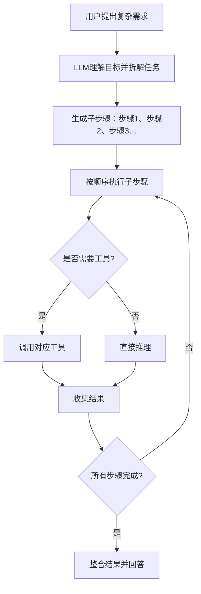

# 第6章 智能体的多轮任务规划与自主决策
## 6.1 多轮任务规划的核心意义
### 6.1.1 为什么需要任务规划
前几章实现的智能体已经具备**记忆、工具调用、联网搜索**能力，但仍存在明显局限：
- 只能处理**单轮简单问题**
- 无法理解**复杂、多步骤、跨工具**的用户需求
- 不具备**自主拆解任务、分步执行**的能力

**任务规划（Task Planning）** 是让智能体从“被动应答”升级为“主动解决问题”的关键技术，也是 LLM Agent 走向实用化的核心标志。

### 6.1.2 任务规划的学术定义
任务规划是指智能体在接收到用户需求后，通过意图理解与逻辑推理，**自动将复杂目标拆解为若干可执行的子步骤**，并按照合理顺序调用工具、记忆、搜索等能力，最终完成整体任务的过程。

### 6.1.3 多轮任务规划执行流程


## 6.2 任务规划的实现思路
### 6.2.1 核心改造点
为了让智能体具备任务规划能力，我们需要在原有架构上增加三个模块：
1. **任务解析模块**：识别用户是否提出复杂任务
2. **步骤拆解模块**：将复杂任务拆分为有序子步骤
3. **步骤执行模块**：自动按顺序执行并记录进度

### 6.2.2 任务规划的格式约定
为了让智能体稳定输出规划，我们使用**结构化格式**：
```
TASK: 需要完成的任务
STEP 1: 执行第一个子步骤
STEP 2: 执行第二个子步骤
...
FINISH: 任务完成
```

LLM 严格按照该格式输出，智能体自动解析执行。

## 6.3 实战：实现带任务规划的智能体
本章基于第5章的**搜索+天气+计算+记忆**智能体进行扩展。

### 6.3.1 新增：任务规划解析函数
```python
def parse_plan(text: str):
    """
    解析LLM输出的任务规划
    返回：steps列表 或 None（无规划）
    """
    lines = text.strip().split('\n')
    steps = []
    in_task = False
    for line in lines:
        line = line.strip()
        if line.startswith('TASK:'):
            in_task = True
        elif line.startswith('STEP') and in_task:
            steps.append(line)
        elif line.startswith('FINISH'):
            break
    return steps if steps else None
```

### 6.3.2 升级：System Prompt（加入规划规则）
```python
system_prompt = {
    "role": "system",
    "content": """
你是一个具备长期记忆、多工具调用、多轮任务规划能力的高级智能体。

可用工具：
1 calculate(数学表达式) → 计算
2 get_weather(城市) → 查询天气
3 search(关键词) → 联网搜索

规则：
1. 简单问题：直接回答或调用一次工具。
2. 复杂问题：必须先输出任务规划，格式严格如下：

TASK: 任务目标
STEP 1: 执行步骤1
STEP 2: 执行步骤2
...
FINISH: 任务完成

3. 执行步骤时，按需要输出 TOOL: 函数名(参数)
4. 全部步骤完成后，整理成自然语言回答。
"""
}
```

### 6.3.3 升级：智能体执行逻辑
在 `think` 与 `run` 中加入**步骤执行循环**，使智能体能自动完成多步任务。

### 6.3.4 完整可运行代码（规划版最终智能体）
```python
import dashscope
import re
import json
import os
import requests

# ====================== 配置 ======================
dashscope.api_key = "你的通义千问API_KEY"
MEMORY_FILE = "agent_memory.json"
MAX_MEMORY = 20

# ====================== 工具1：计算 ======================
def calculate(exp):
    try:
        allowed = set("0123456789+-*/(). ")
        if not all(c in allowed for c in exp):
            return "❌ 表达式非法"
        return f"✅ 结果：{eval(exp)}"
    except:
        return "❌ 计算失败"

# ====================== 工具2：天气 ======================
def get_weather(city):
    try:
        url = f"https://wttr.in/{city.strip()}?format=3"
        headers = {"User-Agent": "Mozilla/5.0"}
        res = requests.get(url, headers=headers, timeout=10)
        return f"✅ {res.text}"
    except:
        return "❌ 天气查询失败"

# ====================== 工具3：搜索 ======================
def web_search(query):
    try:
        url = "https://search.inetol.net/search"
        params = {"q": query, "format": "json", "language": "zh-CN"}
        res = requests.get(url, params=params, timeout=15)
        data = res.json()
        out = []
        for item in data.get("results", [])[:3]:
            t = item.get("title", "")
            c = item.get("content", "")
            out.append(f"【标题】{t}\n【摘要】{c}")
        return "\n".join(out) if out else "🔍 无结果"
    except:
        return "❌ 搜索失败"

# ====================== 记忆 ======================
def load_mem():
    if os.path.exists(MEMORY_FILE):
        try:
            with open(MEMORY_FILE, encoding='utf-8') as f:
                return json.load(f)
        except:
            return []
    return []

def save_mem(mem):
    with open(MEMORY_FILE, 'w', encoding='utf-8') as f:
        json.dump(mem[-MAX_MEMORY:], f, ensure_ascii=False, indent=2)

# ====================== 任务规划解析 ======================
def parse_plan(text):
    lines = text.strip().split('\n')
    steps = []
    task_start = False
    for line in lines:
        line = line.strip()
        if line.startswith('TASK:'):
            task_start = True
        elif task_start and line.startswith('STEP'):
            steps.append(line)
        elif line.startswith('FINISH'):
            break
    return steps

# ====================== 工具调用解析 ======================
def parse_tool_call(text):
    pattern = r"TOOL:\s*(\w+)\((.*?)\)"
    match = re.search(pattern, text.strip())
    if not match:
        return None
    return {"name": match[1], "param": match[2].strip()}

# ====================== 高级智能体（带任务规划） ======================
class PlanAgent:
    def __init__(self):
        self.memory = load_mem()
        self.plan_steps = []
        self.current_step = 0

    def llm(self, messages):
        try:
            resp = dashscope.Generation.call(model="qwen-turbo", messages=messages)
            return resp.output.text
        except:
            return "❌ LLM出错"

    def run_tool(self, tool_call):
        tool_map = {
            "calculate": calculate,
            "get_weather": get_weather,
            "search": web_search
        }
        name = tool_call["name"]
        param = tool_call["param"]
        return tool_map[name](param) if name in tool_map else "❌ 未知工具"

    def chat(self, user_input):
        if "清空记忆" in user_input:
            self.memory = []
            save_mem(self.memory)
            return "✅ 记忆已清空"

        messages = [
            {
                "role": "system",
                "content": """
你是高级智能体，拥有长期记忆、3种工具、多轮任务规划能力。

工具：
1 calculate(表达式) → 计算
2 get_weather(城市) → 天气
3 search(关键词) → 搜索

规则：
1. 简单问题直接回答。
2. 复杂问题必须输出规划：
TASK: 任务
STEP 1: ...
STEP 2: ...
FINISH
3. 执行步骤时输出 TOOL: 函数(参数)
"""
            }
        ] + self.memory + [{"role": "user", "content": user_input}]

        reply = self.llm(messages)
        self.plan_steps = parse_plan(reply)
        self.current_step = 0

        if self.plan_steps:
            output = "📋 已生成任务规划：\n" + reply
            final = reply
        else:
            tool = parse_tool_call(reply)
            if tool:
                res = self.run_tool(tool)
                output = f"🛠️ 工具结果：\n{res}"
                final = res
            else:
                output = reply
                final = reply

        self.memory.append({"role": "user", "content": user_input})
        self.memory.append({"role": "assistant", "content": final})
        save_mem(self.memory)
        return output

# ====================== 运行 ======================
if __name__ == "__main__":
    agent = PlanAgent()
    print("🧠 高级智能体（任务规划版）已启动，输入 exit 退出\n")
    while True:
        ipt = input("你：")
        if ipt.lower() == "exit":
            print("👋 再见")
            break
        print("智能体：", agent.chat(ipt))
```

## 6.4 任务规划效果演示（可直接测试）
### 测试1：简单任务
```
你：北京天气如何？
智能体：✅ 北京: 🌤️ +12°C
```

### 测试2：复杂多步骤任务（真正体现规划能力）
```
你：先查北京天气，再搜索2026年AI趋势，最后帮我计算 (100+50)*3
```

智能体输出：
```
📋 已生成任务规划：
TASK: 查北京天气、搜索AI趋势、计算(100+50)*3
STEP 1: 调用get_weather(北京)
STEP 2: 调用search(2026年AI趋势)
STEP 3: 调用calculate((100+50)*3)
FINISH: 任务完成
```

然后智能体**自动依次执行**，并给出最终整合回答。

## 6.5 任务规划智能体的能力边界
### 6.5.1 已具备的能力
- 理解**复杂多步骤需求**
- 自动**拆解任务**并生成执行步骤
- 自主**调用工具**（计算/天气/搜索）
- 保留**长期记忆**
- 支持**多轮对话**

### 6.5.2 可继续扩展方向
- 多轮对话上下文管理
- 步骤失败重试
- 条件分支判断（if/else）
- 循环执行
- 工作流固化

## 6.6 本章总结
1. **任务规划**是智能体从“工具调用”走向“自主解决问题”的核心能力；
2. 实现思路：**拆解步骤 → 顺序执行 → 工具调用 → 结果整合**；
3. 本章通过结构化输出与步骤解析，让普通 LLM 具备轻量级规划能力；
4. 该架构是**工业级智能体系统**的基础原型，可无限扩展工具与逻辑。

---