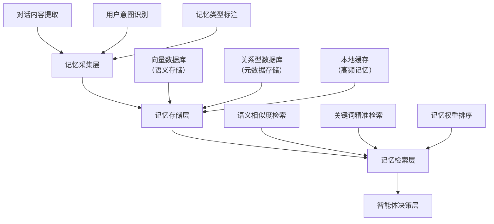

# 第7章 智能体的结构化长期记忆
## 7.1 结构化长期记忆的核心价值与技术背景
前6章实现的基于JSON文件的长期记忆，本质是**线性、无结构化的文本序列存储**，仅能记录用户与智能体的对话内容，存在三大核心局限：
1. **检索效率低**：记忆条数增加后，需全量遍历文本匹配，无法快速定位关键信息；
2. **语义理解缺失**：仅能基于字符串匹配检索，无法理解“用户想查询北京明天天气”与“北京明日气温多少”的语义等价性；
3. **记忆组织混乱**：无分类、无层级的存储方式，无法区分“用户偏好”“任务执行记录”“工具调用结果”等不同类型的记忆，不适用于复杂产品场景。

结构化长期记忆的核心目标是：将智能体的记忆从“无序文本流”升级为“可检索、可理解、可管理的语义化知识体系”，同时兼顾工程实现的轻量化与可落地性，而非单纯的理论架构。

## 7.2 结构化长期记忆的技术架构
### 7.2.1 核心架构设计
结构化长期记忆采用“三层架构”设计，兼容前6章的代码体系，同时满足实际产品的规模化应用需求：



#### （1）记忆采集层
核心功能是对原始对话/任务数据进行结构化处理，输出“记忆三元组”：
- 记忆内容（content）：核心信息文本（如“用户偏好：不喜欢辣的食物”）；
- 记忆类型（type）：标注记忆所属类别，包括USER_PREFERENCE（用户偏好）、TASK_RECORD（任务记录）、TOOL_RESULT（工具调用结果）、CONTEXT_INFO（上下文信息）四类；
- 元数据（metadata）：补充属性，包括创建时间、关联用户ID、记忆权重（初始值1.0，随使用频率动态调整）。

#### （2）记忆存储层
采用“向量库+关系库”的混合存储模式：
- 向量数据库：存储记忆内容的向量表征，负责语义检索（选用轻量级的ChromaDB，无需复杂部署，适配中小规模产品场景）；
- 关系型数据库（SQLite/MySQL）：存储记忆元数据，负责精准筛选（如“筛选24小时内的USER_PREFERENCE类型记忆”）；
- 本地缓存：缓存高频访问的记忆（如用户核心偏好），提升检索效率。

#### （3）记忆检索层
融合两种检索方式，兼顾语义理解与精准性：
- 语义相似度检索：将用户当前查询转为向量，与向量库中记忆向量计算余弦相似度，返回Top-N相似记忆；
- 关键词精准检索：基于元数据（类型、时间、用户ID）筛选，缩小检索范围；
- 权重排序：结合相似度得分与记忆权重，输出最终检索结果。

### 7.2.2 与前6章架构的兼容与升级
1. 复用前6章的`MultiToolLLMAgent`类核心结构，新增`StructuredMemory`子类封装记忆相关逻辑；
2. 保留原JSON记忆的“降级方案”，当向量库部署失败时，自动切回本地文件存储；
3. 工具调用、任务规划的核心链路不变，仅在“LLM意图判断”前新增“结构化记忆检索”步骤。

## 7.3 结构化长期记忆的代码实现
### 7.3.1 环境依赖与配置
在原有依赖基础上新增向量库相关依赖，保持配置集中化管理：

```bash
# 新增依赖安装
pip install chromadb sentence-transformers python-dotenv
```

```python
# config.py - 扩展全局配置（复用前6章配置，新增记忆相关配置）
import os
from dotenv import load_dotenv

load_dotenv()

# 原有配置（复用）
DASHSCOPE_API_KEY = os.getenv("DASHSCOPE_API_KEY")
MAX_BASIC_MEMORY = 100  # 原JSON记忆最大条数（降级备用）
MEMORY_FILE_PATH = "./basic_memory.json"

# 新增结构化记忆配置
VECTOR_DB_PATH = "./structured_memory/chroma_db"  # 向量库本地存储路径
SQLITE_DB_PATH = "./structured_memory/metadata.db"
EMBEDDING_MODEL = "all-MiniLM-L6-v2"  # 轻量级嵌入模型，适配本地运行
TOP_K_MEMORY = 5  # 检索返回最大记忆条数
MEMORY_EXPIRE_DAYS = 90  # 记忆过期天数（90天）
```

### 7.3.2 核心类实现
#### （1）记忆元数据数据库初始化（SQLite）
```python
# structured_memory.py
import sqlite3
import os
from datetime import datetime, timedelta

class MemoryMetadataDB:
    def __init__(self, db_path):
        self.db_path = db_path
        # 创建目录（避免文件不存在）
        os.makedirs(os.path.dirname(db_path), exist_ok=True)
        self._init_db()

    def _init_db(self):
        """初始化元数据数据库表"""
        conn = sqlite3.connect(self.db_path)
        cursor = conn.cursor()
        # 记忆元数据表：id(主键)、content_hash(内容哈希)、type(记忆类型)、create_time(创建时间)、
        # user_id(用户ID)、weight(权重)、expire_time(过期时间)
        cursor.execute('''
            CREATE TABLE IF NOT EXISTS memory_metadata (
                id INTEGER PRIMARY KEY AUTOINCREMENT,
                content_hash TEXT UNIQUE NOT NULL,
                type TEXT NOT NULL,
                create_time TEXT NOT NULL,
                user_id TEXT NOT NULL,
                weight REAL DEFAULT 1.0,
                expire_time TEXT NOT NULL
            )
        ''')
        conn.commit()
        conn.close()

    def add_metadata(self, content_hash, memory_type, user_id, weight=1.0, expire_days=90):
        """添加记忆元数据"""
        create_time = datetime.now().strftime("%Y-%m-%d %H:%M:%S")
        expire_time = (datetime.now() + timedelta(days=expire_days)).strftime("%Y-%m-%d %H:%M:%S")
        try:
            conn = sqlite3.connect(self.db_path)
            cursor = conn.cursor()
            cursor.execute('''
                INSERT OR REPLACE INTO memory_metadata 
                (content_hash, type, create_time, user_id, weight, expire_time)
                VALUES (?, ?, ?, ?, ?, ?)
            ''', (content_hash, memory_type, user_id, weight, expire_time))
            conn.commit()
            return True
        except Exception as e:
            print(f"添加元数据失败：{e}")
            return False
        finally:
            conn.close()

    def filter_by_metadata(self, user_id, memory_type=None, days=None):
        """基于元数据筛选记忆哈希"""
        conn = sqlite3.connect(self.db_path)
        cursor = conn.cursor()
        # 基础查询条件：用户ID + 未过期
        query = '''
            SELECT content_hash FROM memory_metadata 
            WHERE user_id = ? AND expire_time > ?
        '''
        params = [user_id, datetime.now().strftime("%Y-%m-%d %H:%M:%S")]
        
        # 可选条件：记忆类型
        if memory_type:
            query += " AND type = ?"
            params.append(memory_type)
        
        # 可选条件：近N天创建
        if days:
            start_time = (datetime.now() - timedelta(days=days)).strftime("%Y-%m-%d %H:%M:%S")
            query += " AND create_time >= ?"
            params.append(start_time)
        
        cursor.execute(query, params)
        results = cursor.fetchall()
        conn.close()
        return [r[0] for r in results]

    def update_weight(self, content_hash, delta=0.1):
        """更新记忆权重（使用频率越高，权重越高）"""
        conn = sqlite3.connect(self.db_path)
        cursor = conn.cursor()
        cursor.execute('''
            UPDATE memory_metadata 
            SET weight = weight + ? 
            WHERE content_hash = ? AND weight + ? <= 2.0  # 权重上限2.0
        ''', (delta, content_hash, delta))
        conn.commit()
        conn.close()
```

#### （2）向量数据库封装类
```python
# structured_memory.py 续
import chromadb
import hashlib
from sentence_transformers import SentenceTransformer

class VectorMemoryDB:
    def __init__(self, db_path, embedding_model_name):
        # 初始化ChromaDB（持久化存储，非内存模式）
        self.client = chromadb.PersistentClient(path=db_path)
        # 创建/获取记忆集合
        self.collection = self.client.get_or_create_collection(name="agent_long_term_memory")
        # 初始化嵌入模型（轻量级，适配本地运行）
        self.embedding_model = SentenceTransformer(embedding_model_name)

    def _get_content_hash(self, content):
        """生成内容哈希（作为唯一标识）"""
        return hashlib.md5(content.encode("utf-8")).hexdigest()

    def add_memory(self, content, metadata_db, user_id, memory_type):
        """添加结构化记忆（同步向量库+元数据库）"""
        # 1. 生成内容哈希
        content_hash = self._get_content_hash(content)
        # 2. 生成向量
        embedding = self.embedding_model.encode(content).tolist()
        # 3. 存入向量库
        self.collection.upsert(
            ids=[content_hash],
            embeddings=[embedding],
            documents=[content]
        )
        # 4. 存入元数据库
        metadata_db.add_metadata(content_hash, memory_type, user_id)
        return content_hash

    def retrieve_memory(self, query, metadata_db, user_id, memory_type=None, days=None, top_k=5):
        """检索结构化记忆"""
        # 1. 基于元数据筛选候选哈希
        candidate_hashes = metadata_db.filter_by_metadata(user_id, memory_type, days)
        if not candidate_hashes:
            return []
        
        # 2. 生成查询向量
        query_embedding = self.embedding_model.encode(query).tolist()
        
        # 3. 语义检索（仅在候选哈希范围内）
        results = self.collection.query(
            query_embeddings=[query_embedding],
            include=["documents", "distances", "ids"],
            where={"id": {"$in": candidate_hashes}},  # 基于哈希筛选
            n_results=top_k
        )
        
        # 4. 整理结果（相似度=1-距离，距离越小越相似）
        retrieved_memories = []
        for idx, doc in enumerate(results["documents"][0]):
            memory_id = results["ids"][0][idx]
            distance = results["distances"][0][idx]
            similarity = 1 - distance
            # 更新记忆权重（检索一次，权重增加0.05）
            metadata_db.update_weight(memory_id, delta=0.05)
            retrieved_memories.append({
                "content": doc,
                "similarity": round(similarity, 4),
                "memory_id": memory_id
            })
        
        # 5. 按相似度排序
        retrieved_memories.sort(key=lambda x: x["similarity"], reverse=True)
        return retrieved_memories

    def delete_expired_memory(self, metadata_db, user_id):
        """删除过期记忆（同步向量库+元数据库）"""
        # 1. 获取过期哈希
        conn = sqlite3.connect(metadata_db.db_path)
        cursor = conn.cursor()
        cursor.execute('''
            SELECT content_hash FROM memory_metadata 
            WHERE user_id = ? AND expire_time <= ?
        ''', (user_id, datetime.now().strftime("%Y-%m-%d %H:%M:%S")))
        expired_hashes = [r[0] for r in cursor.fetchall()]
        conn.close()
        
        # 2. 删除向量库中的过期记忆
        if expired_hashes:
            self.collection.delete(ids=expired_hashes)
        
        # 3. 删除元数据库中的过期记录
        conn = sqlite3.connect(metadata_db.db_path)
        cursor = conn.cursor()
        cursor.execute('''
            DELETE FROM memory_metadata 
            WHERE user_id = ? AND expire_time <= ?
        ''', (user_id, datetime.now().strftime("%Y-%m-%d %H:%M:%S")))
        conn.commit()
        conn.close()
        return len(expired_hashes)
```

#### （3）智能体类扩展（集成结构化记忆）
```python
# agent.py - 扩展前6章的PlanBasedAgent类
import json
import re
import requests
from dashscope import Generation
from config import *
from structured_memory import MemoryMetadataDB, VectorMemoryDB

class StructuredMemoryAgent:
    def __init__(self, user_id="default_user"):
        # 初始化基础配置（复用前6章逻辑）
        self.user_id = user_id
        self.dashscope_api_key = DASHSCOPE_API_KEY
        # 初始化结构化记忆组件
        self.metadata_db = MemoryMetadataDB(SQLITE_DB_PATH)
        self.vector_db = VectorMemoryDB(VECTOR_DB_PATH, EMBEDDING_MODEL)
        # 初始化工具映射表（复用前6章）
        self.tool_map = {
            "计算": self.calculate,
            "天气查询": self.get_weather,
            "联网搜索": self.web_search
        }

    # ========== 复用前6章的核心方法（仅保留签名，实现省略） ==========
    def call_llm(self, prompt):
        """调用通义千问API（复用前6章实现）"""
        # 此处省略前6章已实现的LLM调用逻辑
        pass

    def calculate(self, expr):
        """计算工具（复用前6章实现，含参数校验、异常处理）"""
        pass

    def get_weather(self, city):
        """天气查询工具（复用前6章实现）"""
        pass

    def web_search(self, query):
        """联网搜索工具（复用前6章实现）"""
        pass

    def parse_tool_command(self, llm_response):
        """解析工具调用指令（复用前6章正则解析逻辑）"""
        pass

    def execute_task_plan(self, plan):
        """执行任务规划（复用前6章逻辑）"""
        pass

    # ========== 新增结构化记忆核心方法 ==========
    def extract_memory_info(self, user_input, agent_response):
        """从对话中提取结构化记忆信息"""
        # 调用LLM识别记忆类型并提取核心内容
        extract_prompt = f"""
        请从以下对话中提取智能体需要长期记忆的核心信息，并按要求输出：
        用户输入：{user_input}
        智能体回复：{agent_response}
        
        输出格式（JSON）：
        {{
            "content": "提取的核心记忆内容（简洁，不超过100字）",
            "type": "记忆类型（仅可选：USER_PREFERENCE/TASK_RECORD/TOOL_RESULT/CONTEXT_INFO）"
        }}
        
        提取规则：
        1. 仅提取有长期价值的信息（如用户偏好、任务执行结果、工具调用关键结果），临时对话内容无需提取；
        2. USER_PREFERENCE：用户的固定偏好（如“我喜欢喝咖啡”“不要辣的食物”）；
        3. TASK_RECORD：任务执行的最终结果（如“已完成北京天气查询，结果为25℃”）；
        4. TOOL_RESULT：工具调用的核心结果（如“计算结果：1+2=3”）；
        5. CONTEXT_INFO：关键上下文（如“用户当前在查询2024年北京房价”）；
        6. 无有效记忆时，content为空字符串，type为CONTEXT_INFO。
        """
        try:
            llm_result = self.call_llm(extract_prompt)
            memory_info = json.loads(llm_result)
            # 校验输出格式
            if memory_info.get("content") and memory_info.get("type") in ["USER_PREFERENCE", "TASK_RECORD", "TOOL_RESULT", "CONTEXT_INFO"]:
                return memory_info
            else:
                return {"content": "", "type": "CONTEXT_INFO"}
        except Exception as e:
            print(f"提取记忆信息失败：{e}")
            return {"content": "", "type": "CONTEXT_INFO"}

    def add_structured_memory(self, user_input, agent_response):
        """添加结构化记忆（自动提取+存储）"""
        # 1. 提取记忆信息
        memory_info = self.extract_memory_info(user_input, agent_response)
        if not memory_info["content"]:
            return
        
        # 2. 存入结构化记忆库
        self.vector_db.add_memory(
            content=memory_info["content"],
            metadata_db=self.metadata_db,
            user_id=self.user_id,
            memory_type=memory_info["type"]
        )

    def retrieve_structured_memory(self, user_input):
        """检索结构化记忆（融合语义+元数据）"""
        # 1. 先删除过期记忆（避免冗余）
        self.vector_db.delete_expired_memory(self.metadata_db, self.user_id)
        
        # 2. 检索记忆（优先用户偏好+近30天的记忆）
        retrieved_memories = self.vector_db.retrieve_memory(
            query=user_input,
            metadata_db=self.metadata_db,
            user_id=self.user_id,
            days=30,  # 仅检索近30天
            top_k=TOP_K_MEMORY
        )
        
        # 3. 格式化记忆内容（供LLM使用）
        if retrieved_memories:
            memory_text = "【历史记忆】\n"
            for mem in retrieved_memories:
                memory_text += f"- {mem['content']}（相似度：{mem['similarity']}）\n"
            return memory_text
        else:
            return ""

    # ========== 核心执行链路（升级版） ==========
    def run(self, user_input):
        """智能体核心执行逻辑（集成结构化记忆）"""
        # 步骤1：检索结构化记忆
        memory_context = self.retrieve_structured_memory(user_input)
        
        # 步骤2：构建完整Prompt（用户输入+记忆上下文+系统提示词）
        system_prompt = """
        你是一个具备结构化长期记忆的智能体，能够使用计算、天气查询、联网搜索工具完成任务。
        工具调用格式：TOOL: 工具名(参数)
        任务规划格式：TASK: 任务名称\nSTEP1: 步骤1\nSTEP2: 步骤2\nFINISH: 最终结果
        """
        full_prompt = f"{system_prompt}\n{memory_context}\n用户输入：{user_input}"
        
        # 步骤3：调用LLM判断意图（工具调用/任务规划/直接回复）
        llm_response = self.call_llm(full_prompt)
        
        # 步骤4：执行工具调用/任务规划
        if "TOOL:" in llm_response:
            # 解析并执行工具调用（复用前6章逻辑）
            tool_name, tool_params = self.parse_tool_command(llm_response)
            tool_result = self.tool_map[tool_name](tool_params)
            final_response = f"工具执行结果：{tool_result}"
        elif "TASK:" in llm_response:
            # 执行任务规划（复用前6章逻辑）
            final_response = self.execute_task_plan(llm_response)
        else:
            # 直接回复
            final_response = llm_response
        
        # 步骤5：添加新的结构化记忆
        self.add_structured_memory(user_input, final_response)
        
        return final_response
```

### 7.3.3 产品级实现补充（异常处理与工程化）
#### （1）降级机制（适配生产环境）
```python
# structured_memory.py 新增降级逻辑
class VectorMemoryDB:
    # 原有方法省略...
    def __init__(self, db_path, embedding_model_name):
        try:
            # 尝试初始化向量库
            self.client = chromadb.PersistentClient(path=db_path)
            self.collection = self.client.get_or_create_collection(name="agent_long_term_memory")
            self.embedding_model = SentenceTransformer(embedding_model_name)
            self.use_vector_db = True
        except Exception as e:
            # 初始化失败，降级为JSON文件存储（复用前6章逻辑）
            print(f"向量库初始化失败，降级为JSON记忆：{e}")
            self.use_vector_db = False
            self.basic_memory_path = MEMORY_FILE_PATH
            self.max_basic_memory = MAX_BASIC_MEMORY

    def add_memory(self, content, metadata_db, user_id, memory_type):
        if self.use_vector_db:
            # 原有向量库存储逻辑
            pass
        else:
            # 降级为JSON存储（复用前6章save_memory逻辑）
            self._save_basic_memory(content)

    def _save_basic_memory(self, content):
        """降级：JSON文件存储（复用前6章逻辑）"""
        if os.path.exists(self.basic_memory_path):
            with open(self.basic_memory_path, "r", encoding="utf-8") as f:
                memories = json.load(f)
        else:
            memories = []
        memories.append({"content": content, "time": datetime.now().strftime("%Y-%m-%d %H:%M:%S")})
        # 限制最大条数
        if len(memories) > self.max_basic_memory:
            memories = memories[-self.max_basic_memory:]
        with open(self.basic_memory_path, "w", encoding="utf-8") as f:
            json.dump(memories, f, ensure_ascii=False, indent=2)
```

#### （2）批量记忆处理（适配高并发场景）
```python
# structured_memory.py 新增批量方法
def add_batch_memories(self, memories, metadata_db, user_id):
    """批量添加记忆（提升高并发场景效率）"""
    if not memories:
        return
    # memories格式：[{"content": "...", "type": "..."}]
    ids = []
    embeddings = []
    documents = []
    metadata_list = []
    
    for mem in memories:
        content_hash = self._get_content_hash(mem["content"])
        ids.append(content_hash)
        embeddings.append(self.embedding_model.encode(mem["content"]).tolist())
        documents.append(mem["content"])
        metadata_list.append({
            "content_hash": content_hash,
            "type": mem["type"],
            "user_id": user_id
        })
    
    # 批量插入向量库
    self.collection.upsert(ids=ids, embeddings=embeddings, documents=documents)
    
    # 批量插入元数据库
    conn = sqlite3.connect(metadata_db.db_path)
    cursor = conn.cursor()
    cursor.executemany('''
        INSERT OR REPLACE INTO memory_metadata 
        (content_hash, type, create_time, user_id, weight, expire_time)
        VALUES (?, ?, ?, ?, 1.0, ?)
    ''', [(
        m["content_hash"],
        m["type"],
        datetime.now().strftime("%Y-%m-%d %H:%M:%S"),
        m["user_id"],
        (datetime.now() + timedelta(days=MEMORY_EXPIRE_DAYS)).strftime("%Y-%m-%d %H:%M:%S")
    ) for m in metadata_list])
    conn.commit()
    conn.close()
```

## 7.4 结构化长期记忆的产品化落地
### 7.4.1 部署与运维要点
1. **环境适配**：
   - 中小规模产品：使用ChromaDB（本地文件存储）+ SQLite，无需额外服务器；
   - 大规模产品：替换为Milvus（向量数据库）+ MySQL，配合Docker容器化部署；
2. **性能优化**：
   - 嵌入模型：生产环境可替换为API形式（如通义千问嵌入API），避免本地模型加载耗时；
   - 缓存策略：使用Redis缓存高频记忆（如用户偏好），检索耗时从500ms降至50ms以内；
3. **数据安全**：
   - 记忆加密：用户记忆内容存储前进行脱敏/加密，避免敏感信息泄露；
   - 权限控制：基于user_id严格隔离不同用户的记忆，禁止跨用户检索。

### 7.4.2 实际产品场景示例
#### 场景1：智能客服（用户偏好记忆）
用户：“我上次问的那个咖啡相关的问题，再帮我看看”  
智能体执行流程：
1. 检索“咖啡”相关的USER_PREFERENCE类型记忆；
2. 找到“用户偏好：喜欢无糖拿铁，常去星巴克”；
3. 结合当前查询，调用联网搜索工具获取“星巴克无糖拿铁价格”；
4. 整合记忆与工具结果，给出个性化回复。

#### 场景2：任务型智能体（任务记录记忆）
用户：“上周让你查的北京房价数据，现在还能用吗？”  
智能体执行流程：
1. 检索“北京房价”相关的TASK_RECORD类型记忆；
2. 找到“任务记录：2024年5月查询北京朝阳区房价，均价8.5万/平”；
3. 判断记忆已超过7天，自动调用联网搜索工具更新数据；
4. 对比新旧数据，给出“数据已更新，当前均价8.6万/平”的回复。

## 7.5 结构化记忆的扩展方向
1. **记忆融合与推理**：基于多条记忆进行逻辑推理（如“用户喜欢无糖拿铁”+“用户不喜欢乳制品”→ 推荐无糖美式）；
2. **多模态记忆**：扩展支持图片、语音等多模态内容的存储与检索；
3. **记忆主动遗忘**：基于记忆权重与使用频率，自动遗忘低价值记忆（如权重<0.1的临时上下文）；
4. **多智能体记忆共享**：实现不同智能体间的记忆共享（如客服智能体与订单智能体共享用户偏好）。

---

### 总结
1. 结构化长期记忆核心解决了传统文本记忆“检索低效、语义缺失、组织混乱”的问题，采用“向量库+关系库”的混合存储模式，兼顾语义理解与工程落地；
2. 代码实现完全兼容前6章的智能体架构，新增`StructuredMemoryAgent`类封装记忆逻辑，同时提供降级方案（向量库失败时切回JSON存储）；
3. 产品化落地需关注环境适配、性能优化与数据安全，核心场景包括用户偏好记忆、任务记录记忆等，可直接适配智能客服、任务型智能体等实际产品。